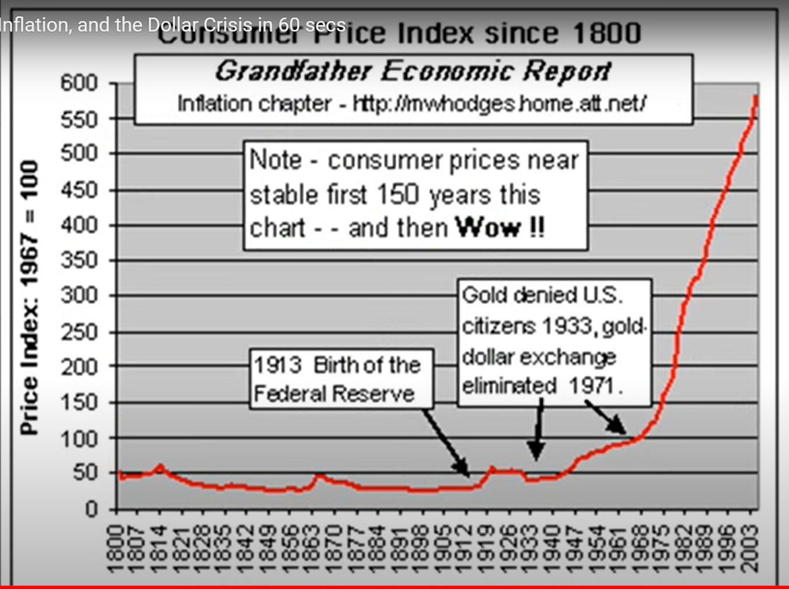
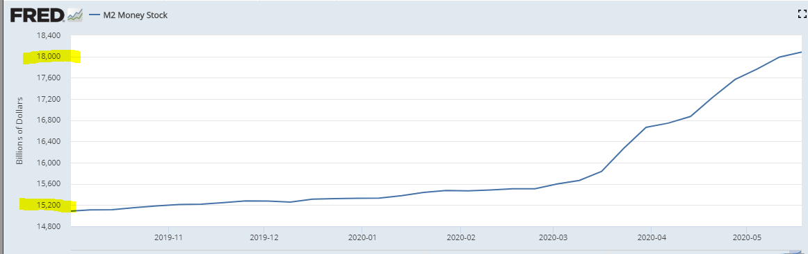

# Intro

My name is Jorge Besada and I am running for Congress in Washington State' 9th District

I am computer guy, a contractor at Microsoft.

I was born in Cuba, a once prosperous country destroyed by economic fallacies which led many to adopt Socialism and thus inevitably bring oppression and poverty upon themselves. The purpose of my campaign is to help bring about world peace and quick technological advancement so that among numerous other benefits those of us who have more than 5 to 10 years left to live, like my parents, can even beat dying of old age. In order to do this we have to have a worldwide intellectual revolution where enough people understand how the world works, in other words, enough people must familiarize themselves with the ideas of the economists usually referred to as "The Austrian School", but more specifically, Ludwig von Mises and especially his great protege 1974 Nobel Laureate in Economics Friedrich  Hayek. There is only one simple and greatly misunderstood concept we have to properly grasp in order to make sense of the world. "selective evolution" or what is more commonly referred to as "Natural Selection".

American biologist Theodosius Dobzhansky is known for having written a famous essay titled “Nothing in Biology Makes Sense Except in the Light of Evolution.” Had he been familiar with the works of F.A. Hayek he would have dropped the “in Biology” and have come up with a far more profound and sweeping statement: Hayek wrote: 

“We understand now that all enduring structures above the level of the simplest atoms, and up to the brain and society, are the results of, and can be explained only in terms of, processes of selective evolution…” (Hayek F. , 1981, p. 158)(emphasis mine)

Whether we know much about natural selection or not, most of us associate it with people like Charles Darwin and the biological world of animals and living things, but natural selection also evolved the socioeconomic order and things like religions, laws, customs, language, and especially for our purposes, the many socioeconomic institutions that make up our modern economies like money, the banking and lending industries, interest rates and more, and it is also indispensable for understanding our geopolitical conflicts like the Israeli/Palestinian conflict as well as their history. In other words, at a fundamental level natural selection creates both the biological as well as the socioeconomic orders and is indispensable for understanding how they have come into existence and behave.

Most people fear the concepts of natural selection and evolution with good reason, we don’t really understand them, especially when it comes to the concept of race and socioeconomic achievement. Popular phrases associated with evolution like Herbert Spencer’s “survival of the fittest” can scare us and keep us away from learning these vital subjects. Racist and erroneous ideologies like the ones that flourished in Hitler’s Germany were also heavily influenced by faulty evolutionary thought and still play a significant role today.

Natural selection is a simple process that creates order which is what life is all about. Life can be seen as a sort of ongoing chain-reaction of “order”. For example, if we could travel back in time about 4 billion years, there would have been no complex life forms like what we have today; there probably would have been what is commonly referred to as the “chemical soup”, which can be seen as a sort of chaotic sea of atoms/molecules. Out of this chemical soup, order and complexity arose and eventually those molecules became ordered in a way that led to the first living cells. Complexity and order continued to increase and eventually single cells were ordered in a way that led to the first multi-cellular life forms like plants, animals, eventually us humans, and now what the great British 19th century thinker Herbert Spencer referred to as ["The Social Organism"](https://oll.libertyfund.org/titles/spencer-the-man-versus-the-state-with-six-essays-on-government-society-and-freedom-lf-ed)

At the beginning of this process we could say that there was 0 or very little “biomass”, in other words, matter that was transformed and incorporated into these self-sustaining chain-reactions of order/life. Living things don’t just act randomly, they require precise knowledge/information to move the matter around in a way that becomes the wealth that keeps the “order” and thus life going. For billions of years, most information needed to create life/order was stored in genes, which changed very slowly via biological evolution. About 500 million years ago, life-forms with brains began to emerge which allowed information to be stored outside of genes leading to more flexible and superior decision-making. Eventually life-forms evolved that used their brains to be increasingly “social”, and cooperate with others to reach even higher levels of productivity/fitness/competitiveness, which leads us to ourselves, anatomically-modern man. 

Tribal man was doing relatively great compared to other species, instead of hiding in the trees like his recent ancestors, he became the ultimate carnivorous predator, his brain tripled in size, hunted megafauna to extinction and easily spread and adapted himself to every corner of the world, but with at most about 150 brains per tribe and most people knowing how to do similar things, which meant information was more or less repeated across each brain, the social order had to remain relatively simple and backward/tribal. Then, during the last 30,000 or so years, something wonderful happened, something as momentous in the history of life as the emergence of biological evolution and genetics, the so-called ‘market process’ and its various components like trade, money, profit/loss calculation, economic competition and interest rate coordination, began to emerge and radically alter the way the social order worked. As wonderful as this was, information had been limited by the amount of human brains needed to store it and their ability to process it quickly and efficiently, until computers and software came along which brings us to the present, where software, artificial intelligence, and robotics are taking productivity and progress to new heights.

The human body and the numerous "systems" that coordinate it like the respiratory, nervous, and digestive "systems", is the result of the actions of some 30 trillion cells but obviously NOT the result of any conscious planning, designing, or conspiring by them. Thanks to the likes of Darwin and a modern understanding of genetics we can understand how natural selection was the inadvertent "designer" of such systems and complex order. Similarly, the global socioeconomic order, Spencer's 'Social Organism'  is also coordinated by a "system", by what Hayek and Mises, referred to as "The Market Process". 'The Market Process' and the "parts" it is composed of like money, prices, economic competition, interest rates, and the legal/religious/governmental frameworks that sustain it, "are indeed the result of human action, but not the execution of any human design" [(Adam Ferguson)](https://www.adamsmith.org/blog/adam-fergusons-great-insight). The 'market process' shares this trait with language which is also a complex mechanism that is the result of human action but was not consciously designed or invented by people/cells. Just like cells are unaware of why they act the way they do and how natural selection has evolved them over billions of years to be parts of complex multi-cellular organisms, so is mankind ignorant of how "processes of selective evolution" have shaped "the brain and society" and created "the market process" which coordinates our actions to create the global socioeconomic order. 

Standing on Mises' shoulders, who provided him with a superb explanation of the workings of the economy and thus all aspects of the market process(money/prices/'interest rates'/etc.) and much, much, much more, Hayek would go on to explain how in a few thousand years culture and 'the market process' had co-evolved to transform homo sapiens, from tribes of slightly smarter vicious apes, into today's massively complex global socioeconomic order/'Social Organism' thus arguably becoming the first person in the history of mankind to provide a complete evolutionary understanding of how the world works. Ignorance of how the socioeconomic order works and has evolved is what keeps plunging the slightly smarter apes, regardless of their "experts" and "great leaders", into tribalistic world wars and economic disasters like Communism and the current Coronavirus-related economic shutdowns and restrictions which are on their way to becoming mankind's Final Disaster. Hayek is still is so far ahead of our time that even today's leading thinkers, like renowned popular science writer Matt Ridley, are just beginning to catch up to the enormity of his insights. Ridley humbly acknowledges this in a 2011 speech where he mentions:

>"As someone who came to Fredrick von Hayek comparatively late in life, I'm still catching up with him...Indeed, many of the insights I thought I had discovered in my own readings and writings on the frontier of evolutionary biology and economics it turns out Hayek had long before me...It's Hayek who first puts it all together." - [Matt Ridley](https://www.youtube.com/watch?v=pG-grkJPU8Q)

So how did Hayek 'put it all together'?. Easy. Hayek realized that "all enduring structures above the level of the simplest atoms, and up to the brain and society" require precise information to sustain/coordinate/expand their order. If one understands how information coordinates the biological and social orders, then one understands how the world works. It is that simple! Let's briefly try to get a feel for how Hayek saw the world. 

## Biological and Social Order

"Enduring structures" like living things and society are self-perpetuating orders that are in continuous cycles of wealth production and consumption. Production involves the transformation or relocation of matter to create wealth, and consumption transforms/relocates wealth/matter in a way that sustains or expands living things/orders and their internal parts/orders. The Sun sends us photons/energy which the process of photosynthesis is able to store in chemical form. This energy is then used to power the cycles of production/consumption. If there is more production than consumption then the order is profitable and thus has additional wealth with which to sustain itself for longer periods and/or grow. For example, paramecium are single-celled life-forms that produce food/wealth by swimming around and swallowing small bacteria which they then consume by digesting and transforming them into the various nutrients/wealth needed to maintain and expand the paramecium's internal order and thus life. A more complex multi-cellular animal like a person, is simply a collection of cells (which are themselves orders) which must be productive as a whole in order to produce and then consume the necessary wealth needed to nourish itself and the sub-orders/organs/cells/organelles it is composed of. Today we not only have biological order, we have social order, Spencer's "Social Organism", which is rapidly growing and increasing its 'rate of production', in other words, the rate at which it transforms the earth's matter into human usable wealth/order/life/biomass. Every year, increasingly automated building-sized machinery in the mining industries scrape/mine less than 10 cubic miles of matter from the earth's massive volume of 260 billion cubic miles. This matter is 'collaboratively transformed' or relocated by billions of people as trillions of dollars worth of wealth in terms of cars/computers/buildings/products/etc. are produced thus increasing the word's economic pie of wealth and social order. These continuous cycles of production and consumption require precise knowledge/information. By focusing on how information arises, spreads, and guides these cycles of production and consumption which lead to order/life/society we can have a simple yet profound understanding of how the entire world works.

## Creation and Spread of Information via Biological Evolution

"Processes of selective evolution" can be said to have created two mechanisms for creating two types of orders/"enduring structures", biological and social. The biological order is created via the well-known mechanism of 'biological evolution' with genes being like the sentences which store the information necessary to create/coordinate life/order. Mutations cause new genes and thus new information to arise which leads to a different life-form which is then 'naturally selected' as it inadvertently competes with others, with the winner reproducing more and thus passing on more copies of the better-adapted/"fitter" genes/information/design to later generations.

## More complexity requires more information

The more complex a thing is, the more information is needed to create it and keep it in order. Tiny E. coli bacteria have about 4,000 genes and are relatively simple in structure and function. On the other hand, each human cell has about 25,000 genes thus containing far more information allowing each cell to specialize and take part in a vast "division of labor" by transforming itself into a heart/lung/nerve/etc. cell as a young fetus develops inside the womb. About 500 million years ago, life-forms with brains began to emerge which allowed information to be stored outside of genes. Eventually life-forms evolved that used their brains to be increasingly "social" and cooperate with others to reach even higher levels of relative productivity/fitness/competitiveness which leads us to ourselves, anatomically-modern man (about 50,000 years ago), whose ancestors had spent over 2 million years living in small nomadic tribes of about 15 to 150 people where everyone more or less knew how to do the same things so information was inefficiently repeated across the social order. Just like few genes/information leads to simple bacteria, few brains lead to a simple and relatively unproductive social order. Tribal man had an information storage/sharing problem. Then something wonderful happened, something as momentous in the history of life as the emergence of biological evolution. The so-called 'market process' and its various components like trade, money, economic competition, and very recently "interest rate coordination" began to emerge, thus giving birth to Spencer's "Social Organism".

### Production and Consumption

Whenever a person works he produces his labor and whatever wealth it creates thus increasing the economic pie. If you are a freelancer you produce a product/service/wealth and trade it directly with society (customers) for money, and then trade the money back with society for the wealth you consume. If you work for a company, you produce your labor and trade it for money with your “employer” who combines it with the labor of others to produce a product/service/wealth which is then traded with society for the money from which your paycheck comes. Whether you are a freelancer, employee, or company, what is commonly referred to as sales revenue (your paycheck), is an estimate of the total amount of wealth produced. Costs, like employee wages which will be used by them to consume wealth(food,energy,etc.), are an estimate of how much wealth is consumed from the economic pie. And profits, which are the difference between sales revenue (production) and costs (consumption) are an estimate of by how much additional wealth the economic pie has grown. Again, a profitable order is an order (cell/person/company) that produces more than it consumes and is therefore self-sustaining/alive. The global economy or ‘Social Organism’ is really a vast collection of orders/people/companies that are constantly trading with each other, nourishing each other, each trade taking each participant/order from an inferior to a superior state of well-being from its own perspective, otherwise the trade would not occur. When Carl trades a dollar for a hamburger he values the hamburger more than the dollar and the restaurant values the dollar more than the hamburger so the action of trading takes place, which like all action which is not coerced, takes each participant from an inferior to superior state of wellbeing. 

If a teenager uses a tree-trimmer to produce one mowed lawn valued at $50 in 10 hours, his 'rate of production' is $50 / 10 hours = $5/hour. If next month he uses a riding lawn mower and mows the same lawn in 1 hour, he has increased his 'rate of production' 10-fold to $50/hour. Profit/loss calculation motivates and enables all orders to guide their actions in the most profitable and thus pie-increasing way, and, very importantly, it also prevents orders from consuming more than what they produce. Unless, of course, they are the benefactors of charity. The wealthier a person/company/order is, the more this order has produced and exchanged for all this money/wealth. Bill Gates is one of the world’s richest men because the social order he helped shape and successfully managed, Microsoft, has been one of the most productive in the world. We know this is the case because billions of human beings traded their money/wealth for its products/services.

The production of wealth requires the consumption of wealth. For example, if 10,000 men are to spend 2 years producing an airplane factory, they must consume/use the concrete/materials/food/energy/transportation/shelter/wealth that they (as well as their dependents/family) need while they produce the factory. In other words, there can be no production if there does not already exist enough wealth that can be consumed while production takes place.

### Money

More money does not equal more wealth. Imagine if everyone in the world suddenly had an extra billion dollars. Would this make society wealthier? No. The amount of REAL wealth(goods/services) has not increased by a single toothpick. It would actually lead to less wealth since many people wound stop working/producing seeing their new-found fortune. Would the 10,000 men above be able to produce the factory if instead of having real wealth to use/consume had to consume pieces of paper with dead presidents on them? Of course not.

More money leads to and enables higher prices. For example, if there are 1,000 people in an island (BlueIsle) and each has $100 for a total of $100,000 in the island, can anything sell for $200,000? Of course not, even if they all combined their money such a transaction could not happen because there isn't enough money, but what if each person had $500 so that there is now a total of $500,000? Then yes obviously, prices could go up to $500,000. So for general prices to go up there HAS to be more money. And who creates the money and is ultimately responsible for a general increase in prices? Generally speaking, today all money is created by governments via their central banks (Federal Reserve in USA) and they are thus responsible for the price increases. Let’s say you print yourself 1,000 trillion dollars and start offering people in the USA’s West coast ridiculous amounts of money for their goods/property/wealth. You buy all the wealth in California, Washington, Oregon, etc. As this is happening Americans are growing richer in terms of money but poorer in terms of what really matters, homes/property/wealth. At some point you make it to Florida, by this time it will be packed with about 300 million Americans and perhaps the 1,000 trillion dollars or more you kept offering people. The price of wealth tends to be the amount of money that is offered in exchange for it given all the other things the money could be traded for. With so much money and so little wealth left, the price of everything would be astronomical and people would be much poorer given that you are the one that possesses most of the wealth in the country. Assuming the total amount of money remains stable, if the economy/wealth is expanding, which can only happen if the rate at which goods/services/wealth is produced is faster than the rate at which it is consumed, we expect general prices to go DOWN because the money will sort of get divided among more goods/wealth so less money per item/wealth means a lower price. This last point is of vital importance, under normal/ideal circumstances, as the economy grows we should expect prices to go down and people's savings to buy them more in the future. If the amount of wealth remains stable or grows slower than the amount/supply of money, then we have more money per item, thus higher prices.

Let's go over a final and very important example. Keep your eye on how much wealth is being produced and consumed, and the relationship between the quantity of money, wealth, and thus prices. Let's say Alan prints himself another $100,000 which is enough to hire half the people in BlueIsle for 3 months while they build him a small castle. Alan thinks this is a great idea, he is paying some people more than what they were making before, there were also a few unemployed or unmotivated-to-work people before but he is offering enough money to get everyone working thus achieving "full-employment". Prior to trading their labor for Alan's paper/money, people were producing stuff that they either wanted/needed to consume themselves or could be sold/traded to others who obviously wanted/needed to consume them, they were producing "socially desired" or "order/life creating/sustaining" stuff like oranges/apples/hair-cuts/blankets/baskets/etc. The day half the population begins working on Alan's castle, the island's economic pie begins to lose half its "socially desired" stuff/wealth since half the population is no longer creating it, and begins increasing the amount of rocks, ladders, and other things for Alan's castle. These things, are NOT "socially desired" or "order creating/sustaining" wealth as judged/calculated by the inhabitants. Since the existing $100,000 will be distributed over half as many socially-desired-goods, this would eventually motivate their prices to about double. However, since Alan is further doubling the money supply as he pays people using his newly printed $100,000, on the last days of castle-building, when half the population is still working on his castle and they have also spent most of the new $100,000, prices would have nearly doubled once again making them about 4 times higher than they were before Alan came up with his idea. It should be easy to see that Alan has reordered society in an inferior way. Everyone is "working" and making more money than before, but the unavoidable reality that they are ordered in a less productive way reflects itself in the much higher prices and smaller amount of wealth on average that each can consume. Ideally people now "lose their jobs", and instead of working on the easily identifiable yet disastrous plan laid out by Alan, for a few days there appears to be "chaos" as people discover superior plans and likely transition to their old trades/jobs thus once again reordering society on a far, far more productive way. However, they are **economically ignorant**, so they tell Alan "Can you hire us again to make the castle bigger? You pay us more than what we used to make before. You are about to create massive unemployment". Alan thinks to himself "Gosh! It is a good thing that by creating money I am preventing massive unemployment and chaos. Obviously I must keep providing 'liquidity'!" So the relative suffering continues. Had Alan been a bad king, who instead of creating money to acquire the necessary wealth to create his castle, simply taxed people at a 50% rate, the people's living standard would have suffered similarly, but they would have easily understood the fact that their wealth was taken from them for the creation of things they didn't want or benefit from for a hopefully more obvious massive loss.

The creation of money by governments is just a hidden tax that transfers wealth from savers and society at large to the people who get the newly created money. For example, Let's say you have saved $1,000 which can buy you 1,000 items at $1/each. The government via the central bank (Federal Reserve in US) and a convoluted process eventually creates billions of dollars which are given to the newly-created Space Force military personnel so they can trade them for the wealth they need to consume/live and because of this money-creation prices go up 5% so each item is now $1.05 and your saved(or future earned) $1,000 can only buy you about 952 instead of 1,000 items. The 48 items/wealth (5%) that you (and other taxpayers) can no longer obtain, is the exact amount of wealth that the Space Force personnel got to consume. Again, money is not the same thing as wealth, when governments create money they are simply creating an additional tax or transfer of wealth from savers and the public at large to those who get the money. 

    

The following graph helps us understand how when the US was still on a gold standard, since gold can't be increased by adding 0s at the end of bars, this prevented the government from acquiring additional wealth/taxes by just creating the money thus prices had a slight downward trend until 1971 when the USA completely abandoned the gold standard. Up to 1971 the US would give foreign governments an ounce of gold per $35 dollars, but in order to acquire enough wealth to sustain the costly Vietnam War, as well as grow a rapidly increasing welfare system, the US was creating more dollars than what it could honestly exchange to gold. French president Charles de Gaulle, who wanted the war to end, knew this money/debt-creation was allowing the US to dishonestly acquire the needed wealth to finance the war so he demanded many dollars to be exchanged into gold. The US had enough for France, but was running very low on gold and knew it could not meet further obligations so it just completely stopped dollar-to-gold convertibility and thus end the gold standard. Had the US government tried to obtain this wealth, not via money-creation/inflation, but by raising taxes directly, chances are Americans would not have gone along. Thus from 1971 onward the US government thanks to Fed has been able to additionally tax workers/savers causing prices to rapidly increase instead of going down. If you look very carefully at the graph, you will notice two rapid increases in prices, one occurring during the American Civil War (1861-65) and another during the First World War(1914-1918). During wars, tribalistic politicians/ideologues always resort to the price-increasing  money-creation to acquire the wealth needed to feed/clothe/nourish the war effort, because if they had to get the wealth via direct taxation, the public would more easily factor the true costs of the tribalistic warmongering and likely bring an end to such slaughters.

This next graph shows how from early march to mid may 2020, the Federal reserve has created about 3 trillion dollars which will be given to people and businesses so that they can exchange this money for wealth they can consume, much of this will be unemployment benefits which will motivate many to not even look for work and thus continue to be pure consumers thus overall the 3+ trillion is leading to a rapid shrinking of the economy and accelerating rise in prices. Again, this is just a transfer of wealth from workers/seniors/some to others as the economy continues to shrink and prices rise. If the Federal Reserve continues to create money at this rate or faster, this will eventually lead to a hyperinflationary chaos as happened in Germany after WWI when the German government kept rapidly creating money (not wealth obviously) to pay for war reparations, military pensions, and the countless things the socialist-minded economically ignorant population always expects governments to accomplish. 

### Trade, Money and the Division of Labor and Information

Trade and money led to the "division of labor and information" which allowed the social order to efficiently compartmentalize information in only the brains that needed it and also accumulate a virtually limitless amount of information with which to continuously restructure itself in increasingly more productive/advanced ways. For example, Mark's brain contains knowledge of how to get coconuts and process them to create pastries. Tom's brain contains knowledge of how to find the best vines and weave them together to make baskets. Jim's of where to find rocks which when split can create sharp knives and how to sharpen them. When Mark trades his pastries for Tom's baskets and Jim's knives he is a benefactor of all the knowledge needed to creating those items yet he only had to know how to make his pastries. Unlike the tribal social order where knowledge is inefficiently repeated across every brain, trade allows for information to be efficiently stored fewer times freeing up more brains to contain more information. We can envision 1,000 men producing and trading 1,000 different types of items requiring 1,000 times more information which without trade and the 'division of information' that it enables would have been impossible to achieve in a tribal society. Also, when Mark trades his pastries for the baskets and knives he can now make less trips to gather coconuts by using the baskets and process them faster by using the knives and thus increase his 'rate of production' from 2 to 10 pastries per day. The pastry-making process has become more productive and also more complex because it was enabled by basket and knife making knowledge. We now have a never-ending cycle of increased 'rate of production' and complexity -> population growth (more brains) -> increased 'rate of production' and complexity -> more brains -> … leading to where we are today with nearly 8 billion people and the inability to fully trace the knowledge that enabled the creation of anything. In Hayek's words: 

>"the greater density of population, leading to the discovery of opportunities for specialisation, or division of
labour, led to yet further increases of population and per capita income that
made possible another increase in the population. [And so on."](https://books.google.com/books?id=YQLYAQAAQBAJ&pg=PA40&lpg=PA40&dq=%22the+greater+density+of+population,+leading+to+the+discovery+of+opportunities%22&source=bl&ots=OdrrCyyGT3&sig=ACfU3U2RrY6L_hQm8BCBOad08o-du-kPtQ&hl=en&sa=X&ved=2ahUKEwj3wOfc4q_pAhUxFjQIHe5VBigQ6AEwAHoECAcQAQ#v=onepage&q=%22the%20greater%20density%20of%20population%2C%20leading%20to%20the%20discovery%20of%20opportunities%22&f=false)

For example, a web-designer can trade his services which are dependent on web-design information that resides in his brain for money, and then trade the money for any of the billions of products/services that exist in the world and are likewise dependent on information spread throughout the world. The websites he creates are also enabled by all the information that enabled the "factors of production" he used to create them, like his computer, monitor, keyboard, software, electricity, the Internet, etc., which themselves are enabled by all the information that enabled their "factors of production" like the computer's memory, processor, and so on. Everything that is produced today is the result of an interdependence of information that spans millions of minds, not just in the present, but in the past as well, because wealth that is currently being produced/consumed is dependent on tools/'factors of production'/information provided further in the past. When he upgrades to a better computer, the information that enabled these improvements also contributes to/enables the improvement of his website production process. Without money how would a heart surgeon trade his costly services for toothpicks? Without trade and money, this "division of labor and information" as well as the inter-temporal cooperation/interlocking/stacking of information just described, and the ability to do profit/loss calculation to ensure that each order guides its actions in a manner that it produces more than it consumes, would not exist and neither would our social order which depends on it.

### Creation and Spread of Information via Economic Competition

In the 'Social Organism' new/superior information arises and spreads largely thanks to economic competition. Economic competition motivates the social order's billions of minds/CPUs to constantly innovate and copy each other's innovations thus continuously generating and spreading superior information, inadvertently reordering society as fast as humanly possible/profitable, turning it into a sort of super-computer which coordinates the transformation of matter into socioeconomic order/life. For example, all private sector orders/companies like BMW, Ford, and Toyota are constantly innovating and copying each other's innovations like power door-locks/windows and more recently electric vehicles thus continuously creating/spreading superior information and subsequent order. Why do they do this? Because people/orders have the freedom to trade their life/order-sustaining wealth with the better informed auto-manufacturers/competitors. This in turn motivates all competitors/orders to learn/copy each other lest they not get enough revenue/wealth with which to pay their employees a competitive wage so they use their 'freedom to trade' their labor to join the better-informed and thus more productive/efficient orders. This wonderful automatic mechanism is "turned on" or "emerges" from the simple concept, or better said, tradition of 'private property'. Private property gives everyone in our role as consumers the 'freedom to trade' our life/order-sustaining wealth for what we calculate/think is best. This 'freedom to trade/choose' in turn motivates everyone, in our role as producers, to discover how to order ourselves in a manner that produces something society/customers value (our labor, a product/service), which we do by, once again, innovating and/or copying/learning existing ideas/information, in other words, by competing in the economic sense. Most of us simply choose to produce and then trade our labor with a company/order that knows how to further incorporate our labor in a more competitive/profitable way.

A mind/CPU anywhere in the planet that comes up with an improvement will benefit everyone in the world if they are free to trade for his product/service which will also motivate all competitors in the world to likewise improve their actions/order. So we can see how just like in the Olympics we can discover the best athletes in the world due to global competition, so does having the freedom to trade with everyone in the world allows the best ideas to compete/spread globally thus ensuring the best possible global order. As cost-cutting ideas emerge and inevitably spread via competition leading prices to continuously fall, new profitable ideas easily arise and once again spread via competition in an endless cycle of knowledge generation/innovation. For example, computers were once very expensive, but once the price of making them came down enough, people easily realized that every home could have them, which gave birth to our computerized world and the Internet and all the great things that flow from it. The more wealth is produced, the more wealth has to be offered in exchange for labor as companies/orders compete against each other for the labor they need which helps explain why the economic pie grows for everyone. For example, imagine that after a shipwreck you end up in an island where everyone has a machine that can turn dirt into food. Tom wants your labor to build a home, Mark, to build a boat, and Gina to plant a garden. Competition will motivate them to offer you all the food you want and more.  

### Prices and the Impossibility of 'Central Planning'/Socialism/Communism

How much wealth had to be consumed in order to produce a gallon of gasoline that sells in Seattle for $3.50? Or a pound of beef that sells in a store in London for $5.35? We can't know for sure, however, we can be fairly certain that it was less than the advertised price which on average must include the costs. The price of any item in the world lets us know that there is an order at that particular place and time that is coordinated by information that can produce the item while consuming less than the advertised price. THAT IS AMAZING! This allow goods to be purchased and combined in a manner that ensures that the combination (like a car) can easily have a price set that properly accounts for the costs/consumption of the whole (car) by just adding the prices of the parts used to produce it (wheels, glass, robotics, labor, etc.), parts which themselves had a price set that included their costs/consumption and so on, each part/input managed/ordered by entrepreneurs with highly specialized time-and-place specific information who are always using profit/loss calculation to ensure they are increasing the economic pie. The concept/tradition of 'private property' plays a vital role here as well, it is not until things are privately owned, that they are controlled/coordinated by brains/CPUs that are incentivized to use/reorder/coordinate them in the most productive/profitable way possible.

The information needed to create/coordinate the social order, like whether to produce cars, or buildings, or pizzas, where to do so, what prices to set, and most importantly, how to produce them in a manner that more wealth is produced than consumed, is information that can only be created by free people dispersed throughout the world thus rendering central planning ideologies like Socialism/Communism IMPOSSIBLE regardless of the good intentions of their members or their intelligence. For example, a Cuban restaurant in Miami Beach sells a picadillo dish (ground beef, plantains, rice) for $8. Perhaps $1 might be profit, and $7 will be spent in costs, in other words, in the necessary consumption of wealth needed to produce the meal/wealth, things like equipment/electricity/food, and everything employees and their families will consume at home (food, energy) thanks to their paychecks that came from the $7/meal. The businessman discovered 1) that there are enough customers nearby willing to patronize the restaurant at the $8/meal price which necessitates taking into account customer's already existing local competitive options thus providing an improvement in society, and 2) how to reorder $7 worth of stuff(labor/supplies/etc.) to produce the meal. If he sets prices too high, customers will choose other superior existing competing options. If he sets prices too low, he won't cover costs and cause more consumption than production thus shrinking the economic pie. These are two vital things that are impossible for a central planning body to discover and helps explain why every time Communism has been attempted the result has been a much faster rate of consumption than production and eventual famine/starvation/chaos/death.

Since prices that properly estimate costs/consumption can only be set by free entrepreneurs, when the government (central planners) attempts to set them via "price controls" it warps the socioeconomic order in inferior ways. For example, if the free-market price of a gallon of milk is $2.30 in a particular store in Miami which profits 0.30 per gallon (costs = $2.00) and the government mandates the price to be $1.99, then the business is consuming more wealth ($2.00) than what it gets ($1.99) and will eventually go bankrupt causing less milk to be produced leading to shortages. Even if the government sets the price to, say $2.15, so that the business can still profit, it will still lead to eventual shortages for the following reasons. Under normal circumstances the rate of profit tends to be equal/uniform across all sectors/businesses, if higher-than-average profits are being made in say auto-manufacturing, factors of production like labor, materials, real-estate are withdrawn from other less profitable sectors which reduces production/competition in them causing profits to go up in those sectors, while simultaneously increasing production/competition in the auto-manufacturing sector causing the initial higher-than-average rate of profit to go down towards average levels. So by making profits in milk production lower than the average it still has the effect of decreasing, albeit less drastically, milk production which is the opposite of what the economically ignorant masses and politicians want.

It is important to envision the socioeconomic order as it really exists as if looked at from high above. Envision people coming together/apart as companies/orders emerge and dissolve in ever-changing conditions. Superior information arising and rippling/restructuring the social order thanks to competition. As orders get more productive they lure other people to 'trade-with'/'join-them' by offering more money/wealth for their labor relative to other companies/orders, eventually causing the least productive orders to sort of dissolve as their 'factors of production' like labor, buildings, etc. are bid away to be parts of more productive plans/orders. A sort of swarm intelligence emerges as the all-pervasive public quickly nourishes the growth and spread or superior orders/companies/information, inadvertently expanding the worldwide "division of labor and information" as entire neighborhoods/cities morph themselves in specialized ways as complementary pieces of information/orders segregate themselves in distinct geographical locations like the software industry in Silicon Valley, California and manufacturing in Guangdong, southern China. As Mises reminds us "The division of labour is a fundamental principle of all forms of life." The division of labor is a pattern/way which natural selection rediscovers to enable smaller units/orders to efficiently compartmentalize labor/information as they contribute-to (and are nourished-by) a larger organism they become parts of(Organelles -> Cells -> Organs -> Humans -> Social Organism).

### Morals as Superior Information

We should quickly add that morals are simply ways of acting, they are knowledge which also emerges and spreads via economic competition. Companies/orders that hire/nourish/'trade with' lazy, disrespectful, or corrupt people will be less competitive and be inevitably pressured/selected to hire people with better morals which in turn forces everyone to be respectful and hardworking regardless of race, sex, etc. Similarly, it is hard-working, tolerant, courteous people who thanks to competition inevitably force everyone else to be likewise. As Hayek tells us:

>"Competition is, after all, always a process in which a small number makes it necessary for larger numbers to do what they do not like, be it to work harder, to change habits, or to devote a degree of attention, continuous application, or regularity to their work which without competition would not be needed." [(Hayek "Law, Legislation and Liberty, Volume 3: The Political Order of a Free People" 1981, p. 77)](https://books.google.com/books?id=malYAQAAQBAJ&pg=RA2-PA77&lpg=RA2-PA77&dq=%22continuous+application,+or+regularity+to+their+work+which+without+competition+would+not+be+needed%22&source=bl&ots=kU2cMHmKYQ&sig=ACfU3U30vW96Pca8EGx2LO5qTHNN9P8FNw&hl=en&sa=X&ved=2ahUKEwinl4zg4PDoAhUChHIEHWifC9IQ6AEwAHoECAsQKQ#v=onepage&q=%22continuous%20application%2C%20or%20regularity%20to%20their%20work%20which%20without%20competition%20would%20not%20be%20needed%22&f=false)

As millions of Italians, Britons, Germans and others from all over the world came to America, it was ultimately the competition which grows from 'private property' and thus individual liberty/freedom which stripped these people of their otherwise nationalistic/ethnocentric/tribalistic identities and evolved what came to be seen as the classic American character/ethos of wanting to be seen as a reputable/honest businessman/professional who treats everyone with respect and wears a business suit as opposed to older religious/ethnocentric dress. So not only does 'private property' "turn on" or leads to economic competition and other aspects of the market process and resulting social order/civilization, it also evolves our culture/identity to be ideally suited for participation in the 'Social Organism'.

### Government/'Public Sector' is an Inefficient Monopoly

Governmental/'public sector' orders, being COERCIVE MONOPOLIES which get their life/order-sustaining wealth through taxes/compulsion are immune to the competitive-information-spreading incentives/pressures which motivate/force private sector orders to be efficient/innovative/hard-working. This helps one further understand how Communism, which abolishes competing orders and replaces them with a single competition-less monopolistic bureaucracy, leads to a massive lack of production/innovation and eventually socioeconomic chaos/starvation as the economic pie continuously shrinks as has happened in every country that consciously attempts Communism/Socialism or inadvertently drifts in that direction as their governments get bigger and bigger (USA/Word). Central plans can’t work if people are free to not go along with them — so they inevitably require compulsion/tyranny. For example, it is a criminal act in Communist countries like my native Cuba to start a business, in other words, to attempt a superior restructuring of society because it interferes with the plans of "the experts" who run the government. It is also a criminal act everywhere to not pay taxes that sustain public sector bureaucracies like "public education" so there is little incentive or wealth to sustain other, more desirable/superior competitors. For example, the NYC public(monopolistic) school bureaucracy consumes about $29,000 per year to “educate” a K-12 student. Refusing to pay a single dollar that goes to this bureaucracy is a criminal act. Taxes and all transfers of wealth from the private sector to the government, besides being an obvious burden to the human beings that had to sacrifice a part of their lives to earn such wealth and now have less wealth to trade for the things they want, simply destroy the private sector jobs the taxed-away spending would have sustained in the private sector and replaces such productive/efficient and pie-increasing jobs for inefficient government ones or worse like militarism/wars. The former Soviet Union had plenty of highly educated scientists/'experts' whose plans required the coercion of millions, but they were thoroughly crushed by free Americans and their competitive knowledge discovery as they worked hard towards the American Dream. The image below is another one of our most powerful memes for explaining the difference between competitive/private/free orders(South Korea) and monopolistic/government/coerced orders (North Korea). Again, keep your eye on how information arises/spreads via competition and continuously restructures the social order. 

In his essay ["Over-Legislation" Herbert Spencer](https://www.econlib.org/book-chapters/chapter-essay-over-legislation/) beautifully comments on the differences between governmental(law-made) orders and private/competitive ones:

>How invariably officialism becomes corrupt every one knows. Exposed to no such antiseptic as free competition — not dependent for existence, as private unendowed organizations are, upon the maintenance of a vigorous vitality; all law-made agencies fall into an inert, over-fed state, from which to disease is a short step. Salaries flow in irrespective of the activity with which duty is performed; continue after duty wholly ceases; becomes rich prizes for the idle well born; and prompt to perjury, to bribery, to simony. ... Officialism is habitually slow. When non-governmental agencies are dilatory, the public has its remedy: it ceases to employ them, and soon finds quicker ones. Under this discipline all private bodies are taught promptness. But for delays in State-departments there is no such easy cure. ...

>Consider first how immediately every private enterprise is dependent upon the need for it; and how impossible it is for it to continue if there be no need. Daily are new trades and new companies established. If they subserve some existing public want, they take root and grow. If they do not, they die of inanition. It needs no act of Parliament, to put them down. As with all natural organizations, if there is no function to them, no nutrient comes to them, and they dwindle away. Moreover, not only do the new agencies disappear if they are superfluous, but the old ones cease to be when they have done their work. Unlike law-made instrumentalities…these private instrumentalities dissolve when they become needless. ...

>Again, officialism is stupid. Under the natural course of things each citizen tends towards his fittest function. Those who are competent to the kind of work they undertake, succeed, and, in the average of cases, are advanced in proportion to their efficiency; while the incompetent, society soon finds out, ceases to employ, forces to try something easier, and eventually turns to use. But it is quite otherwise in State-organizations. Here, as everyone knows, birth, age, back-stairs intrigue, and sycophancy, determine the selections, rather than merit. The “fool of the family” readily finds a place in the Church, if “the family” have good connections. A youth, too ill-educated for any active profession, does very well for an officer in the Army. Gray hair or a title, is a far better guarantee of naval promotion than genius is. Nay, indeed, the man of capacity often finds that, in government offices, superiority is a hindrance — that his chiefs hate to be pestered with his proposed improvements, and are offended by his implied criticism. Not only, therefore, is legislative machinery complex, but it is made of inferior materials.

### Savings, Interest Rates, Business Cycles, and Recuperating Coronavirus Job Losses.

Finance/banking and interest rates are other vital aspects of the 'Market Process'. Besides the more obvious function of safeguarding savings and pooling the savings of many people to allow the execution of bigger projects which would have been impossible if entrepreneurs were limited to the few savings/wealth of friends and family, banking/finance and more specifically the phenomenon of 'interest rates' also play a nearly miraculous role. For example, assuming interest rates are at around 8-10%, some people, those who have no desire to start a business or have inferior business ideas they expect will have a return on investment (ROI) lower than 8%, will be motivated to lend their money to banks to earn ~8% interest and by doing so they refrain from consumption/spending, thus increasing the amount of wealth/savings available to the future borrowers. The banks are a place where such saved money can be combined, easily accessed and loaned out in different quantities to nourish ideas/businesses/restructurings of different sizes. Banks charge borrowers a higher interest than what they pay to savers/lenders and profit the difference. For example, they lend 1 million to John who uses the money to pay for his business' consumption as it produces (has sales revenue) $1,300,000 worth of stuff thus growing the economic pie by 30%. He pays back loan with the 10% interest (1.1 million) and keeps the $200,000. The Bank pays the savers 8% ($80,000) and keeps the %2 ($20,000) with which to pay-for/nourish its own consumption. Something amazing is going on here!!!. Interest rates motivate the accumulation of wealth and movement of money from minds/CPUs that have inferior ideas that can grow the economic pie slowly (0-8% rate) to minds that have superior ideas and can grow the economy faster (> 10%) thus giving a tremendous sort of 'computational boost' to society. To the economically ignorant, banks/financers/money-lenders, making a living by charging interest without seemingly having to "sweat" seems immoral/unethical, but the economically woke can see how they play a vital role in pairing savings with the best ideas and the interest rate is like a barometer that helps decide whether a mind should do the saving or borrowing. The savings/wealth of the rich, like all wealth in the private sector, is eventually spent on the private sector sustaining efficient private sectors jobs that will tend to grow the economic pie by at least the prevailing interest rate. Taxing such wealth/savings from the rich just destroys those jobs/orders and leads to relatively unproductive government consumption. If you take away the wealth that the rich spend on creating yachts and big homes, you have destroyed the jobs/livelihoods of the yacht and big-home builders. 

 It is important to realize that, as the great economist Henry Hazlitt writes in his classic “Economics in One Lesson”:

>“ “Saving,” in short, in the modern world, is only another form of spending. The usual difference is that the money is turned over to someone else to spend on means to increase production”,

and that this increase in production has to be at least large enough to pay back the loan with interest. The economically ignorant masses are unaware of the fact that thanks to the finance/banking sector, the savings of the much vilified "rich" is the very wealth that private sector workers consume while they go about increasing production by an amount greater than the current interest rate. Taxing "the rich" just removes this wealth and the private sector jobs it would otherwise sustain and gives it to government where it is inefficiently consumed while producing little in comparison leading to massive relative losses. 

A society that saves little is sort of stuck in the same cycle of production and consumption and is unable to nourish a new business/idea/restructuring for the time it might take before it produces wealth. Where would our 10,000 airplane factory builders get the wealth to nourish their consumption for the 2 years it would take them to even begin making new planes if others had not saved it? How long would it take for such savings/wealth to exist if savings grow very slowly? On the other hand, a society that saves a lot is constantly making wealth available for superior ideas/businesses/restructurings and thus growing and advancing technologically much faster. 

The more people save, the more money banks will have to lend out and the lower the interest rate will be as banks compete with each other by offering a lower interest rate to lure borrowers. This also means that there is more REAL wealth available to sustain more ideas/businesses, the REAL wealth that savers did NOT consume when they gave their money to banks. If interest rates are at 10%, it does not make sense to borrow/consume to nourish an idea/restructuring that will have a return on investment of less than 10%, but if they go down to 3%, then it does make sense for additional entrepreneurs to borrow and nourish ideas that will yield 10% ROI to profit the 7% difference. Now, VERY IMPORTANT!. What happens if interest rates are lowered, not because more saved/unconsumed wealth is available, but because central banks increased the money supply("bank credit") to "artificially lower" interest rates from the "natural rate" of 10%, to the "artificial rate" of 3%? What happens is that additional projects/ideas which would NOT have been attempted before will now be attempted even though the needed wealth to sustain them to profitable completion will not exist eventually leading to a sort of "bust"/bankruptcies, and partly-finished projects which squandered wealth. Mises has a masterful analogy that goes as follows. At any moment in time given a certain real "natural rate"(again, we assume 10%), there exists enough wealth in terms of bricks/wealth needed to create 100 buildings/projects. If people have really saved more to bring down the interest rate from 10% to 3% there are now more bricks/wealth and 120 buildings/projects can be completed, but if the interest rate has gone down to 3%, not because there really are more bricks/wealth/savings, but because more money has been created, the bases and some scaffolding for 120 buildings is attempted, but eventually, due to the fact that there are now more businessmen with more newly created money which was used to lower the interest rate competing for the same amount of bricks/wealth, the price of bricks (factors of production like labor,land,energy,materials) goes up more than would have otherwise been the case, which eventually causes many entrepreneurs to face the unavoidable fact that there did not exist enough wealth/bricks at the right prices to complete their projects in a profitable way, therefore a sort of bust/chaos and loss of wealth will eventually happen as inevitable bankruptcies occur. Partly finished buildings that are inhabitable are obviously massive losses, and even though eventually perhaps 70 buildings are completed, the wealth/bricks that could have completed an extra 30 was consumed/used to create 50 unfinished ones. Mises summarizes:

>“Credit expansion cannot increase the supply of real goods. It merely brings about a rearrangement. It diverts capital investment away from the course prescribed by the state of economic wealth and market conditions. It causes production to pursue paths which it would not follow unless the economy were to acquire an increase in material goods. As a result, the upswing lacks a solid base. It is not real prosperity. It is illusory prosperity. It did not develop from an increase in economic wealth. Rather, it arose because the credit expansion created the illusion of such an increase. Sooner or later it must become apparent that this economic situation is built on sand.”[(Mises L. v., 2006, p. 162)](https://books.google.com/books?id=n2o4k-RaWrcC&pg=PA162&lpg=PA162&dq=%22that+this+economic+situation+is+built+on+sand%22&source=bl&ots=J362cHTdkY&sig=ACfU3U2dd0wZHn-qAwigsnFxCOXK8hYdrA&hl=en&sa=X&ved=2ahUKEwi739ry0PDoAhUclnIEHcY5BzwQ6AEwAXoECAwQLw#v=onepage&q=%22that%20this%20economic%20situation%20is%20built%20on%20sand%22&f=false)

The sort of bust/chaos will occur in one of two ways depending on how the central banks act. If the myth/error that creating "liquidity"/money is beneficial persists as the government via the central banks attempts to 'bail out' more and more industries/businesses/people, either by sending money to people directly or adding it to banks to keep interest rates low and thus continuing the illusion that there is enough saved wealth/bricks, then the hopefully obvious result is hyperinflation and an intensifying unproductive chaos as money's vital coordination of profit/loss/economic calculation breaks down, leading to more consumption than production, riots, famine, who knows. Eventually people will switch to a foreign currency or something else for money. The better scenario is that the central banks stop the money-creation. Remember, the creation of money just transfers wealth from society at large to the entities receiving the money, it is just a transfer of wealth. Unfortunately the wealth is being transferred to orders/governments/businesses that are misaligned, ultimately consuming more than producing, thus continuously shrinking parts of the economic pie, so you have less wealth and more money and the obvious relative higher prices. Stopping the money creation/inflation will do several beneficial things: 

1) It will allow wealth to remain in the control of the brains that created it in the first place and thus contain superior 'profitable information', in other words, the information needed to order society in a manner that creates more wealth than it consumes which is precisely what is needed. When the government creates money and gives it to some entity, like when it sends a check to someone who lost his job due to Coronavirus lockdowns who will simply trade the money for wealth to consume, this obviously just reduces the economic pie while adding additional money leading to relatively higher prices so everyone else will consume less, and also incentivizes the person to not even work/produce. If the money is given to some inherently inefficient government bureaucracy we again have consumption by its employees with little wealth added in return thus continuing the relative shrinking of the economic pie and higher prices. If it is given to a private sector company, it will most likely be a misaligned/unprofitable order/company which will once again lead to a relative shrinking of the economy although not as severe or quickly as the first two scenarios. 

2) Stopping money creation/inflation will also cause interest rates to rise to whatever level truly coordinates the level of savings and investment possible. Initially and temporarily this will be very high which is great, those projects/businesses for which there weren't enough bricks/wealth to complete in a truly profitable manner and were fooled into trying by borrowing at low interest rates, will no longer be able to do so and finally go bankrupt and their 'factors of production' like existing buildings and labor, will be sold/laid off and their prices will come down enough to the point where entrepreneurs will once again be able to incorporate them into truly profitable plans/orders thus realigning the social structure of production in the best possible way. 

3) The temporary high interest rates will also motivate people to save and thus consume less so they can earn the higher interest rates which will provide the necessary REAL wealth/savings to sustain further economic growth and also quickly bring down interest rates to more normal levels.

Again, the information needed to organize labor/society can only be discovered and acted upon by free people/entrepreneurs who are at the right time and place and have the ideal incentives. Taxes, or creating money which is just another way to transfer wealth or tax, simply removes wealth from the private sector where it is part of profitable orders which grow the economic pie on average at a rate greater than the prevailing interest rate, and gives the wealth to government which for the most part just consumes it adding little productivity in return leading to horrendous relative losses of prosperity/progress. No matter how chaotic it might seem due to the potential number of bankruptcies, the quicker we allow them to occur and prices to fall, the quicker will entrepreneurs/people discover how to once again order labor and existing "factors of production" in profitable and thus truly pie-increasing ways. This applies just as much to a recovery from a Central Banking/inflation-created business cycle as it does to quickly figuring out how to reorder millions of people who are out of work due to Coronavirus-hype and related government lockdowns. Right now I could easily hire 50 people in my building for $1/hour and rent them out to give massages, do laundry, deliveries, etc., however, competition from other entrepreneurs/brains/CPUs who have superior information would pay them more and thus lure them away from my inferior order so that very quickly everyone would be incorporated in the most profitable plans the millions of competing brains can come up with. It is of course vitally important that minimum wage laws are abolished so we allow all profitable ideas/restructurings to occur. 

The Coronavirus lockdowns have led to more consumption than production thus obviously shrinking the economic pie. The less seed a farmer has to plant for the next crop, the smaller the crop will be. Since there exists less wealth, the wealth that can be traded for people's labor will be smaller and therefore people should expect lower wages. Most of the 35+ million people who have lost their jobs would probably be able to work in the same companies as before if they are wise enough to accept correspondingly lower pay. Most of us have been made poorer, we will have less wealth to trade for meals at restaurants which means less wealth/revenue for restaurants and correspondingly smaller wages if they are to remain in business/profitable. Since many businesses, especially restaurants, already pay minimum or close to minimum wages, many will not be allowed to lower wages and have to stop producing altogether.

When a business like an airline goes bankrupt and ownership/assets are now in the hands of creditors, what usually happens is that the creditors are motivated to sell the business to a competitor who is likely to have the best ideas/information leading to profitable use of resources/labor and will thus typically be the highest bidder for the old airline/business. That's all, financers/investors take losses and often employees also see their wages reduced as part of a now-profitable company/order. Economic education is obviously the most important thing needed to allow the necessary freedom for this to happen. 

Hayek summarizes the cure:

>“And, if we pass from the moment of actual crisis to the situation in the following depression, it is still more difficult to see what lasting good effects can come from credit-expansion. The thing which is needed to secure healthy conditions is the most speedy and complete adaptation possible of the structure of production … determined by voluntary saving and spending. If the proportion as determined by the voluntary decisions of individuals is distorted by the creation of artificial demand, it must mean that part of the available resources is again led into a wrong direction and a definite and lasting adjustment is again postponed. And, even if the absorption of the unemployed resources were to be quickened this way, it would only mean that the seed would already be sown for new disturbances and new crises. The only way permanently to “mobilize” all available resources is, therefore, not to use artificial stimulants—whether during a crisis or thereafter—but to leave it to time to affect a permanent cure by the slow process of adapting the structure of production to the means available for capital purposes.” [(Hayek F. A., 1932, pp. 86-87)](https://cdn.mises.org/Prices%20and%20Production_5.pdf)

#### You can't print savings/wealth. The Errors of Keynes, Krugman and the mainstream.

It should be easy to see that you can’t “print savings” at least not the REAL wealth/savings that the REAL world needs, yet to John Maynard Keynes, arguably the most famous mainstream economist, such money-only savings [“are just as genuine as any other savings”](https://www.marxists.org/reference/subject/economics/keynes/general-theory/ch07.htm) Let’s look at another absurd statement from Keynes which further reflects the utter ignorance of the vital role savings play in the economy:

>“…whenever you save five shillings, you put a man out of work for a day. Your saving that five shillings adds to unemployment to the extent of one man for one day — and so in proportion. On the other hand, whenever you buy goods you increase employment…For if you buy goods, someone will have to make them. And if you do not buy goods, the shops will not clear their stocks, they will not give repeat orders, and some one will be thrown out of work. Therefore, oh patriotic housewives, sally out to-morrow early into the streets and go to the wonderful sales which are everywhere advertised. You will do yourselves good…And have the added joy that you are increasing employment, adding to the wealth of the country because you are setting on foot useful activities…Surely all this is the most obvious common sense. For take the extreme case. Suppose we were to stop spending our incomes altogether, and were to save the lot. Why, every one would be out of work. And before long we should have no incomes to spend.” [(Keynes, 1963, pp. 152–3)](https://www.economicsnetwork.ac.uk/archive/keynes_persuasion/Saving_and_Spending.htm)

Wow! First of all, when most people save their money they invest it, which for the general case here we’ll just assume that it is loaned out at interest. The money still gets spent by the borrowers as Hazlitt already reminded us. With respect to his “extreme case” where people save all their income and don’t spend. Why bring up such a foolish scenario that would never be in anyone’s best interest to attempt? Who does not want to trade/spend for the food, gasoline, wealth they need to survive?

Keynes, like most of his adherents (and the public at large sadly), is also utterly ignorant of the vital fact that ‘economic activity’ must be coordinated in a way that produces more than it consumes, otherwise it is obviously shrinking the economic pie. Yet this coordination requires precise knowledge and is something only millions of free individuals and businessmen can achieve by using profit/loss calculation at the individual, household, and corporate level. Unaware of this, Keynes disastrously encourages the purposeful destruction of wealth just so people are put to work rebuilding it even though the effects of this are a massive shrinking of the economic pie. He writes:

>“…activity of one kind or another is the only possible means of making the wheels of economic progress and of the production of wealth go round again.…why not pull down the whole of South London from Westminster to Greenwich, and make a good job of it…Would that employ men? Why, of course it would!” (Keynes, 1963, pp. 153–4)

One should not be fooled by fancy money-related terms or mathematical equations. Complex-looking mathematical equations/models are just as inappropriate for making sense of the socioeconomic order as they are for making sense of how trillions of cells, bacteria and viruses coordinate the biological one. If you just keep your eye on the cycle of wealth production and consumption, most economic fallacies can easily be avoided. The housing that comprises the ‘South of London’ exists, it is then destroyed thus a huge loss in wealth has occurred, then a massive amount of existing wealth has to be consumed in terms of food/energy/materials/etc. to sustain many men who produce new buildings. The net result is the loss of existing housing and the wealth needed in exchange for new buildings. Had the housing not been destroyed, Londoners would’ve still had them plus new housing or whatever else the men would have produced as they consumed the same amount of existing wealth as before.

So the erroneous belief that real savings/wealth can be “printed” to then “stimulate the economy” (i.e. ‘activity of one kind or another’ even if you have 0 regard for whether the people are ordered in a way that produces more than it consumes), provide the one-two punch of fallacies that keep the mainstream making the same errors over and over, culminating in the most horrific economic fallacy that could possibly exist, that war is good for the economy and its corollary, that WWII is what got the USA out of the Great Depression of the 1930s. Consider the following absurdity by 2008 Nobel Laureate in Economics Paul Krugman:

>"Think about WWII…it brought us out[of the great depression]. If we discovered that, you know, space aliens were planning to attack and we needed a massive buildup to counter the space alien threat…this slump would be over [in 18 months"](https://www.youtube.com/watch?v=MuI9C3Tv4Mk)

How can getting millions of people to consume/wear-down existing wealth to produce weapons which are then used to destroy fellow human beings and their property be anything other than an obvious reduction in life/wealth/order? Krugman's statement is the perfect example of what Mises once told students: 

>"Don't be afraid to speak up. Remember, whatever you say about the subject and however wrong it might be, the same thing has already been said by some eminent [economist."](http://www.libertarianpress.com/rothbard/essential/toc.htm)

### Regulatory Paralysis

With our focus on how information arises and coordinates life/order, we can see that a government regulation is essentially a "way" of doing things, it is information. But unlike information that arises in the private/competitive sector and is constantly being replaced by superior information due to economic competition, a government regulation is information that arises out of a few brains and is then forced upon the entire social order via the law and can only be changed via a painfully slow monopolistic/bureaucratic apparatus made up of economically ignorant politicians, lawyers, lobbyists and special interest groups who always lack the necessary local time-and-place-knowledge and incentives to discover what is the best way to do something. The more the government regulates, the more it paralyzes competitive knowledge discovery. As government regulations have increased in the health care sector, turning it into a sort of island of paralyzed top-down competition-less/socialist central planning, so have costs. These increased costs have led the sector to grow from consuming just 1.6% of the American economic pie in 1960 to 4.2% in 1980 to a whopping 16% in 2006 and about 18% by 2017. The image below helps explain the regulatory paralysis/bureaucratization of the entire medical sector which is responsible for the skyrocketing costs.

What a person must learn in order to legally offer medical advice via licensing of doctors, where he must learn it via licensing of medical schools, what chemical compounds can be legally consumed, how to test drugs, how the medical insurance industry should work, and countless other gigantic bodies of knowledge/information are dictated by monopolistic competition-less bureaucracies like the American Medical Association (AMA), the Food And Drug Administration (FDA) and numerous others. By comparison, the Information Technology sector has very few government regulations so competition motivates the creation and spread of superior information at breakneck speed and is obviously transforming our world right before our eyes. Teenagers can work at Google/Microsoft/Amazon and write the software that keeps planes in the sky or people alive via software in medical equipment, yet there is no American Association of Computer Programmers dictating what or where such knowledge can be obtained similar to how the government via the AMA regulates/monopolizes/paralyzes the medical sector via the licensing of doctors, medical schools, insurance sector, etc. There is no government monopolistic bureaucracy ensuring the proper functioning of the software that runs PCs, smart-phones, the Internet, or ensuring the lack of malware or viruses in software. Freedom and competition in the Software Development industry is even quickly evolving culture. It is increasingly seen as uncool and backward to have a traditional degree, where one wastes thousands of dollars and time physically attending gigantic temple-like universities, inefficiently ("professors" instead of popular online videos you can pause/rewind) "learning" things that have nothing (English 101, etc.) to do with being a productive software/web/IT professional. Thanks to this lack of monopolistic centralized decision making/regulating/paralyzing, education in the Software Development/IT world is astounding. At places like www.freecodecamp.org thousands of people are going from 0 experience to highly-paid computer programmers in just a few months for free. IT companies who reach a large enough size ultimately due to the great services they provide, and therefore the useful/profitable knowledge they contain, like Microsoft, Google, Amazon, and many others, go about creating their own educational institutions which train and test people using their products and technologies which are solving real problems and have been shaped by years of fierce competition. There are over 2.1 million individuals worldwide who have become Microsoft Certified Professionals(MCPs) by studying for and passing exams created by Microsoft. These exams change frequently to reflect the never-ending cycle of knowledge generation that exists in this freer and less regulated sector of the economy. Economic ignorance leads many to believe that since one has to be seemingly more careful with medicine, such monopolistic regulatory oversight is somehow necessary. This is irrelevant, if it is superior knowledge that is needed, which includes figuring out how careful to be, freedom and competition is the best way to discover it, period. If the medical sector, or better yet, the entire world-wide economy was as deregulated and thus as competitive/innovative as the Software/IT sector, the rate of innovation and prosperity would skyrocket and in all likelihood people who as of today have 5-10 years left to live might be able to beat dying of old age. Only the truly economically woke can easily accept the feasibility of this statement. In graph below one can see how the more regulated a sector is (Hospital Services) the more expensive/consumptive it becomes.

One of the numerous flaws in how the AMA goes about regulating the world of medicine is in the assumption that medical professionals have to be some of the brightest and most dedicated people around, which it attempts to achieve by making entry into medical school and training such an arduous and ultimately expensive process. But this assumption is false, what cures people, or produces any product or service in today's world, is not so much hard working bright individuals, it is the tremendous amount of knowledge and cheap technology that the market-process-coordinated world puts at our fingertips. This flaw is not specific to the AMA, it applies to our educational establishments and much of how we look at learning and the role of human intelligence. The market process and resulting world-wide "division of labor and information" is far, far more important than individual intelligence/IQ/effort. For example, Mike knows he can incorporate Tom (who has down syndrome) into his landscaping company by having him perform simple tasks in a manner that increases the company's 'rate of production/revenue' in terms of landscaping services by an additional $4/hour ($640/month). Mike trades $3/hour ($480/month) for Tom's labor to make a 1/hour (160/month) profit, and after just 10 hours of labor/production and trade, Tom can produce a mindbogglingly complex tablet by trading his $30 for it. Thus it currently takes about 10 hours of labor for a low-IQ person to produce something that was impossible to create just 20 years ago. "But he didn't really create the tablet!" thinks the economically ignorant. But guess what? The economically woke knows the neither did the company that "manufactured it". Did such a company create the tablet's CPU? Or the memory/camera/touchscreen/battery/plastic? Or any of the machinery/tools required to produce the aforementioned components? Of course not. The "manufacturer", just like Tom, mostly traded and added a relatively minuscule amount of new information compared to what it already got from the "Social Organism" and its world-wide division of labor/information that has been evolving for thousands of years. Due to massive economic ignorance, Tom's truly astounding rate of production is impossible to achieve because it is either illegal for someone to trade their labor/production for a rate lower than the minimum of $12/hour (i.e. California), or because the legal expenses related to paying someone less than the minimum make it unprofitable to do so. Minimum wage laws are regulations which essentially outlaw all production that does not occur faster than the legally mandated minimum and hurt the least productive members of society who need wealth the most. Elderly who due to old age eventually produce at a slower rate, teenagers, etc.

Government regulations, which again, are knowledge or information which is imposed on the social order by force, not only paralyze the superior competitive knowledge discovery that would otherwise exist and enable the growth of paralyzing/inefficient bureaucracies, they also allow BAD ideas to be much harder to change. We only have to remind ourselves of the Catholic Church’s regulation of speech/thought which led to the persecution of thinkers like Galileo Galilei and thus the general retardation of scientific progress to various degrees. Bad ideas, like Socialism/Communism must have intellectual persecution in order to prevent criticism or ideological competition. So once again we must highlight that freedom, is not only indispensable for the competitive discovery of innovations, but also for discovering the TRUTH.

### Patents

By understanding how patents do far more harm than good we can continue to solidify our vital understanding of how information coordinates the social order. One of the reasons why we so naively fall for the erroneous idea that patents are good for society is because we greatly overestimate the importance of the individual or company making the discovery while being unaware of how it is 'the market process', via its various mechanisms like prices, the profit motive and competition, which plays the key role in innovation. Competing orders/companies, due to the fact that they are already in business competing with each other, contain knowledge that has to be relatively similar. If one competitor has knowledge that leads to much more productivity/profitability, it would drive some competitors out of business, and it would also motivate competitors to copy/emulate the superior knowledge thus leading to a state where once again all competitors contain more or less the same knowledge and inevitably come up with new products/improvements/innovations. Which particular mind manages to stumble upon a new innovation has more to do with chance and circumstances than anything else. Patents inevitably turn competitors which are ultimately cooperators since we are constantly learning from each other as we compete, into bitter rivals; give credit to one where many, or better said, the entire social order via the market process and world-wide division of labor are involved; they slow down the market process by preventing further innovation by competitors whose ideas are based on patented ideas because they now have to pay large sums to patent holders; they remove competitive pressure from patent holders thus making them lazier and worth their time and money to go into the damaging business of suing patent infringes thus retarding technological progress; and since the patent system is overseen by a monopolistic and bureaucratic government organization, it is bound to grow more inefficient and chaotic and also prone to manipulation by the better-connected. Patents, just like regulations, simply create/spread paralysis in the market process. The information technology industry, although less regulated than the health care sector provides a good example of how patents begin to paralyze an industry. Prior to 1981 computer programs could not be patented and this helped spark the explosive growth of the computer/software industry. As Microsoft founder Bill Gates tells us:

>"if people had understood how patents would be granted when most of today's ideas were invented, and had taken out patents, the industry would be at a complete standstill today. I feel certain that some large company will patent some obvious thing… If we assume this company has no need of any of our patents then they have a 17-year right to take as much of our profits as they want. The solution to this is patent exchanges with large companies and patenting as much as we can." [(Bill Gate, "Microsoft Challenges and Strategy," memo, May 16, 1991)](http://antitrust.slated.org/www.iowaconsumercase.org/011607/0000/PX00738.pdf )

So Gates clearly saw how patents would lead to paralysis. Unfortunately his solution at the time was not to argue for the abolishment of patents altogether(which I don't blame him for), but to attempt to protect his company by patenting as many things as possible with which to threaten/protect itself from others in this new ecosystem of warring/litigating patent holders. Given the incentives, this is the strategy that works or is "naturally selected", thus we have bigger and bigger patent holders fighting it out in order to progress, while at the same time making it harder and harder for the little guy or new competitor to innovate.

Without patents, the social order is constantly improving and moving the best information which can be copied freely/quickly, but existing patents inadvertently disincentivise this more ideal outcome and cause research/wealth to be diverted for the discovery of non-patented inferior information. For example, a whopping 77% of new drugs approved by the FDA are not "new" in the sense that they make some significant improvement compared to an existing drug; they are what are referred to as "me-too" drugs. These "me-too" drugs are usually inferior to drugs already on the market to treat the same condition, they simply allow competing drug manufacturers to enter the market to treat a condition where other companies might be making huge profits due to their patents/monopolistic position.

Innovating is a lot easier than people think. As previously mentioned, as prices or costs of production go down, that which was prohibitively expensive becomes possible which in turn makes other things possible and so on. The world is vastly more innovative today than it was 100 years ago not because we got any smarter because obviously our biology has not changed, but because the market process has made it easier to innovate. Some innovations revolutionize entire fields and make it easy for further innovations to come about. For example, how much easier was it for scientists to make biology-related innovations once the electron microscope took magnification from about 2,000 times to over two million? How much easier was it to invent all sorts of gadgets once electricity came about, or computers, or the Internet? The market process and continuously evolving world-wide division of labor can be seen as a sort of ever-growing ladder taking humanity up an infinitely high tree whose fruits are innovations. For the most part all we have to do is easily pick them off the branches when the ladder gets us there. Very expensive endeavors that only seem profitable if granted patents can be seen as attempts to grab a fruit/innovation that is currently too high up in the tree and we are better off just waiting for the normal technological progress to get us there by cheapening all related research/etc. instead of damaging the workings of the system/ladder in an attempt to make gains that really leave us worse off due to the damage made to the ladder/system by patents.

The damaging pro-patent ideology is also adding to tensions between patent enforcing nations and developing nations who are being coerced or erroneously persuaded to implement patents while also being sort of accused of "stealing our ideas without proper compensation". This is rooted in the same fallacy of attributing innovation to those making the innovation as opposed to the market process. So-called "developed" areas like North America, Europe, and Japan became developed because the market process managed to work well enough in those areas as to incentivize and coordinate minds in a way that so much knowledge was created, and this was done, in spite of patents, not because of them. Old people, being more likely to be found with cancers, does not mean that having cancers leads to old age, it means that natural selection has built us in a way that we can continue to live for a while in spite of the cancers. Too much government, just like too much cancer, eventually destroys the super-structure. The market process' ability to organize the social order in ways that lead to what we would call progress is amazing. A little freedom goes a long way. Technological progress in the 20th century has been great, in spite of cancerous government bureaucracies, wars, patents and other misguided government regulatory frameworks which we believe to be the creators or managers of social order while they are in fact its retardants or destroyers to significant degrees. Think about how truly unfair the following is: the Chinese had the misfortune of having much of their 20th century destroyed by war and a truly communist economy which led to the deaths of tens of millions while the market process used millions of brains in the US to discover new ideas, and now that the Chinese increase their freedom and begin to have their social order be coordinated by the market process, they have to pay royalties to the West. This seems pretty "unfair" to me. Developing nations like India and China should not feel like they are "stealing" ideas from the more developed nations, and likewise the United States should not be souring economic relations based on patent infringement which you can be sure is a significant part of the economic saber-rattling that the economically clueless/tribalistic Trump administration is doing.

### The benefits of immigration

The free migration of people allows them to quickly become parts of and expand the most productive orders thus vastly increasing production. A person in Africa is stuck in an unproductive order which lacks good laws (respect for private property of course), roads, advanced tools/factories, large groups of already-highly-educated and productive minds/order so his production might be $5 per day. By just moving to a more advanced/productive country/area like the USA, even without knowing English, he can do many jobs managed/aided by a bilingual English speaker and easily increase his rate of production to say $7/hour or $56/day, an 11-fold increase in his rate of production, benefiting his life tremendously and that of existing American/world producers because they now have additional customers that can actually afford their products instead of poor Africans that can't. In countries like China, every day thousands of relatively unproductive farmers who are producing wealth at a rate of say $4/day are moving to cities to join/work-with/use factories which might triple their rate of production to say $12/day. Similarly, one of the reasons why the USA has been far more productive than the similarly sized Europe is because people have had the freedom to easily move to the areas/companies that are more productive and there have been no internal tariffs and other impediments to free-trade. When countries allow foreign investment, they make it profitable for wealth to be shipped to poor countries to create the tools/factories/order that can increase the productivity of workers, but it is even better when the workers have the freedom to quickly move to and incorporate themselves with the already existing more productive order.  

## Hayekian Cultural Evolution

Having discussed several aspects of the market process like economic competition and interest rates, as well as how 'private property' inadvertently leads to its emergence and civilization, we can now discuss how 'processes of selective evolution' evolved the 'market process'/'Social Organism' without conscious human planning or design. As Carl Menger asks:

>"How can it be that institutions that serve the common welfare and are extremely significant for its development come into being without a common will directed towards establishing [them?"](https://cdn.mises.org/Investigations%20into%20the%20Method%20of%20the%20Social%20Sciences_5.pdf) 

Hayek answered this monumentally important question more or less as follows. If we envision mankind about 50,000 years ago, we would see a sort of petri-dish of competing cultures(languages/concepts/rules/laws) that are being 'naturally selected' based on their ability to grow the groups that contain them relative to other groups. Customs/concepts/rules/etc. that inadvertently cause their respective social orders to grow whether it'd be via conquest, successful defense, migration into, imitation, etc., will expand their order AND the very customs/concepts/rules/ideologies/etc. which helped them thrive. Every rule/law has an effect in the productivity/growth/survival of a social order. Given that a society/tribe is likely to have dozens of such rules it is impossible to know the exact impact of any one of them when considering the overall competitiveness of a society/order. For simplicity's sake let us focus on just one rule, what is the optimal punishment for theft? Let's assume that in culture/tribe 'A' when a man steals he is killed which might deter many thefts but decreases the number of people in the group and all the productivity that this person might contribute in the future. In tribe 'B' they cut off a hand, and in tribe 'C' 10 lashes. Let's assume that tribe A's custom/rule of killing the thief actually proved to lead to a "fitter" social order. Perhaps it turns out that cutting off the hand led to an unproductive person that became a big drain on rest of tribe and a weak/useless fighter when it came to offense/defense so it was better if he was dead, and that lashes proved to not be enough of a deterrent which led to many thefts and retaliatory violence which turned out to be more costly than losing a member of the tribe. For simplicity's sake let us assume that this was by far the most important custom/rule affecting the growth/fitness of the social order, and that because of this, tribe/culture 'A' eventually displaced the others so that its kill-thieves rule/custom survived while the other punishments disappeared. The kill-thieves rule, is the result of human action, yet not the result of conscious human planning or design with the reasoned or conscious goal of having a more competitive/fit social order. The real designing of this rule or cultural element was made, not by innate instinct or human reason, but by 'natural selection'/competition/'group selection'/'cultural evolution'.

This concept of 'cultural evolution'/'group selection' allowed Hayek to identify a sort of 'third dimension'/source/mechanism for discovering/spreading knowledge which was neither instinctual (tied to our genetics/biology), nor the result of our conscious reason. As Hayek liked to refer to it, it was a mechanism for creating/spreading information which laid "between instinct and reason" and is the largely unknown/understood source of knowledge that played the vital role in the evolution of the market process and those related social institutions. Omnipresence, the ability to be everywhere at all times is another concept that would provide a great benefit to religions that used it to describe their God. Without God's omnipresence you could get away with breaking the rules that give society order and only have to face the consequences brought upon by fellow men. But if God is everywhere, watching your every move, you will be much more likely to follow those rules that give your society a productive social order. A similar case can be made for the concepts of "sin" and "evil". Did clever men "conspire" to create our religions to control us? Of course not, like the 'market process' they too "are indeed the result of human action, but not the execution of any human design". These concepts/rules help enforce constraints on what for brevity's sake we'll refer to as our evolved tribalistic('small group')/primate-like nature/instincts, which for millions of years were shaped by things like cannibalism, rape, what today would be considered pedophilia, tribal warfare and other practices which are now generally seen as abhorrent and whose relatively recent suppression via culture/religion/law enabled the emergence of the 'Social Organism'/civilization. Growing up is about programming/molding our flexible brains into learning all of these rules and thus rewiring them to be as happy as possible even though many of these restrictions go counter to our 'uncivilized instincts'. We have tentacle porn, Q.E.D. Obviously the molding/brainwashing fails quite often when we engage in rape/torture/militarism/war/"sin" and more. One can easily speculate about how the simplicity and pro-private-property character of Judaism's Ten Commandments ('Thou shalt not steal/murder/'commit adultery'/ 'covet(neighbor's…)) and monotheism helped it be more 'viral' and thus be 'naturally selected' over other beliefs/religions that might have been more complex/confusing/contradictory and also be less respectful of private property thus inadvertently foregoing the emergence of the market process and corresponding 'Social Organism'/Civilization. 

Rules relating to sex are crucial given the biological importance and potential turmoil relating to it. Some form of marriage custom has evolved to help deal with this and currently the ‘one man’/‘one woman’ rule has been the winning strategy for most cultures, but it is impossible to predict that this arrangement is the best thing for mankind going forward. We certainly know that biologically we are polyamorous and much more like our primate cousins the chimpanzees and bonobos. Fake boobs, genetic engineering coming down the line, birth control, women’s freedom and who-knows-what-else-the-future-holds makes predicting what might emerge impossible. Thanks to the large amounts of wealth, safety, and tolerance that our modern societies now provide, even a single mother can easily provide for her children helping reach a new level of individualism that can make breaking away from the traditional family structure possible. Not that we are encouraging this. Preferably it is the freedom of each person to evaluate what is in his/her best interest that guides this evolution from the bottom up instead of various coercive/controlling schemes the economically ignorant politicians increasingly fall for. Our ever-changing societies will lead to changes whose repercussions we will never be able to fully predict, as Hayek wrote: 

 “Man is not and never will be the master of his fate: his very reason always progresses by leading him into the unknown and unforeseen where he learns new things” (Hayek F. A., 1981, p. 176)

Morals have a lot to do with enforcing the sort of equality that leads to a stable social order. Traditional morals shun showing off and laying praise on qualities that cannot be shared or possessed by everyone. According to traditional morals if you have beautiful daughters, you don’t raise them to take advantage of their looks, on the contrary, it is considered virtuous to forego those advantages that most cannot have. Daddy’s little princes is groomed to be more virtuous, her beauty is like an extra special gift that should go to a man that has done great things for society; to the doctor, the respected member of the community, etc. And definitely not get knocked up by the local playboy who doesn’t have a job but uses his charm and good looks, something that does not add value to society and might not be possessed by others giving him an “unfair” advantage. By doing this sort of thing we create an environment that helps mold us into liking things that everyone can achieve and encourage productivity while disliking things that are not conducive to everyone’s happiness and leads to potentially unproductive habits. If we put too much emphasis on looks then there will be a small number of more beautiful people who set a standard for what is preferred that most cannot achieve, and given the way our minds work, how they are constantly making associations between traits, mannerisms, etc, and what is considered best, an increasing number of people fall into the pattern where they will be unhappy because they cannot associate themselves with that which the trendsetters are creating. This is the kind of thing that makes some fear genetic engineering and the legalization of steroids/prostitution/etc. We fear that suddenly many people will want to look a lot better, or some particular “look” becomes the ideal and the rest of us will either have to go along or have our kids grow up in an environment where they are relatively uglier and less associated with those characteristics that are considered attractive/successful. Any setting where we are associated with qualities that are not as good as those of others naturally make us feel a little uncomfortable, especially if everyone around us considers those qualities to be important. We tend to measure our success relative to others and for obvious reasons we tend to avoid such situations. A modern example of this is the online social sites like Facebook where a sort of subconscious popularity contest seems to drive much of what goes on. We just want to be associated with that which is considered fun and cool or praised by our culture. As we age, we have even less incentive to show off our looks and have a culture that places so much emphasis on looks etc., so older folks play a noticeable role in creating a cultural ambiance that also shuns such inequalities. We also praise hard work, self-reliance, and professional achievement. These are things that everyone can achieve and lead to a more productive society. Religion greatly helps here as well. We are all equal under the eyes of God(at least the large Islam/Christianity), so that too helps us associate great qualities that are held by everyone. We teach our children to try to put themselves in other people’s shoes, this way we can perhaps feel some of the pain our actions might have on others and hopefully this exercise will once again motivate us to act, live, and praise those things that everyone can excel at and have good consequences for society.

These "traditional morals" which are pretty universal and shared by grandparents of Americans, Chinese, Arabs, etc. have worked pretty well. For most of our evolution life was not about how “cool” your partner was, you just looked forward to having one and having enough wealth so that your children were well fed. People who deviated from these morals were quickly shunned and seen as selfish or "sinners", etc. They can/are/will change but what really matters is whether they lead to a competitive order the produces more than it consumes. Some people mistakenly believe that if certain traditions or social norms "break down" society will suffer greatly, but this will not be the case if people understand basic economics.

Just like natural selection modified solitary cells to have tumor suppressing genes to control rapid cell division/proliferation (cancer) in order to cooperate in a multi-cellular organism, so has cultural evolution likewise molded homo sapiens to suppress these "uncivilized" animalistic barbaric tendencies. As Hayek tells us:

>"Man has been civilized very much against his wishes. It was the price he had to pay for being able to raise a larger number of children. We especially dislike the economic disciplines… The indispensable rules of the free society require from us much that is unpleasant, such as suffering competition from others, seeing others being richer than ourselves, etc., etc." [(Hayek "Law, Legislation and Liberty, Volume 3: The Political Order of a Free People" 1981, p. 168)](https://books.google.com/books?id=malYAQAAQBAJ&pg=RA2-PA168&lpg=RA2-PA168&dq=such+as+suffering+competition+from+others,+seeing+others+being+richer+than+ourselves&source=bl&ots=kU2cMHmM0M&sig=ACfU3U1ebW7PN3x-KT4wq6sAFW2yairvrQ&hl=en&sa=X&ved=2ahUKEwjzsbHQ4fDoAhVgmHIEHcT4BXoQ6AEwAXoECAQQLw#v=onepage&q=such%20as%20suffering%20competition%20from%20others%2C%20seeing%20others%20being%20richer%20than%20ourselves&f=false)

>"Constraints on the practices of the small group, it must be emphasized and repeated, are hated. For as we shall see, the individual following them, even though he depend on them for life, does not and usually cannot understand how they function or how they benefit him."…"Disliking these constraints so much, we hardly can be said to have selected them; rather, these constraints selected us: they enabled us to survive." [(Hayek "The Fatal Conceit", 1989, p. 14)](https://books.google.com/books?id=YQLYAQAAQBAJ&pg=PA14&lpg=PA14&dq=%22these+constraints+selected+us:+they+enabled+us+to+survive%22+the+fatal+conceit&source=bl&ots=OdrpACtIP1&sig=ACfU3U0Xx2-a-ItEjsfQyz7doxdiri__IA&hl=en&sa=X&ved=2ahUKEwjWl8qH4vDoAhUcmnIEHZcVA1sQ6AEwA3oECA8QLw#v=onepage&q=%22these%20constraints%20selected%20us%3A%20they%20enabled%20us%20to%20survive%22%20the%20fatal%20conceit&f=false)

### Early Cultural Evolution : Names, Self, Identity, Language and Reason

When/how did we begin "naming" people which would bring a tremendous advantage for group cooperation. Associating ideas/language with the concept of the "self"? And linking the "self" with group/religious/tribal identities which was vital for group/tribal cohesion in war/conquest/defense? The farther back in time we go, the more ethnocentric/tribalistic our ideologies/identities were. A tribe/group that didn't have such strong us vs. them mentality would be outcompeted in war/offence/defense and be naturally selected out of existence thus what remained/existed in our tribal past was strong ethnocentrism. These vital early cultural concepts/software are neither "in our genes", and also "do not prove to be the result of an intention aimed at this purpose, i.e., the result of an agreement of members of society" [(Menger)](https://books.google.com/books?id=3NdnezJePIQC&pg=PA130&lpg=PA130&dq=result+of+an+intention+aimed+at+this+purpose,+i.e.,+the+result+of+an+agreement+of+members+of+society&source=bl&ots=UC_E8u_fPu&sig=ACfU3U13Jzkf_em3RgupNaY7li841zhG9w&hl=en&sa=X&ved=2ahUKEwjnzteF5_7mAhXiNX0KHXFKBVwQ6AEwAHoECAUQAQ#v=onepage&q=result%20of%20an%20intention%20aimed%20at%20this%20purpose%2C%20i.e.%2C%20the%20result%20of%20an%20agreement%20of%20members%20of%20society&f=false), they were designed/refined by competition between groups. Most slightly smarter apes still place great emphasis on their "identity" as Jews, Christians, Muslims, etc., sometimes leading to understandable yet disastrous results as will be discussed later. Obviously it only takes a few seconds to come to the realization that whatever "identity"/religion one identifies with is purely based on luck/circumstance and having grown up among fellow slightly smarter apes that raise us identifying as such. 

What about human "reason"? It too has far more to do with cultural evolution than most realize. Imagine the following cruel scenario. A baby is taken from his mother at birth and raised by plain-looking mechanical arms. No human being looks at him in the eyes implying that there is a "self" behind them. He never sees his own reflection, is never spoken to and thus never picks up a language which is crucial for thinking. For example, Mises writes:

>"Thought is bound up with speech. The thinker's conceptual edifice is built on the elements of language. The human mind works only in language; it is by the Word that it first breaks through from the obscurity of uncertainty and the vagueness of instinct to such clarity as it can ever hope to attain. Thinking and that which is thought cannot be detached from the language to which they owe their origin." [(Mises, "Socialism")](https://www.econlib.org/book-chapters/chapter-part-iiich-19/)

How would this unfortunate person "think" as an adult regardless of how powerful the brain and what it gets purely from genetics? Hayek writes:

>"It may well be asked whether an individual who did not have the opportunity to tap such cultural tradition could be said even to have a mind" (Hayek, "The Fatal Conceit")

My guess is that a bonobo/ape, raised among humans and taught some rudimentary sign language would act far, far more reasonably than this "culture/software-less" person. And again, what is the process that designs those things like language, religions and 'the market process' which "are indeed the result of human action, but not the execution of any human design"(Ferguson)? Natural Selection/competition via Hayek's 'group selection'.

Knowing that 'private property' is the simple concept/institution that leads to a chain-reaction of incentives which creates the Social Organism, we can easily see that those tribes/orders whose customs/religions inadvertently became more peaceful and thus less violent, extended peace/friendship/trade to those outside the tribe, etc., in other words, those who tended to respect 'private property' and thus individual freedom more and more, would become more advanced/powerful, and as they grew, they would inadvertently spread the very customs (increasing respect for private property, tolerance, and commercial culture that emerges from it) and evolving economic system (market process/capitalism) that allowed them to reach such relative heights. Once again, the true sort of 'designer' of the market process was our old friend 'natural selection'/competition acting on groups/cultures, inadvertently selecting those customs/ideologies/concepts as if they were genes. We are now in a position to understand Hayek when he writes:

>"The ultimate decision about what is accepted as right and wrong will be made not by individual human wisdom but by the disappearance of the groups that have adhered to the "wrong" beliefs."

>"Culture is neither natural nor artificial, neither genetically transmitted nor rationally designed. It is a tradition of learnt rules of conduct which have never been 'invented' and whose functions the acting individuals usually do not understand" (Hayek "Law, Legislation and Liberty, Volume 3: The Political Order of a Free People" 1981, p. 155)

>"To understand our civilisation, one must appreciate that the extended order resulted not from human design or intention but spontaneously: it arose from unintentionally conforming to certain traditional and largely moral practices, many of which men tend to dislike, whose significance they usually fail to understand, whose validity they cannot prove, and which have nonetheless fairly rapidly spread by means of an evolutionary selection - the comparative increase of population and wealth - of those groups that happened to follow them. The unwitting, reluctant, even painful adoption of these practices kept these groups together, increased their access to valuable information of all sorts, and enabled them to be 'fruitful, and multiply, and replenish the earth, and subdue it' (Genesis 1:28). This process is perhaps the least appreciated facet of human evolution." [(Hayek, "The Fatal Conceit" p. 6)](https://books.google.com/books?id=YQLYAQAAQBAJ&pg=PA6&lpg=PA6&dq=%22process+is+perhaps+the+least+appreciated+facet+of+human+evolution%22&source=bl&ots=OdrpACuHR_&sig=ACfU3U0UE4tgtm1gzIQrjd-chvvfdgZppg&hl=en&sa=X&ved=2ahUKEwjhwtC85fDoAhXhlHIEHRe7BEQQ6AEwBXoECAcQOw#v=onepage&q=%22process%20is%20perhaps%20the%20least%20appreciated%20facet%20of%20human%20evolution%22&f=false)

### Cultural, not Biological Evolution is the key

We must stress the fact that the cultural evolutionary process which has created 'the market process' is much, much faster than the slow genetic biological evolution thus rendering slight genetic differences between races/populations largely irrelevant. As Hayek tells us:

>"With respect to what we mean by cultural evolution in a narrower sense, that is, the fast and accelerating development of civilization…Since it differs from genetic evolution by relying on the transmission of acquired properties, it is very fast, and once it dominates, it swamps genetic evolution" [(Hayek "Law, Legislation and Liberty, Volume 3: The Political Order of a Free People" 1981, p. 156)](https://books.google.com/books?id=9IpEBAAAQBAJ&pg=PA489&lpg=PA489&dq=%22With+respect+to+what+we+mean+by+cultural+evolution+in+a+narrower+sense,+that+is,+the+fast+and+accelerating%22&source=bl&ots=unmroxTPbu&sig=ACfU3U1hRwunoRJDJ9cd_DAAu0YcZ-uEoA&hl=en&sa=X&ved=2ahUKEwjZkY6Hw_jmAhWBMX0KHbatDF4Q6AEwAHoECAYQAQ#v=onepage&q=%22With%20respect%20to%20what%20we%20mean%20by%20cultural%20evolution%20in%20a%20narrower%20sense%2C%20that%20is%2C%20the%20fast%20and%20accelerating%22&f=false)

Also:

>"…biological evolution would have been far too slow to alter or replace man's innate responses in the course of the ten or twenty thousand years during which civilisation has developed…. Thus it hardly seems possible that civilisation and culture are genetically determined and transmitted. They have to be learnt by all alike through tradition." (Hayek's 'The Fatal Conceit' page 16)

As numerous great free-market thinkers like Mises, [Robert Higgs](https://mises.org/library/rise-west), and [Ralph Raico](https://mises.org/library/european-miracle-0) just to name a few have shown, during the last couple thousand years different groups of people in widely dispersed locations like, the Middle East, Asia, and Europe, traded the sort of title for most socioeconomically advanced places in the planet. Mises makes this point and criticizes people who focus on race:

>"But it is by all means an unsatisfactory answer to say that a genius owes his greatness to his ancestry or to his race. The question is precisely why such a man differs from his brothers and from the other members of his race. It is a little bit less faulty to attribute the great achievements of the white race to racial superiority. Yet this is no more than vague hypothesis which is at variance with the fact that the early foundations of civilization were laid by peoples of other races. We cannot know whether or not at a later date other races will [supplant Western civilization."](https://mises.org/library/human-action-0/html/pp/661)

With respect to the momentary lead in terms of civilization that China had, and the real reason why whites/Europeans had a recent relative lead, Hayek writes:

>"…the history of China provides many instances of government attempts to enforce so perfect an order that innovation became impossible. This country, technologically and scientifically developed so far ahead of Europe that, to give only one illustration, it had ten oil wells operating on one stretch of the river Po already in the twelfth century, certainly owed its later stagnation, but not its early progress, to the manipulatory power of its governments. What led the greatly advanced civilisation of China to fall behind Europe was its government's clamping down so tightly as to leave no room for new developments, while, as remarked in the last chapter, Europe probably owes its extraordinary expansion in the Middle Ages to its political anarchy" [(Hayek's 'The Fatal Conceit' page 44)](https://books.google.com/books?id=YQLYAQAAQBAJ&pg=PA45&lpg=PA45&dq=%22Europe+probably+owes+its+extraordinary+expansion+in+the+Middle+Ages+to+its+political+anarchy%22&source=bl&ots=OdrpACuIRZ&sig=ACfU3U0bJQJuY3PuMN0tExE9cXiIi_mO7Q&hl=en&sa=X&ved=2ahUKEwjH94Xs5fDoAhW8knIEHWHYBS4Q6AEwBHoECAsQOA#v=onepage&q=%22Europe%20probably%20owes%20its%20extraordinary%20expansion%20in%20the%20Middle%20Ages%20to%20its%20political%20anarchy%22&f=false)

### The roots of the Left/Right political divide

Given mankind's current ignorance of how the socioeconomic order works and has evolved(Mises/Hayek/etc. still not mainstream), which is something that has potentially little to do with race, it is quite understandable how various race-related fallacies which equate civilization with 'white people'/race, like British/European Imperialism and Nazism, dominated much of the last few centuries and are still very influential today. Certainly at least some much-hated "racist white men" believe that civilization and prosperity is somehow tied to their race and understandably so these people tend to be more against immigration for example. Here we can see the root of the political Left/Right divide that has the USSA on the brink of civil war. If you are going to have a civil war you need some simplistic ideas which can segregate/polarize the masses. To one economically ignorant horde of slightly smarter apes (the political "Left"/"Democrats"/"Liberals"), the political "Right"/"Republicans"/"Conservatives" is just the "racist white man who uses capitalism to exploit and maintain the status quo for his benefit and Donald Trump and all the other white 'conservative' leaders are the perfect embodiment of this fact". That's pretty much it. It is so-called "identity politics", where the "racist white man" oppresses or discriminates against various groups/"identities"(women/minorities) and overturning such supposed political/economic oppression is what is needed to fix the world's problems by sharing more wealth and funding social programs that treat everyone fairly/equitably. The fact that many whites understandably make the erroneous assumption that their blood/race was a very significant factor in the recent emergence of civilization only helps add fuel to the Left/Right polarization. Many whites/liberals, with the best of intentions, might be ashamed of the imperialist past of their ancestors or of the racism of their parents/uncles/etc. and erroneously believe that such a past/racism is a significant factor in the relative underachievement/problems of other groups/minorities. The stereotypical "Right"/"Republican"/"Conservative"/"white man", at least some of them, can be racist/xenophobic and thus understandably more opposed to immigration and really believe "he is better" due to the already mentioned fallacies. Both groups are wrong. Whatever "racism"  Although it is certainly true that there must be differences in mental ability just like there are differences in physical ones, whatever minute differences can exist are largely irrelevant. The explosion in relative human prosperity and technology mankind has stumbled upon during the last 200 years has little to do with biological differences and much more to do with the expansion of the global 'division of labor and information'/free-trade/competition/Capitalism, etc. If a human being can grow up and learn something as complex as a language, which can take even the brightest of people years to master, everyone has more than enough intelligence to understand the basics of how freedom and privatization are the keys to rapid socioeconomic progress. Clever economic education/marketing is obviously the key.
 

### Economic ignorance is the root cause of the relative poverty of "minorities"/blacks

The overwhelming factor in the relative underachievement of "minorities" compared to "whites", especially African Americans, is simply due to the fact that blacks find themselves (due to obvious historical factors like slavery) in an environment where the economic fallacies which lead to central planning/Socialism (take from others to redistribute equally/fairly via huge monopolistic gov. bureaucracies) are even more convincing/viral. If white people/everyone hates the rich and wants to see redistribution of wealth as the solution to every problem, it makes perfect sense that such sentiment would be much stronger with blacks. For example, perhaps America's most famous black leader, Martin Luther King, like most other prominent black political leaders and intellectuals, had little understanding of economics, and for reasons already hinted at, his socioeconomic views leaned more towards Socialism. One of today’s leading mainstream African American intellectuals, Michael Eric Dyson writes:

>“King also contended, in 1967, that “the roots [of economic injustice] are in the system rather than in men or faulty operations.” In a remarkable statement in a speech he gave to his staff in 1966, King laid out the ideological basis for his deepened assault on poverty, economic injustice, and class inequality:

>>We are now making demands that will cost the nation something. You can’t talk about solving the economic problem of the Negro without talking about billions of dollars. You can’t talk about ending slums without first saying profit must be taken out of slums. You’re really tampering and getting on dangerous ground because you are messing with folk then. You are messing with the captains of industry….Now this means that we are treading in difficult waters, because it really means that we are saying that something is wrong… with capitalism….There must be a better distribution of wealth and maybe America must move toward a Democratic Socialism

>This statement is remarkable since King rarely allowed his positive response to democratic socialism to be recorded. His usual practice, according to one of his aides, was to demand that they “turn off the tape recorder” while he expounded on the virtues of “what he called democratic socialism, and he said, ‘I can’t say this publicly, and if you say I said it I’m not gonna admit to it.’ ” King “didn’t believe that capitalism as it was constructed could meet the needs of poor people” ” [(Dyson,"I may not Get There with You: The True Martin Luther King, Jr" p. 88)](https://books.google.com/books?id=F7ljj_iyQcwC&pg=PA87&lpg=PA87&dq=%22King+also+contended,+in+1967,+that+%E2%80%9Cthe+roots+%5Bof+economic+injustice%5D+are+in+the+system+rather+than+in+men%22&source=bl&ots=aiAd2iTj9v&sig=ACfU3U2wI2T3iw9aW7v1OF8Qx75vPbFZsA&hl=en&sa=X&ved=2ahUKEwjG6s78xvjmAhWVnp4KHbATCZYQ6AEwAHoECAEQAQ#v=onepage&q=%22King%20also%20contended%2C%20in%201967%2C%20that%20%E2%80%9Cthe%20roots%20%5Bof%20economic%20injustice%5D%20are%20in%20the%20system%20rather%20than%20in%20men%22&f=false)

So understandably MLK had to keep his Socialist socioeconomic views under wraps but it was hard to conceal the fact that he was often surrounded by communists. Another famous American black leader, Malcolm X, sent a letter to President Truman letting him know that [“I have always been a communist”](https://books.google.com/books?id=RownbjVryWIC&pg=PT124&lpg=PT124&dq=%22I+have+always+been+a+communist%22+malcolm+x&source=bl&ots=0zculHF59I&sig=ACfU3U08S-Up8-ZXAnVbSZs0_Df5Bu7CdA&hl=en&sa=X&ved=2ahUKEwiAopS3x_jmAhVTop4KHbaxAzgQ6AEwAnoECAgQAQ#v=onepage&q=%22I%20have%20always%20been%20a%20communist%22%20malcolm%20x&f=false). Perhaps the most famous international black leader, South Africa’s Nelson Mandela who won the Nobel Peace Prize in 1993 is also a Socialist ideologue. In a statement at the beginning of the trial that would send him to jail for 27 years he said:

>“We all accept the need for some form of socialism to enable our people to catch up with the advanced countries of this world and to overcome their legacy of extreme poverty...I should tie myself to no particular system of society other than of [socialism.” ](https://books.google.com/books?id=beRL3schM0kC&pg=RA2-PA206&lpg=RA2-PA206&dq=%22We+all+accept+the+need+for+some+form+of+socialism+to+enable+our+people+to+catch+up+with+the+advanced%22&source=bl&ots=67XG2f71DK&sig=ACfU3U3ViPIrY7wN-Wp-h_ky-qKPzAlYtA&hl=en&sa=X&ved=2ahUKEwjA8tHXx_jmAhVGJTQIHdefAfQQ6AEwAnoECAgQAQ#v=onepage&q=%22We%20all%20accept%20the%20need%20for%20some%20form%20of%20socialism%20to%20enable%20our%20people%20to%20catch%20up%20with%20the%20advanced%22&f=false)

These black leaders/intellectuals should not be blamed for the fact that they have inadvertently pushed America in the wrong socioeconomic direction and have helped keep Africa devastatingly poor at times. We want to understand the complex environmental factors that lead to the economic fallacies which then manifest themselves in the more obvious/trivial "identities" of socialists/communists/etc., and place the "blame" on such fallacies, instead of blaming the current "identities" of people which can easily change with the proper understanding of economics. Further proof of the damage that such leaders and their bad economic policies creates can be seen in those cities where blacks have the most political power and can thus implement their well-intentioned yet socioeconomically disastrous programs and regulations. As black economist Walter E. Williams writes:

>“While black politicians have preached that political power is a means to gain economic power, whether it has done so is a testable proposition. We only have to examine the socioeconomic status of black Americans in cities where blacks hold considerable political power, cities such as Washington, D.C., Newark, Philadelphia, Detroit, Cleveland, Memphis and others. What we'll find in those cities are grossly inferior education, welfare dependency for much of the population, unsafe neighborhoods and citizens, both black and white, who can't wait for the first opportunity to [get out.”](http://walterewilliams.com/does-political-power-mean-economic-power/)

### The war on drugs, its history, and race relations

Many people like mind-altering substances/drugs/alcohol/etc., mankind always has and they have played an important role in our cultural evolution since getting high was an important way to interact with the spirit world/gods which played a vital role in the emergence of our religions/rules/laws/etc. Since many drugs are outlawed but people still want them and are thus willing to trade money for them, their cost has to pay for the additional risk/consumption involved in their production like the concealment, bribes to corrupt cops that will look the other way and more. This is why a kilogram of cocaine might cost $200 to produce in a Bolivian jungle might sell for $20,000 in New York City. The relative higher price needed to cover such costs/consumption inevitably motivates people, especially poorer and less educated/productive, to enter the drug-production and trafficking business. Eventually these people get busted which now forces taxpayers to pay over $31,000 per year per inmate (over $60,000 in California and in NYC it is a whopping $168,000) to keep each drug dealer and user in jail. From 1984 to 1996, California built 21 new prisons, and only one [new university.](https://www.drugwarfacts.org/chapter/prison) In 2006 there were 1,889,810 drug related arrests, of which almost 830,000 were related to marijuana, which is relatively harmless, and much less so than alcohol. Just try to imagine all the wealth that is consumed from society as we feed, clothe and equip the criminal-industrial-complex as it does this useless function. Each drug bust and jailing of dealers/producers simply reduces the supply of drugs which means a smaller amount of wealth being chased by the same amount of money so that their price simply goes up, once again increasing the motivation for people to become drug producers/traffickers/dealers. This is a cycle that never ends and has nearly half a million Americans in jail at an enormous cost to taxpayers and causing horrible suffering and misery in poorer Latin American countries where powerful drug cartels/businesses emerge because the cost to not only manufacture the drugs is smaller but to also avoid/bribe/terrorize the local police/citizens which explains why countries like Mexico have so much drug-related violence. The US government further intensifies the suffering by taxing and taking wealth from Americans to then arm and train the police in those countries to help crack down on the cartels leading to brutal mini-civil wars. If drugs were legalized, instead of having millions of people consuming billions of dollars worth of wealth as they made a living doing the expensive and deadly aforementioned activities (cartels/prisons), you would simply get a small increase in the people employed in the pharmaceutical and agricultural industry lowering their price to that of your average multivitamin. The money saved by drug users and taxpayers since jails would no longer be needed would now get spent in other areas increasing employment and wages in those industries. 

An important factor in the prohibition of drugs as well as prostitution is our desire or incentive to restrain the freedom of others; actions which we feel might put us at a disadvantage in some regard. For example, one of the things we inadvertently like about marriage customs, is because we fear a guy who is a stud who will do better with many women, and likewise, women fear other women luring their men away and so on. The ideologies which we adhere to have a lot to do with incentives and how we see ourselves succeeding or failing given the world lived according to such ideologies. For example, if you see yourself as being very beautiful with a killer body compared to others, you might be ok with people wearing skimpy dresses and would be less likely to shun such behavior. If on the other hand you are fat and ugly, you might shun such behavior and have your mind inadvertently gravitate towards ideologies which associate such behavior with bad things. If you are the nerdy kid who for whatever reason never managed to absorb the much more fun culture of recreational drug use and sex, your mind might inadvertently gravitate more towards an ideology that restricts such behavior. So we can assume that people who are less likely to feel threatened by what others might do with their freedom tend to be more tolerant of freedom. And similarly, people who tend to be less tolerant of freedom are more likely to feel threatened by what others do with their freedom.

This applies perfectly to drug prohibition which to a significant degree is a strategy for preventing others from perhaps succeeding at being more social and gaining the benefits that come from this and the history of drug prohibition clearly shows this to have been an important motivating factor. 

Harry J. Anslinger, the nation’s first Drug Czar, before Congress in 1937 said: 

>“There are 100,000 total marijuana smokers in the U.S. and most are Negroes, Hispanics, Filipinos and entertainers. Their satanic music, jazz and swing, result from marijuana use. This marijuana causes white women to seek sexual relations with Negroes.”

What was happening was that jazz music was the cool music and blacks were just having more fun or better said, spreading a more fun environment/culture that was more in tune with our human nature compared to the more human-nature-restricting but more civilization-enabling Christian norms of the time. 

The down-to-earth white girls wanted to be where the fun, dancing and happy guys were, and that was in the jazz scene, and quite naturally there were plenty of happy and high black guys looking to score. Similar interracial fears were at play in some of our very first drug prohibitions, in this case involving Opium and the Chinese that brought it over here.  In San Francisco in 1875 when the City of San Francisco passed the first laws aimed at prohibiting drug use.

>“The roots of this ordinance were racist rather than health-oriented, and were concerned with what today is known as "life-style." Opium smoking was introduced into the United States by tens of thousands of Chinese men and boys imported during the l850s and 1880s to build the great Western railroads. The Chinese laborers then drifted into San Francisco and other cities, and accepted employment of various kinds at low wages --- giving rise to waves of anti-Chinese hostility. Soon white men and even women were smoking opium side by side with the Chinese, a life-style which was widely disapproved. The San Francisco authorities, we are told learned upon investigation that "many women and young girls, as well as young men of respectable family, were being induced to visit the [Chinese] opium-smoking dens, where they were ruined morally [and otherwise”](http://www.druglibrary.org/schaffer/library/studies/cu/cu6.htm#Anchor-44867)

 
The following quote by former U.S. president Gerald Nixon’s staffer John Ehrlichman really shows how racism towards black men was the leading motivating factor in Nixon’s escalation of the “War on Drugs”:

>“The Nixon campaign in 1968, and the Nixon White House after that, had two enemies: the antiwar left and black people. You understand what I’m saying? We knew we couldn’t make it illegal to be either against the war or black, but by getting the public to associate the hippies with marijuana and blacks with heroin, and then criminalizing both heavily, we could disrupt those communities. We could arrest their leaders, raid their homes, break up their meetings, and vilify them night after night on the evening news. Did we know we were lying about the drugs? Of course we did.”[Legalize It All: How to win the war on drugs” By Dan Baum. Harper’s Magazine, March 22, 2016](https://harpers.org/archive/2016/04/legalize-it-all/?single=1)

One of the examples of our current drug laws’ more blatant racism comes from the discrepancy in sentencing between being busted for crack cocaine and powdered cocaine. Crack cocaine is cheaper and more predominantly used by lower income blacks yet the punishment for using crack is much more severe. For example, you might get a mandatory 5 year sentence for carrying 5 grams of crack cocaine, yet you would need to carry maybe 500 grams of the powdered cocaine to get hit with same sentence. As mentioned in drugwarfacts.com :

>“In 1986, before mandatory minimums for crack offenses became effective, the average federal drug offense sentence for blacks was 11% higher than for whites. Four years later following the implementation of harsher drug sentencing laws, the average federal drug offense sentence was 49% [higher for blacks.”](https://www.drugwarfacts.org/chapter/race_prison)

There was a time when kids could go to drugstores and buy anything and people could take any substance and people weren’t all high and unproductive. Few people would consider jailing a grown man and taking him away from his children and job because he abuses alcohol and gets drunk from time to time at parties in responsible ways, yet someone who does a little cocaine or heroin is somehow treated different, as some sort of irresponsible ‘evil-doer’. If drugs were legal, instead of having mostly just alcohol, people would have more choices and the normal consequences and incentives related to their use would ensure that they would be used responsibly. Consequences are all that we need to help mankind discover how to best go about utilizing its freedom. The bottom line is that drugs don’t screw people’s lives, it is getting busted and the financial and other stresses that the drug war causes as well as the socioeconomic problems people have that lead them to abuse drugs in the first place.

We conclude this section with the story of Rachel Harrison. Rachel was a newborn when Child Protection Services took her away from her responsible and loving parents for the “crime” of recreational marijuana use even though [CPS personnel never found the parents to have abused or neglected her in any way.](https://www.youtube.com/watch?v=VYC-EJ18IT0&feature=player_embedded) Eventually her parents got her back but when she was 3 years old her mother had an appendectomy and this time they found cocaine in her system, a drug both parents responsibly used and never got in the way of being responsible, hardworking, and caring adults. This time, instead of just being mistreated and neglected by a foster system that cared little about her, a psychiatrist who worked for CPS put her on multiple psychiatric drugs like Risperdal which even according to the medical establishment should not be given to kids under 10. Next time her parents were allowed to see her she had become a “drooling, lethargic, emaciated little girl”. The parents asked CPS if she had been given psychiatric drugs but they would lie to them and tell them she wasn’t. Eventually, after a drawn out legal battle (I’m sure costly too) they got her back. “You are powerless against these people. They hold all the cards and they will do whatever they want.” Said the father in an interview. “There is paperwork saying she was screaming for mommy and daddy, and the easiest way to handle her acting up was to medicate her.” Said the mother. According to the Government Accountability Office, about a fourth of all 425,000 children in foster care are given psychiatric drugs with many being forced to take doses higher [than the FDA approves.](https://abcnews.go.com/US/study-shows-foster-children-high-rates-prescription-psychiatric/story?id=15058380&singlePage=true)  In Texas, children in foster care are 53 times more likely to be put on more than FIVE drugs simultaneously than children not in foster care. Foster parents who refuse to put children in psychiatric medications can lose the kids if they don’t do so. 

The drug war needs to be ended immediately and the millions of people in jail or harassed by it should be freed from such bondage. This would be the quickest way to improve the lives of African Americans as a whole.

### Private Governance

The "political anarchy" Hayek referred to in earlier quote just means that there was no central authority preventing/monopolizing legal/religious/moral/ethical knowledge and thus preventing the superior knowledge-discovery that cultural evolution/competition brings about. Not only does government stamp out competition which is the main selective/competitive process that helps us discover what is best in terms of how to go about providing goods and services but also what rules/laws, judicial/penal/transportation systems and more are best. Since freedom, decentralization, and the economic/legal/moral competition it creates is the best way to discover superior information and subsequent order, why not allow freedom/competition in things we usually associate with monopolistic governments like the legal and penal systems and more? The cultural evolutionary/competitive process that has shaped religions and more recently secular governments which provide such governmental functions has been happening blindly, and has been largely tied to the religious myths we inevitably see as absolutes, which explains why the legal/penal systems are still draped in religious-like mysticism. Think of priestly judges and their costumes/robes, temple-like court buildings/etc., but once we understand the competitive process we can use it to our advantage. Imagine if people could own large chunks of land and have more sovereignty or freedom as to what laws/rules people should abide by in them. Today the knowledge of how to plan a city, what laws/rules we should follow, what should be the repercussions of breaking such rules/laws, how to design a transportation/legal/penal system and so much more comes about the bureaucratic-monopolized-politicized process that shapes the inefficient public sector. By allowing people the freedom to create such cities we introduce competition in these areas which will discover superior laws/rules/contracts, ways to build transportation systems, ways to deal with people who break the rules and so on. If people wanted to move to such cities they would just sign a contract saying that they would abide by its rules, which is no different than what we do today when we move to a new country/state, which is just agreeing to abide by certain rules. This is similar to choosing product A over product B. In this case people are selecting one set of laws/rules over the other, nourishing a better social order/information while starving an inferior one. They vote for a better system with their feet.

### The Environment

#### Dealing with pollution

Taking care of the environment is one of the easiest problems to solve. The key to protecting the environment is to privatize as much as possible, including rivers and oceans. If someone dumps garbage in your house they are damaging your private property. If all land is privatized all garbage and pollutants would have to be properly disposed of or stored or transformed into something people don’t mind having around. It is that simple. There is no such thing as pollution or environmental problems in privately owned land. If rivers and streams were privately owned the dumping of toxic chemicals in rivers and streams would be a violation of the river owner’s property rights and bring about a justified lawsuit. Garbage disposal and storage companies would buy large tracts of cheap and undesirable land and use it to properly store and dispose of our garbage and pollutants and they would always take the necessary precautions so that such garbage and pollutants cannot make it to other people’s property. If the pollutants happen to be dangerous chemicals that can get in water supplies and pollute surrounding private property then they would have to be stored in containers raising the cost associated with disposing of such pollutants. This increase in the price/costs associated with disposing of certain pollutants is a signal that carries with it information, the fact that properly disposing of this chemical is hard to do and requires a lot of care/resources/costs/consumption. The companies which use these chemicals will then base their calculations as to whether to use the chemical or not based on this price which embodies all the details/costs relevant to its proper disposal and this would discourage the very use of such pollutants. For example, Larry owns a plastic-making company and as a byproduct of his plastic-making process a very toxic pollutant is created which requires an expensive chemical process that breaks it down into things that aren’t harmful. If Larry’s plastic is great stuff that people are willing to pay a lot of money for, enough money to also cover the cost of the process of transforming the pollutant byproduct into a non-pollutant, then great, Larry is in business, his productive structure is self-sustaining and socially desirable, if not, then Larry needs to find something else to do or wait until a better way of dealing with his pollutant comes along. This example once again shows us how prices contain and propagate knowledge.

The disposal of pollutants is just a transportation and/or transformation of matter, and this is something that market-process coordinated human ant-farms are getting better at faster and faster and faster. Every increase in the efficiency of transportation or automation improves our ability to move/store/dispose of garbage/pollutants. And as our ability to transform matter improves, sometimes we can learn to use our old garbage for new things like in the cases of profitable recycling. This is why the cleanest and most environmentally sound places in the world also happen to be the most economically advanced. Increasingly productive human ant-farms find it easier and easier to clean up after themselves. All garbage is  just matter that has been transformed from a state that is useful to us to one that is less useful or uneconomically usable at a certain time. But as time passes by and our ability to transform matter to our benefit increases garbage will eventually become a usable natural resource. Soon sending pollutants to outer space will become an affordable possibility. But none of this makes sense to the economically slightly smarter apes.

#### The Conservation of Species

Many people increasingly see human beings as a cancer that is growing and destroying the planet and selfishly and “unfairly” killing off other species. But this is not true, and the root of this mistake is due to our belief that we are somehow apart from nature and also to extending our egalitarian tendencies to all living things, and of course, the usual culprit, our lack of an understanding of how the market process creates the social order. It is important to keep in mind how flexible our minds are, we can brainwash ourselves to love and care greatly about fellow human beings but also things like our cars, favorite shirts, teddy bears, pets and especially for some biologists and nature lovers, all living things like bugs, grasses and so on, some of which unfortunately go extinct due to our flourishing. We are a new lifeform, not just a new kind of big-brained ape, we are parts of the new social organism. And species growing and changing the environment at the expense of others is fair game as far as natural selection is concerned. Actually, everything is fair game for natural selection. Our transition from social animal in our tribal world to market process coordinated social organism is as significant in the evolution of life and the continuous increase in complexity on this planet as the transition from single-celled to multicellular life which occurred about a billion years ago. Many people love the way beavers transform their environment when they build dams in rivers, yet they find our cities, skyscrapers, soaring planes, chemicals, and world of concrete and pavement to be an environmental disaster and are completely unaware that these transformations of the world around us are precisely what create a better environment for human beings. One free of snakes, rotting and decaying animals and the countless microbes which would be praying on us.

It can be easy to relate to people who love insects and grasses almost as much as human beings. Natural selection has created every creature to be so unique, with such a wonderful evolutionary story to tell. I love biology! One can even feel like other species besides human beings are sort of innocent because whatever seemingly “evil” things they need to do to survive are not done out of apparent malice like it might seem amongst us humans. Our wars and nuclear weapons can do so much damage; we could easily destroy the whole world and its amazing complexity which has taken natural selection billions of years to create. But even if this were the case, the evolutionary story of life has had many drastic extinctions and setbacks in the past, and perhaps a billion or two years in the future there will be big-brained roaches who reach our present level of civilization, it would just be an unfortunate change that I don’t want to happen either. But preventing the continued economic progress of mankind is not the way to go about helping other species. Other species need us. We are the species that will take the life/order/complexity we have evolved here to other places like the nearby planets and who knows what the future might hold. It is just a matter of time before some asteroid or other major natural disaster takes us out and quite possibly all life in this planet. Assuming there are other planets with life out there, they too will all need a human-being-like species that will also become a social organism and be able to overcome inevitable cosmic disasters. Not only is it great that we are alive right now, but we are part of that special cosmological event where life consciously wakes up and is able to protect itself from cosmological disasters and continue to expand its order. We need to realize that when we work and trade and therefore integrate ourselves with the social organism we are becoming something wonderful, much more unique than the species that will die off and weren’t able to achieve our order. Amongst the many good things we will be doing for all life is that thanks to rapid increases in biotechnology, within a relatively short time we will be able to sequence the genomes of any species we stumble upon with ease, helping save each specie’s amazing evolutionary journey should they be displaced by our progress. Obviously the environments where such creatures have evolved is in many ways as important as their genomes but I think they’d still appreciate our effort. Perhaps someday in the future we could recreate the habitats of species that are dying now and bring them back to life. We are the saviors of all life in this planet, not the destroyers. We are natural selection’s latest and greatest creation. As Spencer said:

>“Instead of civilization being artificial, it is a part of nature; all of a piece with the development of the embryo or the unfolding of a flower. The modifications mankind has undergone, and are still undergoing, result from a law underlying the whole organic creation.”

We really shouldn’t get too worked up over species dying. Every time a species dies you are giving a helping hand to whatever that species ate. Many times all that happens is that the balance of life/order changes, that’s all. Besides, if we slow down the progress of mankind we will be denying the right of the many species that have adapted to leeching off of us to continue their evolution. By preventing the further expansion of human beings we are also preventing the further evolution of things like roaches and the various diseases that pray on us. What about their rights and intrinsic value?

The intellectual fallacies which shape the environmentalist movement are in some ways far more dangerous than Socialism/Communism. Lenin, Stalin and Mao, as wrong and as brutal as they might have been, at least strived towards some socialist utopia where human beings would flourish. But for many in the environmentalist movement, who see human flourishing as more of a destructive cancer to life on this planet and thus something to be prevented, ultimately the death of billions and the prevention of future human life becomes their goal and this mindset will eventually bubble up to politicians that will go along with some disastrous human-depopulation scheme, or easily conclude that some seemingly inevitable world war might be good because it would lower human population/etc. 

The overpopulation myth is one the economically ignorant apes are inevitably falling for. The higher the population, the smarter and more productive the social organism becomes, which makes it easier to both understand and shape/adapt the environment/planet as the need might arise. However, as already mentioned, this "social learning" requires privatization to allow the billions of brains to discover and properly act and morph itself in a profitable way, again, a manner that coordinates the actions of billions of people in a way that is environmentally harmonious and keeps growing/nourishing/improving the social order, something the usual "central plans" of politicians and international environmental organizations have no familiarity with. 

Unfortunately to our "experts" and future "central planners" mankind is not an incredible super-computer/organism, it is some mob of slightly smarter apes to be guided/coerced by the well-intentioned yet economically ignorant "experts" and "central planners" like Bill Gates.  

Let’s read what a few [leading environmentalists have said](https://www.lewrockwell.com/2008/10/eric-englund/environmentalism-is-racism/):

Jacques-Yves Cousteau, environmentalist and documentary maker: "It’s terrible to have to say this. World population must be stabilized, and to do that we must eliminate 350,000 people per day. This is so horrible to contemplate that we shouldn’t even say it. But the general situation in which we are involved is lamentable."

John Davis, editor of Earth First! Journal: "I suspect that eradicating smallpox was wrong. It played an important part in balancing ecosystems."

Paul Ehrlich, Stanford University population biologist: "We’re at 6 billion people on the Earth, and that’s roughly three times what the planet should have. About 2 billion is optimal."

David Foreman, founder of Earth First!: "Phasing out the human race will solve every problem on earth, social and environmental."

David M. Graber, research biologist for the National Park Service: "It is cosmically unlikely that the developed world will choose to end its orgy of fossil-energy consumption, and the Third World its suicidal consumption of landscape. Until such time as Homo sapiens should decide to rejoin nature, some of us can only hope for the right virus to come along."

Alexander King, founder of the Malthusian Club of Rome: "My own doubts came when DDT was introduced. In Guyana, within two years, it had almost eliminated malaria. So my chief quarrel with DDT, in hindsight, is that it has greatly added to the population problem."

Merton Lambert, former spokesman for the Rockefeller Foundation: "The world has a cancer, and that cancer is man."

John Muir, founder of the Sierra Club: "Honorable representatives of the great saurians of older creation, may you long enjoy your lilies and rushes, and be blessed now and then with a mouthful of terror-stricken man by way of a dainty!"

Prince Phillip, Duke of Edinburgh, leader of the World Wildlife Fund: "If I were reincarnated I would wish to be returned to earth as a killer virus to lower human population levels."

Maurice Strong, U.N. environmental leader: "Isn't the only hope for the planet that the industrialized civilizations collapse? Isn't it our responsibility to bring that about?"

Ted Turner, CNN founder, UN supporter, and environmentalist: "A total population of 250–300 million people, a 95% decline from present levels, would be ideal."

Paul Watson, a founder of Greenpeace: "I got the impression that instead of going out to shoot birds, I should go out and shoot the kids who shoot birds."

Bill Gates "The world today has 6.8 billion people. That's headed up to about nine billion...we could lower that by perhaps [ten or 15 percent."](https://youtu.be/c4Aps2NPe54?t=1047)

Not a single one of these “experts” has the slightest clue of what the market process is and how it works, which means that they don’t really understand natural selection(although I’m sure all of them think they are experts at it!). Economic education can easily make them fall in love with the marvels of the market process and thus fix their errors. 

### Concluding remarks

If we are to quickly save mankind and reach the prosperity we are truly capable of, those of us who've had the miraculous fortune of stumbling upon Mises/Hayek/friends' wisdom must succeed at spreading it to fellow slightly smarter apes. We must find/join people who are thoroughly convinced that such quick prosperity can be achieved and thus become beacons of hope and economic education "in order to teach those who are blinded by ignorance and emotions." We must join Mises and go over the parapet in his "intellectual battle" against the economic ignorance that threatens civilization.

Mises: 

>"Everyone carries a part of society on his shoulders; no one is relieved of his share of responsibility by others. And no one can find a safe way out for himself if society is sweeping towards destruction. Therefore, everyone, in his own interests, must thrust himself vigorously into the intellectual battle. None can stand aside with unconcern; the interests of everyone hang on the result. Whether he chooses or not, every man is drawn into the great historical struggle, the decisive battle into which our epoch has plunged us."

We must become and inspire others to be "true friends of mankind"

>"As should be increasingly clear, economics is a science which can make possible the construction of a social and political system in which human success is a feature of normal, everyday life everywhere. It is truly the humanitarian science, and only those who have studied it well and who are prepared to implement its teachings deserve to be called friends of mankind. The most important charity which true friends of mankind can pursue is to disseminate knowledge of this vital subject as widely and as deeply as they know how.” —George Reisman

Since it is a "battle of ideas" against economic ignorance for which nobody is really "to blame", we must try to keep our cool by not turning a problem of economic ignorance into a moral one which as Mises told us only leads to "irreconcilable conflict". Hayek also explains:

>"When I stressed that is genuine intellectual error that we have to fight, what I meant to bring out is that we ought to remain aware that our opponents are often high-minded idealists whose harmful teachings are inspired by very noble ideals. It seems to me that the worst mistake a fighter for our ideals can make is to ascribe to our opponents dishonest or immoral aims. I know it is sometimes difficult not to be irritated into a feeling that most of them are a bunch of irresponsible demagogues who ought to know better... if we have not yet convinced them, the reason must be that our arguments are not yet quite good enough, that we have not yet made explicit some of the foundations on which our conclusions rest. Our chief task therefore must still be to improve the argument on which our case for a free society rests."

Hazlitt as well:

>"...the hard thing must be said that, collectively, we just haven't been good enough. We haven't convinced the majority. Is this because the majority just won't listen to reason? I am enough of an optimist, and I have enough faith in human nature, to believe that people will listen to reason if they are convinced that it is reason. Somewhere, there must be some missing argument, something that we haven't seen clearly enough, or said clearly enough, or, perhaps, just not said often enough. A minority is in a very awkward position. The individuals in it can't afford to be just as good as the individuals in the majority. If they hope to convert the majority they have to be much better; and the smaller the minority, the better they have to be. They have to think better. They have to know more. They have to write better. They have to have better controversial manners. Above all, they have to have far more courage. And they have to be infinitely patient.

We should focus on those ideas that can both explain the most as quickly as possible and also cause enough doubt on what the current crop of clueless "experts" are recommending(essentially more regulation/planning and 'Central Bank Socialism' by creating money to manage the social order). [Hazlitt wisely identified a focus](https://mises.org/library/task-confronting-libertarians) on the basics on monetary policy and inflation because it is easy to understand, teach, and immediately lets people know that it is the Central Banks that are responsible for the inflation, rising prices, and general growth of government. Hayek's focus on how competition spreads information and superior order and how governments prevent/slow-down this process is also easy and a powerful way to get people closer to the proper understanding of how private property leads to economic freedom which then leads to competition and superior order. We must also do our best to keep our cool and note get too deep into the "moral sphere". A problem of economic ignorance is only made far worse by vilifying the misguided/ignorant. Also concentrating on reaching famous people seems like a simple and great strategy. There is no reason why famous athletes and movie stars and others of influence can't understand how the world works.

Let us next discuss some simple and quick ways to quickly get mankind on a path to unimaginable prosperity. 

The public sector at the Federal, State, and municipal levels, coupled with the increased costs and inefficiencies due to regulations, cause about 50% of all wealth that is created to be consumed in ways that add little in exchange or compared to the freer alternative. If we can quickly reduce this to 10% this means that the additional 40% of wealth, instead of being consumed by public sector bureaucracies that add little to no wealth as in the case of the millions of people employed by the Military for example, will still be consumed by the soon-to-be-ex-military/government-related personnel, but this time society will get in exchange a tremendous amount of wealth back, that which the ex-military personnel now produce by being members of the private sector where tax-payers get to spend the money/wealth they now got to keep due to massive tax cuts. The bigger the tax cuts the bigger the boom and expansion in private sector jobs. The sooner tax payers get to keep the wealth that is taken from them to sustain military and government personnel, the sooner they will be able to more or less give them the same wealth VOLUNTARILY for their product/services as they get jobs in private sector.

So let's begin. Abolish minimum wage laws and other restrictions on labor like minimum age requirements and obviously all the Coromunism related restrictions. This would allow everyone to work adding a tremendous boost to the economy and the very morals of people. Coromunism is over! This would greatly reduce crime since former “criminals” will now be able to find employment. It is true that some of their first jobs might not pay much initially, but with a few months of experience and the reputation that comes from this, their productivity would rise and thus would their income. The ability of children and teens to work will greatly reduce whatever little poverty exists in the USA and help to further shape a productive character, one that not only values hard work, honesty, competition, and so on, but a character that appreciates and expects those same values from other individuals because teamwork and mutual respect is crucial for successful competition. Hard working and honest people inevitably force others to be likewise. The sooner and easier we make it for people to integrate themselves into the private sector and its attitude-shaping incentives the better. Public education should be abolished immediately as well. With places like http://www.khanacademy.org/, Wikipedia.org, and the many free educational sites and games and the ability to use video/web conferencing via programs like Skype/Zoom to talk to a knowledgeable person it should be obvious to realize that there is little need to spend thousands of dollars to learn the basic reading, writing, and arithmetic skills needed to move on to more challenging concepts, and much less the need for expensive temple-or-prison-like structures we call “schools”. The war on drugs should be ended immediately and those that have been incarcerated or on parole because of it released from such bondage. At its core the drug war is simply coercion by a group of haters against others. This would turn over a million people/prisoners into wealth producers instead of wealth consumers, reunite parents with children and once again integrate people into the productive-morals-shaping private sector. The violent drug cartels that are destroying Mexico and other Latin American countries would also disappear. And also greatly help black people who are hit hardest by the drug war.

Social Security can be abolished by giving its recipients a check for 3 months of payments. Will this lead to homeless elderly? No way! Many elderly are wealthy enough so they don’t need their Social Security checks at all. The abolishment of minimum wage legislation will make it easy for the elderly to get low paying but easy and comfortable jobs which can supplement their savings in ways that will allow most to still be self-supporting. Most elderly that are unable to work and don’t have enough savings/assets to live independent lives have family members who can take care of them. Most of these elderly will still be a net economic boost to those households that bring them in; they can help with the kids/grandkids, do various errands and so on. For those that become an economic drain on their families then we have to look at the families themselves. Many can easily deal with the additional costs/burden. By the time you are looking at those elderly who are too incapacitated and can’t be taken care of by family, you are dealing with a very small number of people for whom there will be more than enough charity to deal with, especially now that economic prosperity will be growing soooo quickly. If mankind managed to take care of the elderly throughout history when feeding and caring for the old was a hugely more difficult and expensive task, we can surely do it now with much less effort. What about their healthcare or healthcare in general? First of all, much of the healthcare the elderly get is unneeded; most of what goes for medicine in the US is really a society-wide placebo effect. The average Cuban lives just as long as the average American even though the average Cuban gets little to no medical care compared to what Americans get. The abolishment of the FDA, American Medical Association, and the deregulation of the healthcare sector which should happen immediately would reduce the price of medical care tremendously and very fast. If we assume that the cost of medical care goes down by say 90% during the first year after deregulation (which I consider to be a very realistic assumption) then the fear of not having enough wealth to adequately care for even those elderly who don’t have any family should go away. The US military’s nuclear arsenal should be carefully disposed of. The US military and national defense budget can be quickly reduced to 1/10th of what it currently is(or completely abolished but I won’t get into that here J ). All troops from overseas can come home, given a check for 2 months pay and that’s it. The government can continue to pay for the care of people who have been wounded/incapacitated. A year later there will be no need for US military at all since the intellectual revolution will have similar demilitarizing effects all over the world. The national debt should simply be repudiated period! As Murray N. Rothbard writes:

“I propose, then, a seemingly drastic but actually far less destructive way of paying off the public debt at a single blow: out-right debt repudiation. Consider this question: why should the poor, battered citizens of Russia or Poland or the other ex-Communist countries be bound by the debts contracted by their former Communist masters? In the Communist situation, the injustice is clear: that citizens struggling for freedom and for a free-market economy should be taxed to pay for debts contracted by the monstrous former ruling class. But this injustice only differs by degree from "normal" public debt. For, conversely, why should the Communist government of the Soviet Union have been bound by debts contracted by the Czarist government they hated and overthrew? And why should we, struggling American citizens of today, be bound by debts created by a past ruling elite who contracted these debts at our expense?”[527]

People who owe money to the government should just not pay it back. This will greatly help the millions of students who got fooled by the bureaucracy into needing an overpriced college “education”.

If we reach enough of an understanding of freedom and economics to begin to discuss these things in the mainstream then we have definitely reached enough of an ideological change where we can drop our borders and encourage anyone who wishes to do so to come to the US. The statue of liberty will once again be free to welcome people with her beautiful and compassionate message:

“Give me your tired, your poor, Your huddled masses yearning to breathe free, The wretched refuse of your teeming shore. Send these, the homeless, tempest-tossed to me, I lift my lamp beside the golden door”

Just a slight increase in prosperity and the spread of freedom will quickly alleviate poverty, ignorance and the extremist ideologies that arise from the two. This will greatly help soothe the chaos in the Middle East. Extremist religious views, those of Israeli settlers as well as the Islamic kind will quickly see their ideologies lose their appeal and lead to the melting away of the Israeli/Palestinian conflict. Temporarily I can envision a one state solution when Jews feel like giving real equal rights to Palestinians will not jeopardize their safety and the sorts of changes just mentioned will lead to this. And I say ‘Temporarily’ because eventually our monopolistic “State”s will wither away more and more. The bottom line is that the quicker we can get influential people to understand freedom and spread its understanding the quicker we will be able to dismantle monopolistic government bureaucracies.

           

We will even be able to live forever! The medical sector, which is one of the most regulated and paralyzed of all, would begin to advance nearly as fast as the IT sector whose rapid progress we are all familiar with. Top google exec and science writer Ray Kurzweil who is 66 years old believes that soon we will be able to use drugs that can help us extend life and give more time for scientific breakthroughs which will eventually allow us to live forever. If he and other well informed people feel that there is a good chance that something like this can happen given the horrendously slow rate at which medical technology advances now, then I think there is a good chance that if the medical sector would progress many times faster that such breakthroughs will come.

 

