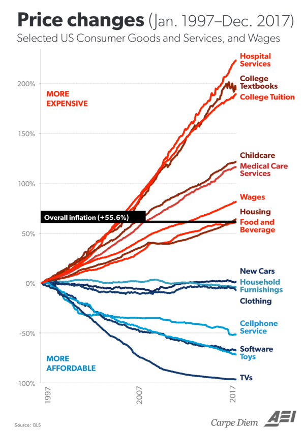

# Mises and Hayek or Bust: Avoiding Extinction by Economic Ignorance [Coronavirus ed.]

    

## Preface

This is an Open Source book which anyone can contribute to by going to our github site at https://github.com/VitalEconomics/Book1

Visit www.econogospel.com,  facebook.com/econogospel/

This work is licensed under a Creative Commons Attribution 4.0 International License

https://creativecommons.org/licenses/by/4.0/

Version 0.81

## Introduction: Without Mises and Hayek mankind drifts towards extinction

During the early days in the lead-up to World War I (July 1914) there was an atmosphere of joy and excitement as thousands of young men celebrated and volunteered for the coming war which would bring unity, purpose, and glory. After the war, when much of Europe lay in ruins and about 18 million lives lost (6.5 million invalids just in France), people were numb and in a state of stupor, wondering how they could have fooled themselves into such needless carnage. Why did this happen? And if it was such a big deal at the time, worth sacrificing so much, how come hardly anybody knows anything about it today? 20 years later via WWII the tribalistic slaughter led to over 80 million deaths and what followed was a "Cold War" that brought mankind close to nuclear annihilation several times. Why were our "great leaders" and "intellectuals" utterly powerless to prevent the WWI/II slaughters? How can mankind build mindbogglingly complex microchips, the Internet and so much more, yet still not have figured out something as simple as peace and always be one spark away from another world-wide calamity? There is something missing from our understanding of how the world works, something that our "leading intellectuals" and "experts" have yet to discover and spread accordingly. That "something" has already been discovered and explained by 1974 Nobel Laureate in Economics F.A. Hayek and can be summarized as follows: Human beings are slightly smarter apes whose nature and instincts are ideally suited to living in small tribes but find themselves relatively maladapted to living in the modern socioeconomic order. Violence, tribal warfare, and rape are things we have been doing for millions of years and are thus somewhat intuitive, but understanding how money, profit/loss calculation, economic competition, interest rates and other  the aforementioned economic concepts which have been around for less than a few thousand years is not. This is one of the main reasons why we are so susceptible to disastrous wars and 

 We are sort of living in a matrix/'Social Organism' whose workings hardly anyone really understands (unless you have heard of Ludwig von Mises), and whose evolution is understood by and even smaller number of people (Hayek is needed here). Either these men's monumental contributions reach the general public or mankind will prove to be an evolutionary dead end. It is that simple.

The human body and the numerous "systems" that coordinate it like the respiratory, nervous, and digestive "systems", is the result of the actions of some 30 trillion cells but obviously NOT the result of any conscious planning, designing, or conspiring by them. Thanks to the likes of Darwin and a modern understanding of genetics we can understand how natural selection was the inadvertent "designer" of such systems and complex order. The global socioeconomic order/'Social Organism' is also coordinated by a "system", by what economists of the so-called 'Austrian School', like Hayek and his great mentor Ludwig von Mises, referred to as "The Market Process". 'The Market Process' and the "parts" it is composed of like money, prices, economic competition, interest rates, and the legal/religious/governmental frameworks that sustain it, "are indeed the result of human action, but not the execution of any human design" (Adam Ferguson). The 'market process' shares this trait with language which is also a complex mechanism that is the result of human action but was not consciously designed or invented by people/cells. Just like cells are unaware of why they act the way they do and how natural selection has evolved them over billions of years to be parts of complex multi-cellular organisms, so is mankind ignorant of how "processes of selective evolution" have shaped "the brain and society" and created "the market process" which coordinates our actions to create the global socioeconomic order. This ignorance of how the socioeconomic order works and has evolved is what keeps plunging mankind into tribalistic world wars and economic disasters like the current Coronavirus-related economic calamity. 

Standing on Mises' shoulders, who provided him with a superb explanation of the workings of the economy and thus all aspects of the market process(money/prices/interest rates/etc.) and much, much, much more, Hayek would go on to explain how in a few thousand years culture and 'the market process' had co-evolved to transform homo sapiens, from tribes of slightly smarter apes, into today's massively complex global socioeconomic order/'Social Organism' thus arguably becoming the first person in the history of mankind to provide a complete evolutionary understanding of how the world works. Hayek is still is so far ahead of our time that even today's leading thinkers, like renowned popular science writer Matt Ridley, are just beginning to catch up to the enormity of his insights. Ridley humbly acknowledges this in a 2011 speech where he mentions:

>"As someone who came to Fredrick von Hayek comparatively late in life, I'm still catching up with him...Indeed, many of the insights I thought I had discovered in my own readings and writings on the frontier of evolutionary biology and economics it turns out Hayek had long before me...It's Hayek who first puts it all together." - [Matt Ridley](https://www.youtube.com/watch?v=pG-grkJPU8Q)

So how did Hayek 'put it all together'?. Easy. Hayek realized that "all enduring structures above the level of the simplest atoms, and up to the brain and society" require precise information to sustain/coordinate/expand their order. If one understands how information coordinates the biological and social orders, then one understands how the world works. It is that simple! Let's briefly try to get a feel for how Hayek saw the world. 

What follows below can be roughly divided into two parts, the first discusses how the socioeconomic order works, and the second how it has co-evolved with culture/religion/ideology. As we do so we try to focus on how economic ignorance is the root of mankind's most pressing problems like the current Coronavirus-related problems and antisemitsm/(Jew-Gentile relations) which continues to play such a disastrous role in the Middle East and propagates fallacious/polarizing "good" vs. "evil" thinking with countless potential civilization-ending repercussions. 

This essay is written with a 'Misesian Ethos'. Ludwig von Mises believed that "Economics deals with society’s fundamental problems; it concerns everyone and belongs to all. It is the main and proper study of every [citizen”](https://mises.org/library/human-action-0/html/pp/932) and is thus written with the hope/expectation that it can be understood by the curious/motivated layperson. Mises again:

>"If we want to avoid the destruction of Western civilization and the relapse into primitive wretchedness, we must change the mentality of our fellow citizens. We must make them realize what they owe to the much vilified "economic freedom," the system of free enterprise and capitalism. The intellectuals and those who call themselves educated must use their superior cognitive faculties and power of reasoning for the refutation of erroneous ideas about social, political and economic problems and for the dissemination of a correct grasp of the operation of the market economy. They must start by familiarizing themselves with all the issues involved in order to teach those who are blinded by ignorance and emotions. They must learn in order to acquire the ability to enlighten the misguided many."

This book is put together by people who feel like we have had the miraculous luck of stumbling upon Mises and feel like he is right, that it is possible to teach how "economic freedom" works to "the immense majority" and that if we fail ["then there is no hope left for mankind".](https://www.econlib.org/book-chapters/chapter-part-2-chapter-viii-human-society/) 
## Biological and Social Order

"Enduring structures" like living things and society are self-perpetuating orders that are in continuous cycles of wealth production and consumption. Production involves the transformation or relocation of matter to create wealth, and consumption transforms/relocates wealth/matter in a way that sustains or expands living things/orders and their internal parts/orders. The Sun sends us photons/energy which the process of photosynthesis is able to store in chemical form. This energy is then used to power the cycles of production/consumption. If there is more production than consumption then the order is profitable and thus has additional wealth with which to sustain itself for longer periods and/or grow. For example, paramecium are single-celled life-forms that produce food/wealth by swimming around and swallowing small bacteria which they then consume by digesting and transforming them into the various nutrients/wealth needed to maintain and expand the paramecium's internal order and thus life. A more complex multi-cellular animal like a person, is simply a collection of cells (which are themselves orders) which must be productive as a whole in order to produce and then consume the necessary wealth needed to nourish itself and the sub-orders/organs/cells/organelles it is composed of. Today we not only have biological order, we have social order, Spencer's "Social Organism", which is rapidly growing and increasing its 'rate of production', in other words, the rate at which it transforms the earth's matter into human usable wealth/order/life/biomass. Every year, increasingly automated building-sized machinery in the mining industries scrape/mine less than 10 cubic miles of matter from the earth's massive volume of 260 billion cubic miles. This matter is 'collaboratively transformed' or relocated by billions of people as trillions of dollars worth of wealth in terms of cars/computers/buildings/products/etc. are produced thus increasing the word's economic pie of wealth and social order. These continuous cycles of production and consumption require precise knowledge/information. By focusing on how information arises, spreads, and guides these cycles of production and consumption which lead to order/life/society we can have a simple yet profound understanding of how the entire world works.

## Creation and Spread of Information via Biological Evolution

"Processes of selective evolution" can be said to have created two mechanisms for creating two types of orders/"enduring structures", biological and social. The biological order is created via the well-known mechanism of 'biological evolution' with genes being like the sentences which store the information necessary to create/coordinate life/order. Mutations cause new genes and thus new information to arise which leads to a different life-form which is then 'naturally selected' as it inadvertently competes with others, with the winner reproducing more and thus passing on more copies of the better-adapted/"fitter" genes/information/design to later generations.

## More complexity requires more information

The more complex a thing is, the more information is needed to create it and keep it in order. Tiny E. coli bacteria have about 4,000 genes and are relatively simple in structure and function. On the other hand, each human cell has about 25,000 genes thus containing far more information allowing each cell to specialize and take part in a vast "division of labor" by transforming itself into a heart/lung/nerve/etc. cell as a young fetus develops inside the womb. About 500 million years ago, life-forms with brains began to emerge which allowed information to be stored outside of genes. Eventually life-forms evolved that used their brains to be increasingly "social" and cooperate with others to reach even higher levels of relative productivity/fitness/competitiveness which leads us to ourselves, anatomically-modern man (about 50,000 years ago), whose ancestors had spent over 2 million years living in small nomadic tribes of about 15 to 150 people where everyone more or less knew how to do the same things so information was inefficiently repeated across the social order. Just like few genes/information leads to simple bacteria, few brains lead to a simple and relatively unproductive social order. Tribal man had an information storage/sharing problem. Then something wonderful happened, something as momentous in the history of life as the emergence of biological evolution. The so-called 'market process' and its various components like trade, money, economic competition, and very recently "interest rate coordination" began to emerge, thus giving birth to Spencer's "Social Organism".

## Economics

### Production and Consumption

Whenever a person works he produces his labor and whatever wealth it creates thus increasing the economic pie. If you are a freelancer you produce a product/service/wealth and trade it directly with society (customers) for money, and then trade the money back with society for the wealth you consume. If you work for a company, you produce your labor and trade it for money with your “employer” who combines it with the labor of others to produce a product/service/wealth which is then traded with society for the money from which your paycheck comes. Whether you are a freelancer, employee, or company, what is commonly referred to as sales revenue (your paycheck), is an estimate of the total amount of wealth produced. Costs, like employee wages which will be used by them to consume wealth(food,energy,etc.), are an estimate of how much wealth is consumed from the economic pie. And profits, which are the difference between sales revenue (production) and costs (consumption) are an estimate of by how much additional wealth the economic pie has grown. Again, a profitable order is an order (cell/person/company) that produces more than it consumes and is therefore self-sustaining/alive. The global economy or ‘Social Organism’ is really a vast collection of orders that are constantly trading with each other, nourishing each other, each trade taking each participant/order from an inferior to a superior state of well-being from its own perspective, otherwise the trade would not occur. When Carl trades a dollar for a hamburger he values the hamburger more than the dollar and the restaurant values the dollar more than the hamburger so the action of trading takes place, which like all action which is not coerced, takes each participant from an inferior to superior state of wellbeing. Profit/loss calculation motivates and enables all orders to guide their actions in the most profitable and thus pie-increasing way, and, very importantly, it also prevents/incentivizes orders from consuming more than what they produce. The wealthier a person/company/order is, the more this order has produced and exchanged for all this money/wealth. Jeff Bezos is one of the world’s richest men because the social order he helped shape and successfully managed, Amazon.com, has been one of the most productive in the world. We know this is the case because billions of human beings traded their money/wealth for its products/services.

The production of wealth requires the consumption of wealth. For example, if 10,000 men are to spend 2 years producing an airplane factory, they must consume/use the concrete/materials/food/energy/transportation/shelter/wealth that they (as well as their dependents/family) need  while they produce the factory. In other words, there can be no production if there does not already exist enough wealth that can be consumed while production takes place. 

### Money

More money does not equal more wealth. Imagine if everyone in the world suddenly had an extra billion dollars. Would this make society wealthier? No. The amount of REAL wealth(goods/services) has not increased by a single toothpick. It would actually lead to less wealth since many people wound stop working/producing seeing their new-found fortune. Would the 10,000 men above be able to produce the factory if instead of having real wealth to use/consume had to consume pieces of paper with dead presidents on them? Of course not.

More money leads to and enables higher prices. For example, if there are 1,000 people in an island (BlueIsle) and each has $100 for a total of $100,000 in the island, can anything sell for $200,000? Of course not, even if they all combined their money such a transaction could not happen because there isn't enough money, but what if each person had $500 so that there is now a total of $500,000? Then yes obviously, prices could go up to $500,000. So for general prices to go up there HAS to be more money. And who creates the money and is ultimately responsible for a general increase in prices? Generally speaking, today all money is created by governments via their central banks (Federal Reserve in USA) and they are thus responsible for the price increases. Let’s say you print yourself 1,000 trillion dollars and start offering people in the USA’s West coast ridiculous amounts of money for their goods/property/wealth. You buy all the wealth in California, Washington, Oregon, etc. As this is happening Americans are growing richer in terms of money but poorer in terms of what really matters, homes/property/wealth. At some point you make it to Florida, by this time it will be packed with about 300 million Americans and perhaps the 1,000 trillion dollars or more you kept offering people. The price of wealth tends to be the amount of money that is offered in exchange for it given all the other things the money could be traded for. With so much money and so little wealth left, the price of everything would be astronomical and people would be much poorer given that you are the one that possesses most of the wealth in the country. Assuming the total amount of money remains stable, if the economy/wealth is expanding, which can only happen if the rate at which goods/services/wealth is produced is faster than the rate at which it is consumed, we expect general prices to go DOWN because the money will sort of get divided among more goods/wealth so less money per item/wealth means a lower price. If the amount of wealth remains stable or grows slower than the amount/supply of money, then we have more money per item, thus higher prices.

Let's go over a final and very important example. Keep your eye on how much wealth is being produced and consumed, and the relationship between the quantity of money, wealth, and thus prices. Let's say Alan prints himself another $100,000 which is enough to hire half the people in BlueIsle for 3 months while they build him a small castle. Alan thinks this is a great idea, he is paying some people more than what they were making before, there were also a few unemployed or unmotivated-to-work people before but he is offering enough money to get everyone working thus achieving "full-employment". Prior to trading their labor for Alan's paper/money, people were producing stuff that they either wanted/needed to consume themselves or could be sold/traded to others who obviously wanted/needed to consume them, they were producing "socially desired" or "order/life creating/sustaining" stuff like oranges/apples/hair-cuts/blankets/baskets/etc. The day half the population begins working on Alan's castle, the island's economic pie begins to lose half its "socially desired" stuff/wealth since half the population is no longer creating it, and begins increasing the amount of rocks, ladders, and other things for Alan's castle. These things, are NOT "socially desired" or "order creating/sustaining" wealth as judged/calculated by the inhabitants. Since the existing $100,000 will be distributed over half as many socially-desired-goods, this would eventually motivate their prices to about double. However, since Alan is further doubling the money supply as he pays people using his newly printed $100,000, on the last days of castle-building, when half the population is still working on his castle and they have also received most of the new $100,000, prices would have nearly doubled once again making them about 4 times higher than they were before Alan came up with his idea. It should be easy to see that Alan has reordered society in an inferior way. Everyone is "working" and making more money than before, but the unavoidable reality that they are ordered in a less productive way reflects itself in the much higher prices and smaller amount of wealth on average that each can consume. Ideally people now "lose their jobs", and instead of working on the easily identifiable yet disastrous plan laid out by Alan, for a few days there appears to be "chaos" as people discover superior plans and likely transition to their old trades/jobs thus once again reordering society on a far, far more productive way. However, they are **economically ignorant**, so they tell Alan "Can you hire us again to make the castle bigger? You pay us more than what we used to make before. You are about to create massive unemployment". Alan thinks to himself "Gosh! It is a good thing that by creating money I am preventing massive unemployment and chaos. Obviously I must keep providing 'liquidity'!" So the relative suffering continues. Had Alan been a bad king, who instead of creating money to acquire the necessary wealth to create his castle, simply taxed people at a 50% rate, the people's living standard would have suffered similarly, but they would have easily understood the fact that their wealth was taken from them for the creation of things they didn't want or benefit from for a hopefully more obvious massive loss.

### Trade, Money and the Division of Labor and Information

Trade and money led to the "division of labor and information" which allowed the social order to efficiently compartmentalize information in only the brains that needed it and also accumulate a virtually limitless amount of information with which to continuously restructure itself in increasingly more productive/advanced ways. For example, Mark's brain contains knowledge of how to get coconuts and process them to create pastries. Tom's brain contains knowledge of how to find the best vines and weave them together to make baskets. Jim's of where to find rocks which when split can create sharp knives and how to sharpen them. When Mark trades his pastries for Tom's baskets and Jim's knives he is a benefactor of all the knowledge needed to creating those items yet he only had to know how to make his pastries. Unlike the tribal social order where knowledge is inefficiently repeated across every brain, trade allows for information to be efficiently stored fewer times freeing up more brains to contain more information. We can envision 1,000 men producing and trading 1,000 different types of items requiring 1,000 times more information which without trade and the 'division of information' that it enables would have been impossible to achieve in a tribal society. Also, when Mark trades his pastries for the baskets and knives he can now make less trips to gather coconuts by using the baskets and process them faster by using the knives and thus increase his 'rate of production' from 2 to 10 pastries per day. The pastry-making process has become more productive and also more complex because it was enabled by basket and knife making knowledge. We now have a never-ending cycle of increased 'rate of production' and complexity -> population growth (more brains) -> increased 'rate of production' and complexity -> more brains -> … leading to where we are today with nearly 8 billion people and the inability to fully trace the knowledge that enabled the creation of anything. For example, a web-designer can trade his services which are dependent on web-design information that resides in his brain for money, and then trade the money for any of the billions of products/services that exist in the world and are likewise dependent on information spread throughout the world. The websites he creates are also enabled by all the information that enabled the "factors of production" he used to create them, like his computer, monitor, keyboard, software, electricity, the Internet, etc., which themselves are enabled by all the information that enabled their "factors of production" like the computer's memory, processor, and so on. Everything that is produced today is the result of an interdependence of information that spans millions of minds, not just in the present, but in the past as well, because wealth that is currently being produced/consumed is dependent on tools/'factors of production'/information provided further in the past. When he upgrades to a better computer, the information that enabled these improvements also contributes to/enables the improvement of his website production process. Without money how would a heart surgeon trade his costly services for toothpicks? Without trade and money, this "division of labor and information" as well as the inter-temporal cooperation/interlocking/stacking of information just described, and the ability to do profit/loss calculation to ensure that each order guides its actions in a manner that it produces more than it consumes, would not exist and neither would our social order which depends on it.
### Creation and Spread of Information via Economic Competition

In the 'Social Organism' new/superior information arises and spreads largely thanks to economic competition. Economic competition motivates the social order's billions of minds/CPUs to constantly innovate and copy each other's innovations thus continuously generating and spreading superior information, inadvertently reordering society as fast as humanly possible/profitable, turning it into a sort of super-computer which coordinates the transformation of matter into socioeconomic order/life. For example, all private sector orders/companies like BMW, Ford, and Toyota are constantly innovating and copying each other's innovations like power door-locks/windows and more recently electric vehicles thus continuously creating/spreading superior information and subsequent order. Why do they do this? Because people/orders have the freedom to trade their life/order-sustaining wealth with the better informed auto-manufacturers/competitors. This in turn motivates all competitors/orders to learn/copy each other lest they not get enough revenue/wealth with which to pay their employees a competitive wage so they leave to join the better informed and thus more productive/efficient orders. This wonderful automatic mechanism is "turned on" or "emerges" from the simple concept, or better said, tradition of 'private property'. Private property gives everyone in our role as consumers the 'freedom to trade' our life/order-sustaining wealth for what we calculate/think is best. This 'freedom to trade/choose' in turn motivates everyone, in our role as producers, to discover how to order ourselves in a manner that produces something society/customers value (our labor, a product/service), which we do by, once again, innovating and/or copying/learning existing ideas/information, in other words, by competing in the economic sense. Most of us simply choose to produce and then trade our labor with a company/order that knows how to further incorporate our labor in a more competitive/profitable way.

A mind/CPU anywhere in the planet that comes up with an improvement will benefit everyone in the world if they are free to trade for his product/service which will also motivate all competitors in the world to likewise improve their actions/order. So we can see how just like in the Olympics we can discover the best athletes in the world due to global competition, so does having the freedom to trade with everyone in the world allows the best ideas to compete/spread globally thus ensuring the best possible global order. As cost-cutting ideas emerge and inevitably spread via competition leading prices to continuously fall, new profitable ideas easily arise and once again spread via competition in an endless cycle of knowledge generation/innovation. For example, computers were once very expensive, but once the price of making them came down enough, people easily realized that every home could have them, which gave birth to our computerized world and the Internet and all the great things that flow from it. The more wealth is produced, the more wealth has to be offered in exchange for labor as companies/orders compete against each other for the labor they need which helps explain why the economic pie grows for everyone. For example, imagine that after a shipwreck you end up in an island where everyone has a machine that can turn dirt into food. Tom wants your labor to build a home, Mark, to build a boat, and Gina to plant a garden. Competition will motivate them to offer you all the food you want and more.  

### Prices and the Impossibility of 'Central Planning'/Socialism/Communism

How much wealth had to be consumed in order to produce a gallon of gasoline that sells in Seattle for $3.50? Or a pound of beef that sells in a store in London for $5.35? We can't know for sure, however, we can be fairly certain that it was less than the advertised price which on average must include the costs. The price of any item in the world lets us know that there is an order at that particular place and time that is coordinated by information that can produce the item while consuming less than the advertised price. THAT IS AMAZING! This allow goods to be purchased and combined in a manner that ensures that the combination (like a car) can easily have a price set that properly accounts for the costs/consumption of the whole (car) by just adding the prices of the parts used to produce it (wheels, glass, robotics, labor, etc.), parts which themselves had a price set that included their costs/consumption and so on, each part/input managed/ordered by entrepreneurs with highly specialized time-and-place specific information who are always using profit/loss calculation to ensure they are increasing the economic pie. The concept/tradition of 'private property' plays a vital role here as well, it is not until things are privately owned, that they are controlled/coordinated by brains/CPUs that are incentivized to use/reorder/coordinate them in the most productive/profitable way possible.

The information needed to create/coordinate the social order, like whether to produce cars, or buildings, or pizzas, where to do so, what prices to set, and most importantly, how to produce them in a manner that more wealth is produced than consumed, is information that can only be created by free people dispersed throughout the world thus rendering central planning ideologies like Socialism/Communism IMPOSSIBLE regardless of the good intentions of their members or their intelligence. For example, a Cuban restaurant in Miami Beach sells a picadillo dish (ground beef, plantains, rice) for $8. Perhaps $1 might be profit, and $7 will be spent in costs, in other words, in the necessary consumption of wealth needed to produce the meal/wealth, things like equipment/electricity/food, and everything employees and their families will consume at home (food, energy) thanks to their paychecks that came from the $7/meal. The businessman discovered 1) that there are enough customers nearby willing to patronize the restaurant at the $8/meal price which necessitates taking into account customer's already existing local competitive options thus providing an improvement in society, and 2) how to reorder $7 worth of stuff(labor/supplies/etc.) to produce the meal. If he sets prices too high, customers will choose other superior existing competing options. If he sets prices too low, he won't cover costs and cause more consumption than production thus shrinking the economic pie. These are two vital things that are impossible for a central planning body to discover and helps explain why every time Communism has been attempted the result has been a much faster rate of consumption than production and eventual famine/starvation/chaos/death.

Since prices that properly estimate costs/consumption can only be set by free entrepreneurs, when the government (central planners) attempts to set them via "price controls" it warps the socioeconomic order in inferior ways. For example, if the free-market price of a gallon of milk is $2.30 in a particular store in Miami which profits 0.30 per gallon (costs = $2.00) and the government mandates the price to be $1.99, then the business is consuming more wealth ($2.00) than what it gets ($1.99) and will eventually go bankrupt causing less milk to be produced leading to shortages. Even if the government sets the price to, say $2.15, so that the business can still profit, it will still lead to eventual shortages for the following reasons. Under normal circumstances the rate of profit tends to be equal/uniform across all sectors/businesses, if higher-than-average profits are being made in say auto-manufacturing, factors of production like labor, materials, real-estate are withdrawn from other less profitable sectors which reduces production/competition in them causing profits to go up in those sectors, while simultaneously increasing production/competition in the auto-manufacturing sector causing the initial higher-than-average rate of profit to go down towards average levels. So by making profits in milk production lower than the average it still has the effect of decreasing, albeit less drastically, milk production which is the opposite of what the economically ignorant masses and politicians want.

It is important to envision the socioeconomic order as it really exists as if looked at from high above. Envision people coming together/apart as companies/orders emerge and dissolve in ever-changing conditions. Superior information arising and rippling/restructuring the social order thanks to competition. As orders get more productive they lure other people to 'trade-with'/'join-them' by offering more money/wealth for their labor relative to other companies/orders, eventually causing the least productive orders to sort of dissolve as their 'factors of production' like labor, buildings, etc. are bid away to be parts of more productive plans/orders. A sort of swarm intelligence emerges as the all-pervasive public quickly nourishes the growth and spread or superior orders/companies/information, inadvertently expanding the worldwide "division of labor and information" as entire neighborhoods/cities morph themselves in specialized ways as complementary pieces of information/orders segregate themselves in distinct geographical locations like the software industry in Silicon Valley, California and manufacturing in Guangdong, southern China. As Mises reminds us "The division of labour is a fundamental principle of all forms of life." The division of labor is a pattern/way which natural selection rediscovers to enable smaller units/orders to efficiently compartmentalize labor/information as they contribute-to (and are nourished-by) a larger organism they become parts of(Organelles -> Cells -> Organs -> Humans -> Social Organism).

### Savings, Interest Rates and Business Cycles

Finance/banking and interest rates are other vital aspects of the 'Market Process'. Besides the more obvious function of safeguarding savings and pooling the savings of many people to allow the execution of bigger projects which would have been impossible if entrepreneurs were limited to the few savings/wealth of friends and family, banking/finance and more specifically the phenomenon of 'interest rates' also play a nearly miraculous role. For example, assuming interest rates are at around 8-10%, some people, those who have no desire to start a business or have inferior business ideas they expect will have a return on investment (ROI) lower than 8%, will be motivated to lend their money to banks to earn ~8% interest and by doing so they refrain from consumption/spending, thus increasing the amount of wealth/savings available to the future borrowers. The banks are a place where such saved money can be combined, easily accessed and loaned out in different quantities to nourish ideas/businesses/restructurings of different sizes. Banks charge borrowers a higher interest than what they pay to savers/lenders and profit the difference. For example, they lend 1 million to John who uses the money to pay for his business' consumption as it produces (has sales revenue) $1,300,000 worth of stuff thus growing the economic pie by 30%. He pays back loan with the 10% interest (1.1 million) and keeps the $200,000. The Bank pays the savers 8% ($80,000) and keeps the %2 ($20,000) with which to pay-for/nourish its own consumption. Something amazing is going on here!!!. Interest rates motivate the accumulation of wealth and movement of money from minds/CPUs that have inferior ideas that can grow the economic pie slowly (0-8% rate) to minds that have superior ideas and can grow the economy faster (> 10%) thus giving a tremendous sort of 'computational boost' to society. To the economically ignorant, banks/financers/money-lenders, making a living by charging interest without seemingly having to "sweat" seems immoral/unethical, but the economically woke can see how they play a vital role in pairing savings with the best ideas and the interest rate is like a barometer that helps decide whether a mind should do the saving or borrowing. It is important to realize that, as the great economist Henry Hazlitt writes in his classic “Economics in One Lesson”:

>“ “Saving,” in short, in the modern world, is only another form of spending. The usual difference is that the money is turned over to someone else to spend on means to increase production”,

and that this increase in production has to be at least large enough to pay back the loan with interest. A society that saves little is sort of stuck in the same cycle of production and consumption and is unable to nourish a new business/idea/restructuring for the time it might take before it produces wealth. Where would our 10,000 airplane factory builders get the wealth to nourish their consumption for the 2 years it would take them to even begin making new planes if others had not saved it? How long would it take for such savings/wealth to exist if savings grow very slowly? On the other hand, a society that saves a lot is constantly making wealth available for superior ideas/businesses/restructurings and thus growing and advancing technologically much faster. 

The more people save, the more money banks will have to lend out and the lower the interest rate will be as banks compete with each other by offering a lower interest rate to lure borrowers. This also means that there is more REAL wealth available to sustain more ideas/businesses, the REAL wealth that savers did NOT consume when they gave their money to banks. If interest rates are at 10%, it does not make sense to borrow/consume to nourish an idea/restructuring that will have a return on investment of less than 10%, but if they go down to 3%, then it does make sense for additional entrepreneurs to borrow and nourish ideas that will yield 10% ROI to profit the 7% difference. Now, VERY IMPORTANT!. What happens if interest rates are lowered, not because more saved/unconsumed wealth is available, but because central banks increased the money supply("bank credit") to "artificially lower" interest rates from the "natural rate" of 10%, to the "artificial rate" of 3%? What happens is that additional projects/ideas which would NOT have been attempted before will now be attempted even though the needed wealth to sustain them to profitable completion will not exist eventually leading to a sort of "bust"/bankruptcies, and partly-finished projects which squandered wealth. Mises has a masterful analogy that goes as follows. At any moment in time given a certain real "natural rate"(again, we assume 10%), there exists enough wealth in terms of bricks/wealth needed to create 100 buildings/projects. If people have really saved more to bring down the interest rate from 10% to 3% there are now more bricks/wealth and 120 buildings/projects can be completed, but if the interest rate has gone down to 3%, not because there really are more bricks/wealth/savings, but because more money has been created, the bases and some scaffolding for 120 buildings is attempted, but eventually, due to the fact that there are now more businessmen with more newly created money which was used to lower the interest rate competing for the same amount of bricks/wealth, the price of bricks (factors of production like labor,land,energy,materials) goes up more than would have otherwise been the case, which eventually causes many entrepreneurs to face the unavoidable fact that there did not exist enough wealth/bricks at the right prices to complete their projects in a profitable way, therefore a sort of bust/chaos and loss of wealth will eventually happen as inevitable bankruptcies occur. Partly finished buildings that are inhabitable are obviously massive losses, and even though eventually perhaps 70 buildings are completed, the wealth/bricks that could have completed an extra 30 was consumed/used to create 50 unfinished ones. Mises summarizes:

>“Credit expansion cannot increase the supply of real goods. It merely brings about a rearrangement. It diverts capital investment away from the course prescribed by the state of economic wealth and market conditions. It causes production to pursue paths which it would not follow unless the economy were to acquire an increase in material goods. As a result, the upswing lacks a solid base. It is not real prosperity. It is illusory prosperity. It did not develop from an increase in economic wealth. Rather, it arose because the credit expansion created the illusion of such an increase. Sooner or later it must become apparent that this economic situation is built on sand.” (Mises L. v., 2006, p. 162)[i]

The sort of bust/chaos will occur in one of two ways depending on how the central banks act. If the myth/error that creating "liquidity"/money is beneficial persists, either by sending money to people directly or adding it to banks to keep interest rates low, then the hopefully obvious result is hyperinflation and an intensifying unproductive chaos as money's vital coordination of profit/loss/economic calculation breaks down, leading to more consumption than production, riots, famine, who knows. Eventually people will switch to a foreign currency or something else for money. The better scenario is that the central banks stop the money-creation which will cause interest rates to rise to whatever level truly coordinates the level of savings and investment possible. Initially this will be very high which is great, those projects/businesses for which there weren't enough bricks/wealth to complete in a truly profitable manner and were fooled into trying by borrowing at low interest rates, will no longer be able to do so and finally go bankrupt and their 'factors of production', like existing buildings and labor, will be sold off and their prices will come down enough to the point where entrepreneurs will once again be able to incorporate them into truly profitable plans/orders thus realigning the social structure of production in best possible way. Again, the information needed to best organize orders/society can only/best be discovered and acted upon by free people who are at the right time and place and have the ideal incentives. No matter how chaotic it might seem due to the potential number of bankruptcies and seeming reduction in wages, the quicker we allow prices to fall, the quicker will entrepreneurs/people discover how to once again order labor and existing "factors of production" in profitable and thus truly pie-increasing ways. This applies just as much to a recovery from a Central Banking created business cycle as it does to quickly figuring out how to reorder millions of people who are out of work due to Coronavirus-hype and related government lockdowns. Right now I could easily hire 30 people in my building for $2/hour and rent them out to give massages, do laundry, deliveries, etc., however, competition from other entrepreneurs/brains/CPUs who have superior information would quickly pay them more so that quickly everyone would be incorporated in the most profitable plans the millions of brains can come up with. It is of course vitally important that minimum wage laws are abolished so we do not criminalize out of existence those ideas which can create a profitable order out of the least skilled/productive. Economic education is obviously the most important thing needed to allow this to happen. 

 Hayek summarizes the cure:

>“And, if we pass from the moment of actual crisis to the situation in the following depression, it is still more difficult to see what lasting good effects can come from credit-expansion. The thing which is needed to secure healthy conditions is the most speedy and complete adaptation possible of the structure of production … determined by voluntary saving and spending. If the proportion as determined by the voluntary decisions of individuals is distorted by the creation of artificial demand, it must mean that part of the available resources is again led into a wrong direction and a definite and lasting adjustment is again postponed. And, even if the absorption of the unemployed resources were to be quickened this way, it would only mean that the seed would already be sown for new disturbances and new crises. The only way permanently to “mobilize” all available resources is, therefore, not to use artificial stimulants—whether during a crisis or thereafter—but to leave it to time to affect a permanent cure by the slow process of adapting the structure of production to the means available for capital purposes.” (Hayek F. A., 1932, pp. 86-87)

#### You can't print savings/wealth. The Errors of Keynes, Krugman and the mainstream.

It should be easy to see that you can’t “print savings” at least not the REAL wealth/savings that the REAL world needs, yet to John Maynard Keynes, arguably the most famous mainstream economist, such money-only savings “are just as genuine as any other savings” (p. 83) Let’s look at another absurd statement from Keynes which further reflects the utter ignorance of the vital role savings play in the economy:

>“…whenever you save five shillings, you put a man out of work for a day. Your saving that five shillings adds to unemployment to the extent of one man for one day — and so in proportion. On the other hand, whenever you buy goods you increase employment…For if you buy goods, someone will have to make them. And if you do not buy goods, the shops will not clear their stocks, they will not give repeat orders, and some one will be thrown out of work. Therefore, oh patriotic housewives, sally out to-morrow early into the streets and go to the wonderful sales which are everywhere advertised. You will do yourselves good…And have the added joy that you are increasing employment, adding to the wealth of the country because you are setting on foot useful activities…Surely all this is the most obvious common sense. For take the extreme case. Suppose we were to stop spending our incomes altogether, and were to save the lot. Why, every one would be out of work. And before long we should have no incomes to spend.” (Keynes, 1963, pp. 152–3)

Wow! First of all, when most people save their money they invest it, which for the general case here we’ll just assume that it is loaned out at interest. The money still gets spent by the borrowers as Hazlitt already reminded us. With respect to his “extreme case” where people save all their income and don’t spend. Why bring up such a foolish scenario that would never be in anyone’s best interest to attempt? Who does not want to trade/spend for the food, gasoline, wealth they need to survive?

Keynes, like most of his adherents (and the public at large sadly), is also utterly ignorant of the vital fact that ‘economic activity’ must be coordinated in a way that produces more than it consumes, otherwise it is obviously shrinking the economic pie. Yet this coordination requires precise knowledge and is something only millions of free individuals and businessmen can achieve by using profit/loss calculation at the individual, household, and corporate level. Unaware of this, Keynes disastrously encourages the purposeful destruction of wealth just so people are put to work rebuilding it even though the effects of this are a massive shrinking of the economic pie. He writes:

>“…activity of one kind or another is the only possible means of making the wheels of economic progress and of the production of wealth go round again.…why not pull down the whole of South London from Westminster to Greenwich, and make a good job of it…Would that employ men? Why, of course it would!” (Keynes, 1963, pp. 153–4)

One should not be fooled by fancy money-related terms or mathematical equations. Complex-looking mathematical equations/models are just as inappropriate for making sense of the socioeconomic order as they are for making sense of how trillions of cells, bacteria and viruses coordinate the biological one. If you just keep your eye on the cycle of wealth production and consumption, most economic fallacies can easily be avoided. The housing that comprises the ‘South of London’ exists, it is then destroyed thus a huge loss in wealth has occurred, then a massive amount of existing wealth has to be consumed in terms of food/energy/materials/etc. to sustain many men who produce new buildings. The net result is the loss of existing housing and the wealth needed in exchange for new buildings. Had the housing not been destroyed, Londoners would’ve still had them plus new housing or whatever else the men would have produced as they consumed the same amount of existing wealth as before.

So the erroneous belief that real savings/wealth can be “printed” to then “stimulate the economy” (i.e. ‘activity of one kind or another’ even if you have 0 regard for whether the people are ordered in a way that produces more than it consumes), provide the one-two punch of fallacies that keep the mainstream making the same errors over and over, culminating in the most horrific economic fallacy that could possibly exist, that war is good for the economy and its corollary, that WWII is what got the USA out of the Great Depression of the 1930s. Consider the following absurdity by 2008 Nobel Laureate in Economics Paul Krugman:

>"Think about WWII…it brought us out[of the great depression]. If we discovered that, you know, space aliens were planning to attack and we needed a massive buildup to counter the space alien threat…this slump would be over in 18 months"

How can getting millions of people to consume/wear-down existing wealth to produce weapons which are then used to destroy fellow human beings and their property be anything other than an obvious reduction in life/wealth/order? Krugman's statement is the perfect example of what Mises once told students: 

>"Don't be afraid to speak up. Remember, whatever you say about the subject and however wrong it might be, the same thing has already been said by some eminent economist."

### Morals as Superior Information

We should quickly add that morals are simply ways of acting, they are knowledge which also emerges and spreads via economic competition. Companies/orders that hire/nourish/'trade with' lazy, disrespectful, or corrupt people will be less competitive and be inevitably pressured/selected to hire people with better morals which in turn forces everyone to be respectful and hardworking regardless of race, sex, etc. Similarly, it is hard-working, tolerant, courteous people who thanks to competition inevitably force everyone else to be likewise. As Hayek tells us:

>"Competition is, after all, always a process in which a small number makes it necessary for larger numbers to do what they do not like, be it to work harder, to change habits, or to devote a degree of attention, continuous application, or regularity to their work which without competition would not be needed." (Hayek "Law, Legislation and Liberty, Volume 3: The Political Order of a Free People" 1981, p. 77)

As millions of Italians, Britons, Germans and others from all over the world came to America, it was ultimately the competition which grows from 'private property' and thus individual liberty/freedom which stripped these people of their otherwise nationalistic/ethnocentric/tribalistic identities and evolved what came to be seen as the classic American character/ethos of wanting to be seen as a reputable/honest businessman/professional who treats everyone with respect and wears a business suit as opposed to older religious/ethnocentric dress. So not only does 'private property' "turn on" or leads to economic competition and other aspects of the market process and resulting social order/civilization, it also evolves our culture/identity to be ideally suited for participation in the 'Social Organism'.
### Government/'Public Sector' is an Inefficient Monopoly

Governmental/'public sector' orders, being COERCIVE MONOPOLIES which get their life/order-sustaining wealth through taxes/compulsion are immune to the competitive-information-spreading incentives/pressures which motivate/force private sector orders to be efficient/innovative so they obviously don't have "to work harder, to change habits, or to devote a degree of attention, continuous application, or regularity to their work" which should help one further understand how Communism, which abolishes competing orders and replaces them with a single competition-less monopolistic bureaucracy, lacks both incentives/pressures to innovate/learn as well as "work harder" thus leading to a massive lack of production/innovation and eventually socioeconomic chaos/starvation as the economic pie continuously shrinks as has happened in every country that consciously attempts Communism/Socialism or inadvertently drifts in that direction as their governments get bigger and bigger (USA/Word). The image below is another one of our most powerful memes for explaining the difference between competitive/private orders(South Korea) and monopolistic/government orders (North Korea). Again, keep your eye on how information arises/spreads and continuously restructures the social order.

### Regulatory Paralysis

With our focus on how information arises and coordinates life/order, we can see that a government regulation is essentially a "way" of doing things, it is information. But unlike information that arises in the private/competitive sector and is constantly being replaced by superior information due to economic competition, a government regulation is information that arises out of a few brains and is then forced upon the entire social order via the law and can only be changed via a painfully slow monopolistic/bureaucratic apparatus made up of economically ignorant politicians, lawyers, lobbyists and special interest groups who always lack the necessary local time-and-place-knowledge and incentives to discover what is the best way to do something. The more the government regulates, the more it paralyzes competitive knowledge discovery. As government regulations have increased in the health care sector, turning it into a sort of island of paralyzed top-down competition-less/socialist central planning, so have costs. These increased costs have led the sector to grow from consuming just 1.6% of the American economic pie in 1960 to 4.2% in 1980 to a whopping 16% in 2006 and about 18% by 2017. The image below helps explain the regulatory paralysis/bureaucratization of the entire medical sector which is responsible for the skyrocketing costs.

What a person must learn in order to legally offer medical advice via licensing of doctors, where he must learn it via licensing of medical schools, what chemical compounds can be legally consumed, how to test drugs, how the medical insurance industry should work, and countless other gigantic bodies of knowledge/information are dictated by monopolistic competition-less bureaucracies like the American Medical Association (AMA), the Food And Drug Administration (FDA) and numerous others. By comparison, the Information Technology sector has very few government regulations so competition motivates the creation and spread of superior information at breakneck speed and is obviously transforming our world right before our eyes. Teenagers can work at Google/Microsoft/Amazon and write the software that keeps planes in the sky or people alive via software in medical equipment, yet there is no American Association of Computer Programmers dictating what or where such knowledge can be obtained similar to how the government via the AMA regulates/monopolizes/paralyzes the medical sector via the licensing of doctors, medical schools, insurance sector, etc. There is no government monopolistic bureaucracy ensuring the proper functioning of the software that runs PCs, smart-phones, the Internet, or ensuring the lack of malware or viruses in software. Freedom and competition in the Software Development industry is even quickly evolving culture. It is increasingly seen as uncool and backward to have a traditional degree, where one wastes thousands of dollars and time physically attending gigantic temple-like universities, inefficiently ("professors" instead of popular online videos you can pause/rewind) "learning" things that have nothing (English 101, etc.) to do with being a productive software/web/IT professional. Thanks to this lack of monopolistic centralized decision making/regulating/paralyzing, education in the Software Development/IT world is astounding. At places like www.freecodecamp.org thousands of people are going from 0 experience to highly-paid computer programmers in just a few months for free. IT companies who reach a large enough size ultimately due to the great services they provide, and therefore the useful/profitable knowledge they contain, like Microsoft, Google, Amazon, and many others, go about creating their own educational institutions which train and test people using their products and technologies which are solving real problems and have been shaped by years of fierce competition. There are over 2.1 million individuals worldwide who have become Microsoft Certified Professionals(MCPs) by studying for and passing exams created by Microsoft. These exams change frequently to reflect the never-ending cycle of knowledge generation that exists in this freer and less regulated sector of the economy. Economic ignorance leads many to believe that since one has to be seemingly more careful with medicine, such monopolistic regulatory oversight is somehow necessary. This is irrelevant, if it is superior knowledge that is needed, which includes figuring out how careful to be, freedom and competition is the best way to discover it, period. In graph below one can see how the more regulated a sector is (Hospital Services) the more expensive/consumptive it becomes.

One of the numerous flaws in how the AMA goes about regulating the world of medicine is in the assumption that medical professionals have to be some of the brightest and most dedicated people around, which it attempts to achieve by making entry into medical school and training such an arduous and ultimately expensive process. But this assumption is false, what cures people, or produces any product or service in today's world, is not so much hard working bright individuals, it is the tremendous amount of knowledge and cheap technology that the market-process-coordinated world puts at our fingertips. This flaw is not specific to the AMA, it applies to our educational establishments and much of how we look at learning and the role of human intelligence. The market process and resulting world-wide "division of labor and information" is far, far more important than individual intelligence/IQ/effort. For example, Mike knows he can incorporate Tom (who has down syndrome) into his landscaping company by having him perform simple tasks in a manner that increases the company's 'rate of production/revenue' in terms of landscaping services by an additional 4/hour (640/month). Mike trades 3/hour (480/month) for Tom's labor to make a 1/hour (160/month) profit, and after just 10 hours of labor/production and trade, Tom can produce a mindbogglingly complex tablet by trading his 30 for it. Thus it currently takes about 10 hours of labor for a low-IQ person to produce something that was impossible to create just 20 years ago. "But he didn't really create the tablet!" thinks the economically ignorant. But guess what? The economically woke knows the neither did the company that "manufactured it". Did such a company create the tablet's CPU? Or the memory/camera/touchscreen/battery/plastic? Or any of the machinery/tools required to produce the aforementioned components? Of course not. The "manufacturer", just like Tom, mostly traded and added a relatively minuscule amount of new information compared to what it already got from the "Social Organism" and its world-wide division of labor/information that has been evolving for thousands of years. Due to massive economic ignorance, Tom's truly astounding rate of production is impossible to achieve because it is either illegal for someone to trade their labor/production for a rate lower than the minimum of 12/hour (i.e. California), or because the legal expenses related to paying someone less than the minimum make it unprofitable to do so. Minimum wage laws are regulations which essentially outlaw all production that does not occur faster than the legally mandated minimum.

Government regulations, which again, are knowledge or information which is imposed on the social order by force, not only paralyze the superior competitive knowledge discovery that would otherwise exist and enable the growth of paralyzing/inefficient bureaucracies, they also allow BAD ideas to be much harder to change. We only have to remind ourselves of the Catholic Church’s regulation of speech/thought which led to the persecution of thinkers like Galileo Galilei and thus the general retardation of scientific progress to various degrees. Bad ideas, like Socialism/Communism must have intellectual persecution in order to prevent criticism or ideological competition. So once again we must highlight that freedom, is not only indispensable for the competitive discovery of innovations, but also for discovering the TRUTH.

### Patents

By understanding how patents do far more harm than good we can continue to solidify our vital understanding of how information coordinates the social order. One of the reasons why we so naively fall for the erroneous idea that patents are good for society is because we greatly overestimate the importance of the individual or company making the discovery while being unaware of how it is 'the market process', via its various mechanisms like prices, the profit motive and competition, which plays the key role in innovation. Competing orders/companies, due to the fact that they are already in business competing with each other, contain knowledge that has to be relatively similar. If one competitor has knowledge that leads to much more productivity/profitability, it would drive some competitors out of business, and it would also motivate competitors to copy/emulate the superior knowledge thus leading to a state where once again all competitors contain more or less the same knowledge and inevitably come up with new products/improvements/innovations. Which particular mind manages to stumble upon a new innovation has more to do with chance and circumstances than anything else. Patents inevitably turn competitors which are ultimately cooperators since we are constantly learning from each other as we compete, into bitter rivals; give credit to one where many, or better said, the entire social order via the market process and world-wide division of labor are involved; they slow down the market process by preventing further innovation by competitors whose ideas are based on patented ideas because they now have to pay large sums to patent holders; they remove competitive pressure from patent holders thus making them lazier and worth their time and money to go into the damaging business of suing patent infringes thus retarding technological progress; and since the patent system is overseen by a monopolistic and bureaucratic government organization, it is bound to grow more inefficient and chaotic and also prone to manipulation by the better-connected. Patents, just like regulations, simply create/spread paralysis in the market process. The information technology industry, although less regulated than the health care sector provides a good example of how patents begin to paralyze an industry. Prior to 1981 computer programs could not be patented and this helped spark the explosive growth of the computer/software industry. As Microsoft founder Bill Gates tells us:

>"if people had understood how patents would be granted when most of today's ideas were invented, and had taken out patents, the industry would be at a complete standstill today. I feel certain that some large company will patent some obvious thing… If we assume this company has no need of any of our patents then they have a 17-year right to take as much of our profits as they want. The solution to this is patent exchanges with large companies and patenting as much as we can." [(Bill Gate, "Microsoft Challenges and Strategy," memo, May 16, 1991)](http://antitrust.slated.org/www.iowaconsumercase.org/011607/0000/PX00738.pdf )

So Gates clearly saw how patents would lead to paralysis. Unfortunately his solution at the time was not to argue for the abolishment of patents altogether(which I don't blame him for), but to attempt to protect his company by patenting as many things as possible with which to threaten/protect itself from others in this new ecosystem of warring/litigating patent holders. Given the incentives, this is the strategy that works or is "naturally selected", thus we have bigger and bigger patent holders fighting it out in order to progress, while at the same time making it harder and harder for the little guy or new competitor to innovate.

Without patents, the social order is constantly improving and moving the best information which can be copied freely/quickly, but existing patents inadvertently disincentivise this more ideal outcome and cause research/wealth to be diverted for the discovery of non-patented inferior information. For example, a whopping 77% of new drugs approved by the FDA are not "new" in the sense that they make some significant improvement compared to an existing drug; they are what are referred to as "me-too" drugs. These "me-too" drugs are usually inferior to drugs already on the market to treat the same condition, they simply allow competing drug manufacturers to enter the market to treat a condition where other companies might be making huge profits due to their patents/monopolistic position.

Innovating is a lot easier than people think. As previously mentioned, as prices or costs of production go down, that which was prohibitively expensive becomes possible which in turn makes other things possible and so on. The world is vastly more innovative today than it was 100 years ago not because we got any smarter because obviously our biology has not changed, but because the market process has made it easier to innovate. Some innovations revolutionize entire fields and make it easy for further innovations to come about. For example, how much easier was it for scientists to make biology-related innovations once the electron microscope took magnification from about 2,000 times to over two million? How much easier was it to invent all sorts of gadgets once electricity came about, or computers, or the Internet? The market process and continuously evolving world-wide division of labor can be seen as a sort of ever-growing ladder taking humanity up an infinitely high tree whose fruits are innovations. For the most part all we have to do is easily pick them off the branches when the ladder gets us there. Very expensive endeavors that only seem profitable if granted patents can be seen as attempts to grab a fruit/innovation that is currently too high up in the tree and we are better off just waiting for the normal technological progress to get us there by cheapening all related research/etc. instead of damaging the workings of the system/ladder in an attempt to make gains that really leave us worse off due to the damage made to the ladder/system by patents.

The damaging pro-patent ideology is also adding to tensions between patent enforcing nations and developing nations who are being coerced or erroneously persuaded to implement patents while also being sort of accused of "stealing our ideas without proper compensation". This is rooted in the same fallacy of attributing innovation to those making the innovation as opposed to the market process. So-called "developed" areas like North America, Europe, and Japan became developed because the market process managed to work well enough in those areas as to incentivize and coordinate minds in a way that so much knowledge was created, and this was done, in spite of patents, not because of them. Old people, being more likely to be found with cancers, does not mean that having cancers leads to old age, it means that natural selection has built us in a way that we can continue to live for a while in spite of the cancers. Too much government, just like too much cancer, eventually destroys the super-structure. The market process' ability to organize the social order in ways that lead to what we would call progress is amazing. A little freedom goes a long way. Technological progress in the 20th century has been great, in spite of cancerous government bureaucracies, wars, patents and other misguided government regulatory frameworks which we believe to be the creators or managers of social order while they are in fact its retardants or destroyers to significant degrees. Think about how truly unfair the following is: the Chinese had the misfortune of having much of their 20th century destroyed by war and a truly communist economy which led to the deaths of tens of millions while the market process used millions of brains in the US to discover new ideas, and now that the Chinese increase their freedom and begin to have their social order be coordinated by the market process, they have to pay royalties to the West. This seems pretty "unfair" to me. Developing nations like India and China should not feel like they are "stealing" ideas from the more developed nations, and likewise the United States should not be souring economic relations based on patent infringement which you can be sure is a significant part of the economic saber-rattling that the economically clueless/tribalistic Trump administration is doing.

### The benefits of immigration

The free migration of people allows them to quickly become parts of and expand the most productive orders thus vastly increasing production. A person in Africa is stuck in an unproductive order which lacks good laws (respect for private property of course), roads, advanced tools/factories, large groups of already-highly-educated and productive minds/order so his production might be $5 per day. By just moving to a more advanced/productive country/area like the USA, even without knowing English, he can do many jobs managed/aided by a bilingual English speaker and easily increase his rate of production to say $7/hour or $56/day, an 11-fold increase in his rate of production, benefiting his life tremendously and that of existing American/world producers because they now have additional customers that can actually afford their products instead of poor Africans that can't. In countries like China, every day thousands of relatively unproductive farmers who are producing wealth at a rate of say $4/day are moving to cities to join/work-with/use factories which might triple their rate of production to say $12/day. Similarly, one of the reasons why the USA has been far more productive than the similarly sized Europe is because people have had the freedom to easily move to the areas/companies that are more productive and there have been no internal tariffs and other impediments to free-trade. When countries allow foreign investment, they make it profitable for wealth to be shipped to poor countries to create the tools/factories/order that can increase the productivity of workers, but it is even better when the workers have the freedom to quickly move to and incorporate themselves with the already existing more productive order.  

## Hayekian Cultural Evolution

Having discussed several aspects of the market process like economic competition and interest rates, as well as how 'private property' inadvertently leads to its emergence and civilization, we can now discuss how 'processes of selective evolution' evolved the 'market process'/'Social Organism' without conscious human planning or design. As Carl Menger asks:

>"How can it be that institutions that serve the common welfare and are extremely significant for its development come into being without a common will directed towards establishing [them?"](https://cdn.mises.org/Investigations%20into%20the%20Method%20of%20the%20Social%20Sciences_5.pdf) 

Hayek answered this monumentally important question more or less as follows. If we envision mankind about 50,000 years ago, we would see a sort of petri-dish of competing cultures(languages/concepts/rules/laws) that are being 'naturally selected' based on their ability to grow the groups that contain them relative to other groups. Customs/concepts/rules/etc. that inadvertently cause their respective social orders to grow whether it'd be via conquest, successful defense, migration into, imitation, etc., will expand their order AND the very customs/concepts/rules/ideologies/etc. which helped them thrive. Every rule/law has an effect in the productivity/growth/survival of a social order. Given that a society/tribe is likely to have dozens of such rules it is impossible to know the exact impact of any one of them when considering the overall competitiveness of a society/order. For simplicity's sake let us focus on just one rule, what is the optimal punishment for theft? Let's assume that in culture/tribe 'A' when a man steals he is killed which might deter many thefts but decreases the number of people in the group and all the productivity that this person might contribute in the future. In tribe 'B' they cut off a hand, and in tribe 'C' 10 lashes. Let's assume that tribe A's custom/rule of killing the thief actually proved to lead to a "fitter" social order. Perhaps it turns out that cutting off the hand led to an unproductive person that became a big drain on rest of tribe and a weak/useless fighter when it came to offense/defense so it was better if he was dead, and that lashes proved to not be enough of a deterrent which led to many thefts and retaliatory violence which turned out to be more costly than losing a member of the tribe. For simplicity's sake let us assume that this was by far the most important custom/rule affecting the growth/fitness of the social order, and that because of this, tribe/culture 'A' eventually displaced the others so that its kill-thieves rule/custom survived while the other punishments disappeared. The kill-thieves rule, is the result of human action, yet not the result of conscious human planning or design with the reasoned or conscious goal of having a more competitive/fit social order. The real designing of this rule or cultural element was made, not by innate instinct or human reason, but by 'natural selection'/competition/'group selection'/'cultural evolution'.

This concept of 'cultural evolution'/'group selection' allowed Hayek to identify a sort of 'third dimension'/source/mechanism for discovering/spreading knowledge which was neither instinctual (tied to our genetics/biology), nor the result of our conscious reason. As Hayek liked to refer to it, it was a mechanism for creating/spreading information which laid "between instinct and reason" and is the largely unknown/understood source of knowledge that played the vital role in the evolution of the market process and those related social institutions. Omnipresence, the ability to be everywhere at all times is another concept that would provide a great benefit to religions that used it to describe their God. Without God's omnipresence you could get away with breaking the rules that give society order and only have to face the consequences brought upon by fellow men. But if God is everywhere, watching your every move, you will be much more likely to follow those rules that give your society a productive social order. A similar case can be made for the concepts of "sin" and "evil". Did clever men "conspire" to create our religions to control us? Of course not, like the 'market process' they too "are indeed the result of human action, but not the execution of any human design". These concepts/rules help enforce constraints on what for brevity's sake we'll refer to as our evolved tribalistic('small group')/primate-like nature/instincts, which for millions of years were shaped by things like cannibalism, rape, what today would be considered pedophilia, tribal warfare and other practices which are now generally seen as abhorrent and whose relatively recent suppression via culture/religion/law enabled the emergence of the 'Social Organism'/civilization. Growing up is about programming/molding our flexible brains into learning all of these rules and thus rewiring them to be as happy as possible even though many of these restrictions go counter to our 'uncivilized instincts'. We have tentacle porn, Q.E.D. Obviously the molding/brainwashing fails quite often when we engage in rape/torture/militarism/war/"sin" and more. One can easily speculate about how the simplicity and pro-private-property character of Judaism's Ten Commandments ('Thou shalt not steal/murder/'commit adultery'/ 'covet(neighbor's…)) and monotheism helped it be more 'viral' and thus be 'naturally selected' over other beliefs/religions that might have been more complex/confusing/contradictory and also be less respectful of private property thus inadvertently foregoing the emergence of the market process and corresponding 'Social Organism'/Civilization. Just like natural selection modified solitary cells to have tumor suppressing genes to control rapid cell division/proliferation (cancer) in order to cooperate in a multi-cellular organism, so has cultural evolution likewise molded homo sapiens to suppress these "uncivilized" tendencies. As Hayek tells us:

>"Man has been civilized very much against his wishes. It was the price he had to pay for being able to raise a larger number of children. We especially dislike the economic disciplines… The indispensable rules of the free society require from us much that is unpleasant, such as suffering competition from others, seeing others being richer than ourselves, etc., etc." (Hayek "Law, Legislation and Liberty, Volume 3: The Political Order of a Free People" 1981, p. 168)

>"Constraints on the practices of the small group, it must be emphasized and repeated, are hated. For as we shall see, the individual following them, even though he depend on them for life, does not and usually cannot understand how they function or how they benefit him."…"Disliking these constraints so much, we hardly can be said to have selected them; rather, these constraints selected us: they enabled us to survive." (Hayek "The Fatal Conceit", 1989, p. 14)

### Early Cultural Evolution : Names, Self, Identity, Language and Reason

When/how did we begin "naming" people which would bring a tremendous advantage for group cooperation. Associating ideas/language with the concept of the "self"? And linking the "self" with group/religious/tribal identities which was vital for group/tribal cohesion in war/conquest/defense? The farther back in time we go, the more ethnocentric/tribalistic our ideologies/identities were. A tribe/group that didn't have such strong us vs. them mentality would be outcompeted in war/offence/defense and be naturally selected out of existence thus what remained/existed in our tribal past was strong ethnocentrism. These vital early cultural concepts/software are neither "in our genes", and also "do not prove to be the result of an intention aimed at this purpose, i.e., the result of an agreement of members of society" [(Menger)](https://books.google.com/books?id=3NdnezJePIQC&pg=PA130&lpg=PA130&dq=result+of+an+intention+aimed+at+this+purpose,+i.e.,+the+result+of+an+agreement+of+members+of+society&source=bl&ots=UC_E8u_fPu&sig=ACfU3U13Jzkf_em3RgupNaY7li841zhG9w&hl=en&sa=X&ved=2ahUKEwjnzteF5_7mAhXiNX0KHXFKBVwQ6AEwAHoECAUQAQ#v=onepage&q=result%20of%20an%20intention%20aimed%20at%20this%20purpose%2C%20i.e.%2C%20the%20result%20of%20an%20agreement%20of%20members%20of%20society&f=false), they were designed/refined by competition between groups. Most slightly smarter apes still place great emphasis on their "identity" as Jews, Christians, Muslims, etc., sometimes leading to understandable yet disastroust results as will be discussed later. Obviously it only takes a few seconds to come to the realization that whatever "identity"/religion one identifies with is purely based on luck/circumstance and having grown up among fellow slightly smarter apes that raise us identifying as such. 

What about human "reason"? It too has far more to do with cultural evolution than most realize. Imagine the following cruel scenario. A baby is taken from his mother at birth and raised by plain-looking mechanical arms. No human being looks at him in the eyes implying that there is a "self" behind them. He never sees his own reflection, is never spoken to and thus never picks up a language which is crucial for thinking. For example, Mises writes:

>"Thought is bound up with speech. The thinker's conceptual edifice is built on the elements of language. The human mind works only in language; it is by the Word that it first breaks through from the obscurity of uncertainty and the vagueness of instinct to such clarity as it can ever hope to attain. Thinking and that which is thought cannot be detached from the language to which they owe their origin." [(Mises, "Socialism")](https://www.econlib.org/book-chapters/chapter-part-iiich-19/)

How would this unfortunate person "think" as an adult regardless of how powerful the brain and what it gets purely from genetics? Hayek writes:

>"It may well be asked whether an individual who did not have the opportunity to tap such cultural tradition could be said even to have a mind" (Hayek, "The Fatal Conceit")

My guess is that a bonobo/ape, raised among humans and taught some rudimentary sign language would act far, far more reasonably than this "culture/software-less" person. And again, what is the process that designs those things like language, religions and 'the market process' which "are indeed the result of human action, but not the execution of any human design"(Ferguson)? Natural Selection/competition via Hayek's 'group selection'.

Knowing that 'private property' is the simple concept/institution that leads to a chain-reaction of incentives which creates the Social Organism, we can easily see that those tribes/orders whose customs/religions inadvertently became more peaceful and thus less violent, extended peace/friendship/trade to those outside the tribe, etc., in other words, those who tended to respect 'private property' and thus individual freedom more and more, would become more advanced/powerful, and as they grew, they would inadvertently spread the very customs (increasing respect for private property, tolerance, and commercial culture that emerges from it) and evolving economic system (market process/capitalism) that allowed them to reach such relative heights. Once again, the true sort of 'designer' of the market process was our old friend 'natural selection'/competition acting on groups/cultures, inadvertently selecting those customs/ideologies/concepts as if they were genes. We are now in a position to understand Hayek when he writes:

>"The ultimate decision about what is accepted as right and wrong will be made not by individual human wisdom but by the disappearance of the groups that have adhered to the "wrong" beliefs."

>"Culture is neither natural nor artificial, neither genetically transmitted nor rationally designed. It is a tradition of learnt rules of conduct which have never been 'invented' and whose functions the acting individuals usually do not understand" (Hayek "Law, Legislation and Liberty, Volume 3: The Political Order of a Free People" 1981, p. 155)

>"To understand our civilisation, one must appreciate that the extended order resulted not from human design or intention but spontaneously: it arose from unintentionally conforming to certain traditional and largely moral practices, many of which men tend to dislike, whose significance they usually fail to understand, whose validity they cannot prove, and which have nonetheless fairly rapidly spread by means of an evolutionary selection - the comparative increase of population and wealth - of those groups that happened to follow them. The unwitting, reluctant, even painful adoption of these practices kept these groups together, increased their access to valuable information of all sorts, and enabled them to be 'fruitful, and multiply, and replenish the earth, and subdue it' (Genesis 1:28). This process is perhaps the least appreciated facet of human evolution." (Hayek, "The Fatal Conceit" p. 6)

### Cultural, not Biological Evolution is the key

We must stress the fact that the cultural evolutionary process which has created 'the market process' is much, much faster than the slow genetic biological evolution thus rendering slight genetic differences between races/populations largely irrelevant. As Hayek tells us:

>"With respect to what we mean by cultural evolution in a narrower sense, that is, the fast and accelerating development of civilization…Since it differs from genetic evolution by relying on the transmission of acquired properties, it is very fast, and once it dominates, it swamps genetic evolution" [(Hayek "Law, Legislation and Liberty, Volume 3: The Political Order of a Free People" 1981, p. 156)](https://books.google.com/books?id=9IpEBAAAQBAJ&pg=PA489&lpg=PA489&dq=%22With+respect+to+what+we+mean+by+cultural+evolution+in+a+narrower+sense,+that+is,+the+fast+and+accelerating%22&source=bl&ots=unmroxTPbu&sig=ACfU3U1hRwunoRJDJ9cd_DAAu0YcZ-uEoA&hl=en&sa=X&ved=2ahUKEwjZkY6Hw_jmAhWBMX0KHbatDF4Q6AEwAHoECAYQAQ#v=onepage&q=%22With%20respect%20to%20what%20we%20mean%20by%20cultural%20evolution%20in%20a%20narrower%20sense%2C%20that%20is%2C%20the%20fast%20and%20accelerating%22&f=false)

Also:

>"…biological evolution would have been far too slow to alter or replace man's innate responses in the course of the ten or twenty thousand years during which civilisation has developed…. Thus it hardly seems possible that civilisation and culture are genetically determined and transmitted. They have to be learnt by all alike through tradition." (Hayek's 'The Fatal Conceit' page 16)

As numerous great free-market thinkers like Mises, [Robert Higgs](https://mises.org/library/rise-west), and [Ralph Raico](https://mises.org/library/european-miracle-0) just to name a few have shown, during the last couple thousand years different groups of people in widely dispersed locations like, the Middle East, Asia, and Europe, traded the sort of title for most socioeconomically advanced places in the planet. For example, with respect to the momentary lead in terms of civilization that China had, Hayek writes:

>"…the history of China provides many instances of government attempts to enforce so perfect an order that innovation became impossible. This country, technologically and scientifically developed so far ahead of Europe that, to give only one illustration, it had ten oil wells operating on one stretch of the river Po already in the twelfth century, certainly owed its later stagnation, but not its early progress, to the manipulatory power of its governments. What led the greatly advanced civilisation of China to fall behind Europe was its government's clamping down so tightly as to leave no room for new developments, while, as remarked in the last chapter, Europe probably owes its extraordinary expansion in the Middle Ages to its political anarchy" (Hayek's 'The Fatal Conceit' page 44)

Given mankind's lack of familiarity with the aforementioned concepts, it is quite understandable how various race-related fallacies which equate civilization with white people/race, like British/European Imperialism and Nazism, dominated much of the last few centuries and are still very influential under the covers. To one economically ignorant horde of slightly smarter apes (the political "Left"/"Democrats"), the political "Right"/"Republicans" is just the "racist white-man who uses capitalism to exploit and maintain the status quo for his benefit and Donald Trump is the perfect embodiment of this fact". The fact that many whites understandably make the erroneous assumption that their blood/race was a very significant factor in the recent emergence of civilization only helps add fuel to the Left/Right polarization. Many whites/liberals, with the best of intentions, might be ashamed of the imperialist past of their ancestors or of the racism of their parents/uncles/etc. and erroneously believe that such a past/racism is a significant factor in the relative underachievement/problems of other groups/minorities. Both groups are wrong. Although it is certainly true that there must be differences in mental ability just like there are differences in physical ones, these minute differences are largely irrelevant. The explosion in relative human prosperity and technology mankind has stumbled upon during the last 200 years has little to do with biological differences and much more to do with the expansion of the global 'division of labor and information'/free-trade/competition/Capitalism, etc. If a human being can grow up and learn something as complex as a language, which can take even the brightest of people years to master, everyone has more than enough intelligence to understand the basics of how freedom and privatization are the keys to rapid socioeconomic progress. Clever economic education/marketing is obviously the key.

### Private Governance

The "political anarchy" Hayek referred to in last quote just means that there was no central authority preventing/monopolizing legal/religious/moral/ethical knowledge and thus preventing the superior knowledge-discovery that cultural evolution/competition brings about. Here we should once again remind ourselves of the unintended harms of government(forced competitionless-monopoly), especially world government organizations such as the United Nations. Their rules/regulations/laws/information are discovered via the usual mixture of human tribalism/nationalism, economic ignorance, all kinds of special interests, the inevitable corruption that emerges and so much more. There is no competition, no voting with your feet once the laws/errors apply to the entire world, as Hayek writes "selection by evolution is prevented by government monopolies that make competitive experimentation impossible". Not only does government stamp out competition which is the main selective/competitive process that helps us discover what is best in terms of how to go about providing goods and services but also what rules/laws, judicial/penal/transportation systems and more are best. Since freedom, decentralization, and the economic/legal/moral competition it creates is the best way to discover superior information and subsequent order, why not allow freedom/competition in things we usually associate with monopolistic governments like the legal and penal systems and more? The cultural evolutionary/competitive process that has shaped religions and more recently secular governments which provide such governmental functions has been happening blindly, and has been largely tied to the religious myths we inevitably see as absolutes, which explains why the legal/penal systems are still draped in religious-like mysticism. Think of priestly judges and their costumes/robes, temple-like court buildings/etc., but once we understand the competitive process we can use it to our advantage. Imagine if people could own large chunks of land and have more sovereignty or freedom as to what laws/rules people should abide by in them. Today the knowledge of how to plan a city, what laws/rules we should follow, what should be the repercussions of breaking such rules/laws, how to design a transportation/legal/penal system and so much more comes about the bureaucratic-monopolized-politicized process that shapes the inefficient public sector. By allowing people the freedom to create such cities we introduce competition in these areas which will discover superior laws/rules/contracts, ways to build transportation systems, ways to deal with people who break the rules and so on. If people wanted to move to such cities they would just sign a contract saying that they would abide by its rules, which is no different than what we do today when we move to a new country/state, which is just agreeing to abide by certain rules. This is similar to choosing product A over product B. In this case people are selecting one set of laws/rules over the other, nourishing a better social order/information while starving an inferior one. They vote for a better system with their feet.

### Economic ignorance as the root of antisemitism and its disastrous repercussions

Hayek:

>[to men] the market economy is largely incomprehensible…and its results seem to them irrational and immoral. They often see in it merely an arbitrary structure maintained by some sinister [power."](https://books.google.com/books?id=nJoIhFSgOGwC&pg=PA497&lpg=PA497&dq=%22the+market+economy+is+largely+incomprehensible%22&source=bl&ots=y1_CLw50yU&sig=ACfU3U2YZVA7UBkEWol4Ek96u0rre6QRqg&hl=en&sa=X&ved=2ahUKEwjl6oTQhf_mAhWWIDQIHVxgAjoQ6AEwAnoECAoQAQ#v=onepage&q=%22the%20market%20economy%20is%20largely%20incomprehensible%22&f=false)

Who is that 'sinister power'? Each group of slightly smarter apes depending on their history and numerous circumstances mistakenly identifies a different boogeyman. As just briefly mentioned, since the recent and rapid evolution of 'the market process' occurred in Europe, understandably so for much of the third world and non-whites, it is "the white man" and his "exploitative Capitalism" and/or "racism". There is of course, the "evil corporations", "the rich/CEOs", "greed", "sexism", "minorities", etc. It is as if we are fooled into believing that just because the social order is the result of human action, that our problems are likewise the result of conscious planning or design/plotting by fellow slightly smarter apes. They are not. They are overwhelmingly the result of economic ignorance. Next we deal with one group of people where once again economic ignorance leads to their being mistaken as some "sinister power" with disastrous world-wide consequences. The Jews.

Let us begin our discussion by trying to identify key economic fallacies which led to antisemitism and how these and other related fallacies led to Hitler's intellectual errors and much that is related.

The classic and perhaps most important example of the co-evolution of the 'market process' and culture can be seen with the emergence of modern banking/finance. For example, Islam has strong prohibitions against charging interest(usury) which have short-circuited or greatly hampered the market process’ evolution in the Islamic world. The following passages from the Qur’an are perhaps the most relevant:

>“That they took usury, though they were forbidden; and that they devoured men's substance wrongfully;- we have prepared for those among them who reject faith a grievous punishment.” 4:161

>“Those who devour usury will not stand except as stands one whom the Evil One by his touch has driven to madness. That is because they say: “Trade is like usury,” but Allah has permitted trade and forbidden usury...” 2:275

>“Allah will deprive usury of all blessing, but will give increase for deeds of charity: for He does not love ungrateful and wicked creatures.” 2:276

Christianity’s New Testament seems more usury-friendly via passages like, Luke 19:23  “Why, then, didst thou not put money in a bank, so that I on my return might have gotten it with interest?” , but Luke 6:35 “But love your enemies, do good to them, and lend to them without expecting to get anything back” could be used to support an anti-usury position which is what the Church enforced for over a thousand years before eventually abandoning the strong anti-usury stand.

When it comes to Judaism and the Old Testament, God’s message is one that shuns charging interest between Israelites/Jews but allows it to be charged to non-Israelites. The most influential verses are Deuteronomy 23:20 “You may charge a foreigner interest, but not a brother Israelite…” and Exodus 22:25 “If you lend money to one of my people among you who is needy, do not be like a moneylender; charge him no interest.” This is a good example of mankind’s tribal ethnocentrism shunning a practice which is believed to be bad within the group, but allowing its use with those outside the group. The fourteenth-century French Jew Levi ben Gershom felt it was good to burden the gentile with interest ‘because one should not benefit an idolator… and cause him as much damage as possible without deviating from righteousness.’ (Johnson, Paul. (1988). A History of the Jews. , p. 174)

The few religious scriptures we have just read have had profound ramifications. In a Christian world that would excommunicate usurers/moneylenders, Jews being immune to excommunication found an advantage as moneylenders, although an advantage that also came with risky court battles as Christian creditors would sometimes try to play the “charging interest is against God” card when it came to paying their debts. The prevalence of Jews as moneylenders even shows itself in the Magna Carta where there is a small section establishing some rules when dealing with [Jewish moneylenders.](https://www.bl.uk/magna-carta/articles/magna-carta-english-translation) Historian Paul Johnson writes:

>“The Jews reacted by engaging in the one business where Christian laws actually discriminated in their favour, and so became identified with the hated trade of moneylending. Rabbi Joseph Colon, who knew both France and Italy in the second half of the fifteenth century, wrote that the Jews of both countries hardly engaged in any other profession” (Johnson, Paul. (1988). A History of the Jews. , p. 174)

Johnson mentions other ways in which Jews helped push the world in a more capitalist direction. One was financial innovation via their influence in the development of stock markets. Another was their stress on the importance of advertising. Better advertising speeds up competition and its spread of superior ideas/products so it is a great boost to civilization/order. Johnson also mentions how “Jews were exceptionally adept at gathering and making use of commercial intelligence.” (Johnson, p. 286) For centuries Jews had evolved into a sort of extended family that covered much of the Western world, “they ran sensitive and speedy information systems which enabled them to respond rapidly to political and military events and to the changing demands of regional, national and world markets.” (Johnson, p. 286) The September 27th 1712 issue of England’s Spectator described the Jew’s influence as follows:

>"They are so disseminated through all the trading Parts of the World, that they are become the instruments by which the most distant Nations converse with one another and by which mankind are knit together in a general correspondence. They are like the pegs and nails in a great building, which though they are but little valued in themselves, are absolutely necessary to keep the whole frame together." (Sombart "The Jews and Modern Capitalism", p. 171)

It was bad enough that they rejected the divinity of Christianity and Islam and practiced usury; but Jews were also fierce competitors who would upset Christian businessmen by disrupting their anti-competitive customs, all for the great benefit of the consumer and European social order and culture of course. Historian/Economist Werner Sombart mentions how according to the values at the time “To take away your neighbour’s customers was contemptible, unchristian, and immoral” (Sombart, p. 129). For example, in 1745 Toulouse France, Christian traders complained that “everybody runs to the Jewish traders.” (Sombart, p. 126) In Poland, 1619, “difficulties and stumbling-blocks are put in the way of merchants and craftsmen by the competition of Jews” (Sombart, p. 126). In England, 17th century English merchant and one time governor of the East India Company Josiah Child mentioned, “The Jews are a subtil people… depriving the English merchant of that profit he would otherwise gain.”[108] In Prussia, 1750 “The merchants of our town…complain… that Jewish traders who sell the same goods do them a great harm, because they sell at a lower price.” (Sombart, p. 142) Mises writes:

>"The Nazis have an ally in every town or village where there is a man eager to get rid of a Jewish competitor. The secret weapon of Hitler is the anti-Jewish inclinations of many millions of shopkeepers and grocers, of doctors and lawyers, professors and writers." [(Mises, "Omnipotent Government")](https://oll.libertyfund.org/titles/mises-omnipotent-government-the-rise-of-the-total-state-and-total-war/simple)

Hitler, who like most popular leaders was simply the embodiment of the economic fallacies/myths/prejudices of the times, was of course a 'National Socialist', who had little understanding of the vital role that economic freedom plays in society and erroneously saw things like the emerging stock markets and finance industry, especially given the relative over-representation of Jews, as some gimmick/scam plotted by them to the detriment of non-Jews. His fallacies/ignorance can easily be seen in numerous excerpts like this one from a speech given in Munich on July 28th, 1922:

>"The vast process of the industrialization of the peoples meant the confluence of great masses of workmen in the towns...Parallel with this was a gradual 'moneyfication' of the whole of the nation's labor-strength. 'Share-capital' was in the ascendant, and thus bit by bit the Stock Exchange came to control the whole national economy. The directors of these institutions were, and are without exception, Jews. I say 'without exception,' for the few non-Jews who had a share in them are in the last resort nothing but screens, shop-window Christians, whom one needs in order, for the sake of the masses, to keep up the appearance that these institutions were after all founded as a natural outcome of the needs and the economic life of all peoples alike, and were not, as was the fact, institutions which correspond only with the essential characteristics of the Jewish people and are the outcome of those characteristics." [(Hitler)](http://comicism.tripod.com/220728.html)

We should quickly add that Churchill, being a slightly smarter ape like Hitler and absorbing similar popular ideas of the times was just as racist and for draconian forceful sterilizations:

>"I propose that 100,000 degenerate Britons should be forcibly sterilized and others put in labour camps to halt the decline of the British race."

>"I am strongly in favour of using poisoned gas against uncivilised tribes"

>"[Mahatma Gandhi] ought to be lain bound hand and foot at the gates of Delhi, and then trampled on by an enormous elephant with the new Viceroy seated on its back. Gandhi-ism and everything it stands for will have to be grappled with and crushed."

>"I hate Indians. They are beastly people with a beastly religion."

>"I do not admit… that a great wrong has been done to the Red Indians of America, or the black people of Australia… by the fact that a stronger race, a higher grade race… has come in and taken its place." 

Let us also briefly discuss some of the environmental/'evolutionary factors'/pressures which unfortunately attracted so many Jews to Socialism/Communism with disastrous repercussions. How prevalent were Jews in spreading/implementing Socialist/Communist ideology? First of all there was Karl Marx, Socialism/Communism's main intellectual who gave the movement enough of a naïve intellectual aura to mislead hundreds of future would-be dictators/intellectuals. Leon Trotsky(born Lev Davidovich Bronstein), founder of the Red Army, second only to Lenin and most likely to succeed him as leader of the Russian communists was also an ethnic Jew. Slezkine writes:

>"At the First All-Russian Congress of Soviets in June 1917, at least 31 percent of Bolshevik delegates(and 37 percent of Unified Social Democrats) were Jews. At the Bolshevik Central Committee meeting of October 23, 1917, which voted to launch an armed insurrection, 5 out of the 12 members present were Jews. Three out of seven Politbureau members charged with leading the October uprising were Jews(Trotsky, Zinoviev, and Grigory Sokolnikov)." (Slezkine,"The Jewish Century" p. 175)

According to Lenin, it was thanks to Jews that his Bolsheviks were able to "take over the state apparatus" in Russia. Lenin mentions:

>"The fact that there were many Jewish intelligentsia members in the Russian cities was of great importance to the revolution. They put an end to the general sabotage that we were confronted with after the October Revolution… The Jewish elements were mobilized… and thus saved the revolution at a difficult time. It was only thanks to this pool of a rational and literate labor force that we succeeded in taking over the state apparatus" (Slezkine, "The Jewish Century" p. 224)

Winston Churchill wisely recognized the tremendous role Jews have played in spreading civilization-enabling ideas, as in the foundation of Christian/Western morals(the simplicity/viralness/competitiveness of the Ten Commandments), as well as disastrous ones as in the case of their large involvement in Socialism/Communism. He writes:

>"Some people like Jews and some do not; but no thoughtful man can doubt the fact that they are beyond all question the most formidable and the most remarkable race which has ever appeared in the world….The conflict between good and evil which proceeds unceasingly in the breast of man nowhere reaches such an intensity as in the Jewish race. The dual nature of mankind is nowhere more strongly or more terribly exemplified. We owe to the Jews in the Christian revelation a system of ethics which, even if it were entirely separated from the supernatural, would be incomparably the most precious possession of mankind, worth in fact the fruits of all other wisdom and learning put together. On that system and by that faith there has been built out of the wreck of the Roman Empire the whole of our existing civilization. And it may well be that this same astounding race may at the present time be in the actual process of producing another system of morals and philosophy, as malevolent as Christianity was benevolent, which, if not arrested, would shatter irretrievably all that Christianity has rendered possible. It would almost seem as if the gospel of Christ and the gospel of Antichrist were destined to originate among the same people; and that this mystic and mysterious race had been chosen for the supreme manifestations, both of the divine and the diabolical….

>There is no need to exaggerate the part played in the creation of Bolshevism and in the actual bringing about of the Russian Revolution, by these international and for the most part atheistical Jews, it is certainly a very great one; it probably outweighs all others. With the notable exception of Lenin, the majority of the leading figures are Jews. Moreover, the principal inspiration and driving power comes from the Jewish leaders. Thus Tchitcherin, a pure Russian, is eclipsed by his nominal subordinate Litvinoff, and the influence of Russians like Bukharin or Lunacharski cannot be compared with the power of Trotsky, or of Zinovieff, the Dictator of the Red Citadel (Petrograd) or of Krassin or Radek –all Jews. In the Soviet institutions the predominance of Jews is even more astonishing. And the prominent, if not indeed the principal, part in the system of terrorism applied by the Extraordinary Commissions for Combating Counter-Revolution has been taken by Jews…" [(Churchill's essay "Zionism vs. Bolshevism (1920))](https://en.wikisource.org/wiki/Zionism_versus_Bolshevism)

Churchill's last sentence above refers to the most unfortunate over-representation of Jews within the Communist nightmare, their over-representation in the top echelons of the Soviet Union's famed/tyrannical secret police, the Cheka, later becoming the OGPU, then NKVD… Slezkine writes that:

>"In 1923, at the time of the creation of the OGPU(the Cheka's successor), Jews made up 15.5 percent of all "leading" officials and 50 percent of the top brass (4 out of 8 members of the Collegium's Secretariat). "Socially alien" Jews were well represented among Cheka-OGPU prisoners, too, but Leonard Schapiro is probably justified in generalizing (especially about the territory of the former Pale) that "anyone who had the misfortune to fall into the hands of the Cheka stood a very good chance of finding himself confronted with and possibly shot by a Jewish investigator." (Slezkine, Yuri. (2004). The Jewish Century., p. 177) … "Indeed, the Soviet secret police - the regime's sacred center, known after 1934 as the NKVD - was one of the most Jewish of all Soviet institutions. In January 1937, on the eve of the Great Terror, the 111 top NKVD officials included 42 Jews, 35 Russians, 8 Latvians, and 26 others. Out of twenty NKVD directorates, twelve(60 percent, including State Security, Police, Labor Camps, and Resettlement) were headed by officers who identified themselves as ethnic Jews. The most exclusive and sensitive of all NKVD agencies, the Main Directorate for State Security, consisted of ten departments: seven of them(…) were run by immigrants from the former Pale of Settlement. Foreign service was an almost exclusively Jewish specialty (as was spying for the Soviet Union in Western Europe and especially in the United States). The Gulag, or Main Labor Camp Administration, was headed by ethnic Jews from 1930, when it was formed, until late November 1938, when the Great Terror was almost over." (Ibid, pp. 254–5)

For a people who were sometimes seen as foreigners, Socialism's international brotherhood ("Workers of the world, unite!" was to be a popular rallying cry) would seem to have an additional appeal and be a perfect fit for a people who were already a sort of international family. Socialism's atheism would also do away with a major source of Jewish troubles now that everyone was supposed to be atheist/irreligious in the new scientific and rational Socialist world. The central and viral economic fallacy of Socialism, that having smart people/"experts" plan the social order would be better than letting selfish and greedy businessmen do so, needed the smarter and better educated to be the planners, and this is exactly what Jews were compared to the rest (at least in Russia), thus naturally rising to the top of the movement. Historian William Johnston writes that "Jews had enjoyed many centuries of literacy before the rest of Europe started to become literate in the eighteenth [century."](https://books.google.com/books?id=it9c6z4bw_8C&pg=PA38&lpg=PA38&dq=%22Jews+had+enjoyed+many+centuries+of+literacy+before+the+rest+of+Europe+started+to+become+literate+in+the+eighteenth+century%22&source=bl&ots=w6zPc5ISGe&sig=ACfU3U32b6Ni1Nyd9C-paQSGo84xFZeHpQ&hl=en&sa=X&ved=2ahUKEwiN77GIj__mAhU5HjQIHWZkDNIQ6AEwAHoECAYQAQ#v=onepage&q=%22Jews%20had%20enjoyed%20many%20centuries%20of%20literacy%20before%20the%20rest%20of%20Europe%20started%20to%20become%20literate%20in%20the%20eighteenth%20century%22&f=false) Slezkine gives more detail:

>"The Jews were, consistently and by a substantial margin, the most literate group in the Soviet Union(85 percent, as compared to 58 percent for Russians, in 1926; and 94.3 percent, as compared to 83.4 percent for Russians, in 1939)…By 1939, 26.5 percent of all Jews had had a high school education(as compared to 7.8 percent of the population for the Soviet Union as a whole and 8.1 percent of Russians in the Russian Federation). In Leningrad, the proportion of high school graduates among Jews was 40.2 percent(as compared to 28.6 percent for the city as a whole). The number of Jewish students in the two upper grades of Soviet high schools was more than 3.5 times their share in the general population." [(Slezkine, "The Jewish Century" p. 222)](https://books.google.com/books?id=qzN6DwAAQBAJ&pg=PA222&lpg=PA222&dq=%22The+Jews+were,+consistently+and+by+a+substantial+margin,+the+most+literate+group+in+the+Soviet+Union%22&source=bl&ots=AFyu8t5M2s&sig=ACfU3U3yeYE4FlVqlF_gUCu1zrGwGLDiow&hl=en&sa=X&ved=2ahUKEwjYu7Gyj__mAhVYHzQIHcDfD-kQ6AEwAHoECAEQAQ#v=onepage&q=%22The%20Jews%20were%2C%20consistently%20and%20by%20a%20substantial%20margin%2C%20the%20most%20literate%20group%20in%20the%20Soviet%20Union%22&f=false)

Chaim Weizmann recalls in his autobiography the simple fact that: "the non-Jewish population had not the same overwhelming thirst for knowledge as the Jews, who were always knocking at the doors of the [schools."](https://books.google.com/books?id=fl2mDwAAQBAJ&pg=PT37&lpg=PT37&dq=%22the+non-Jewish+population+had+not+the+same+overwhelming+thirst+for+knowledge+as+the+Jews,+who+were+always+knocking+at+the+doors+of+the+schools%22&source=bl&ots=a-o-w_-ls7&sig=ACfU3U1DZJvYeKpFP8ephZe8RFXCfH9uZA&hl=en&sa=X&ved=2ahUKEwi6v5LCj__mAhXzGDQIHeb_CHcQ6AEwAHoECAMQAQ#v=onepage&q=%22the%20non-Jewish%20population%20had%20not%20the%20same%20overwhelming%20thirst%20for%20knowledge%20as%20the%20Jews%2C%20who%20were%20always%20knocking%20at%20the%20doors%20of%20the%20schools%22&f=false)

This large participation/association of ethnic Jews with Socialism would have disastrous consequences for the majority of Jews who did not want to be a part of Socialism or much less abandon their faith and traditions. As Lenin and Trotsky were launching post-WWI Russia into a civil war(1918–22) between the Communist Red Army and the White Russian Army which supported the Russian Monarchy and old order/institutions, Jews would pay a heavy price. Johnson writes that:

>"The consequences for the Jews both immediate and long-term, both locally and world-wide, were appalling. The White Russian armies, seeking to destroy the Soviet regime, treated all Jews as enemies. In the Ukraine, the Civil War developed into the most extensive pogrom in Jewish history. There were more than 1,000 separate incidents involving the killing of Jews. Over 700 communities in the Ukraine were involved and several hundred more in Russia. Between 60,000 and 70,000 Jews were murdered. In other parts of eastern Europe, a similar identification of Jews with Bolshevism led directly to murderous attacks on harmless Jewish communities. They were particularly bloody in Poland after the failure of the Bolshevik invasion and in Hungary after the fall of the Bela Kun regime. They occurred intermittently in Rumania throughout the 1920s. In all three countries the local Communist Parties had been largely created and run by Non-Jewish Jews, and in each case it was the unpolitical, traditional, observant Jews of the ghettos and villages who paid the penalty." (Johnson, "A History of the Jews", p. 452)

Again, it needs to be stressed, as Johnson just mentioned: "In all three countries the local Communist Parties had been largely created and run by Non-Jewish Jews". Thus it is quite understandable how so many like Hitler, Churchill and many Europeans came to associate/equate Jews with it. 

We are now in a position to fully appreciate Herzl's wisdom when he summarizes: 

>"We are what the Ghetto made us. We have attained pre-eminence in finance, because mediaeval conditions drove us to it. The same process is now being repeated. We are again being forced into finance, now it is the stock exchange, by being kept out of other branches of economic activity. Being on the stock exchange, we are consequently exposed afresh to contempt. At the same time we continue to produce an abundance of mediocre intellects who find no outlet, and this endangers our social position as much as does our increasing wealth. Educated Jews without means are now rapidly becoming Socialists. Hence we are certain to suffer very severely in the struggle between classes, because we stand in the most exposed position in the camps of both Socialists and [capitalists."](https://www.jewishvirtuallibrary.org/quot-the-jewish-state-quot-theodor-herzl) 

We must emphasize that Socialist/Communist ideology, rooted on easy to absorb economic fallacies, was already occurring in the Western world and can be seen as an almost inevitable mistake as mankind tried to make sense of the workings of the social order/economy which was quickly growing in bewildering complexity. Jews were inadvertently in a position to be more attracted to Socialism and Capitalism and be leaders in both. They obviously did not "invent" or "plot" Socialism/Communism/Capitalism like Hitler and many others to this day claim. It could be said that they were 'naturally selected' to be Socialist/Capitalist/finance leaders, thus giving the impression that they were its "creators/plotters". Jewish involvement in such movements was "indeed the result of human action, but not the execution of any human design." If "the Jews" were smart enough to "plot" the numerous things the non-Jewish world accuses them of, they would have been smart enough to realize that Socialism/Communism was a disaster for Jew and non-Jew alike and have been telling everyone about fellow Jew Ludwig von Mises. Both mankind's utter ignorance of the workings of the socioeconomic order and its evolution, as well as antisemitism and the Jew/Gentile conflicts can be seen as outgrowths of the same sort of economic ignorance. **AND MUST BE DEALT WITH ACCORDINGLY!!!!** The cycle of economic ignorance -> antisemitism > antisemite (first European/Hitler, now due to Zionism Iran/Middle East) vs. Jews and sympathetic supporters -> World War (II and coming III) must be broken!

### Slightly Smarter Apes and their Militarism

In August 10, 1915, British physicist Henry Mosely, who would have probably won the Nobel Prize that year, died in perhaps the most disastrous conflict mankind has been involved in, The First World War (1914–18). Bright and pious German/French/British/Russian… students, fathers, engineers, etc., who even shared a common European Christian faith, reverted to their tribal ape-like nature, and for God, honor, flag and country, slaughtered each other leading to about 18 million deaths. At 7:30 am July 1st, 1916 the 'Battle of the Somme' began. On this single day, just the British alone, had about 20,000 fatalities and 35,000 wounded. On that day a British soldier was either killed or wounded on average every second. The "honor" of a military career would lead to disproportionately higher losses for the upper classes for all belligerents. Germany's top general, Erich Ludendorff would lose two sons, as would future British Prime Minister Andrew Bonar Law. British Prime Minister at the start of the war, Herbert Asquith, lost one. While about 12% of British troops would die in the war, 31% of Oxford's 1913 graduating class would die. This should help abolish the popular naive myth that politicians are quick to bring about wars while wanting to avoid personal loses in them. Nonsense unfortunately, the slightly smarter human apes love war. Warfare/predation was perhaps the optimal evolutionary strategy and one of the main reasons we are social and have evolved big brains to begin with. As Steven Pinker writes:

>"… men go to war to get or keep women –not necessarily as a conscious goal of the warriors(though often it is exactly that), but as the ultimate payoff that allowed a willingness to fight to evolve. Access to women is the limiting factor on male's reproductive success. Having two wives can double a man's children, having three wives can triple it, and so on. The most common spoils of tribal warfare are women. Raiders kill the men, abduct the nubile women, gang-rape them, and allocate them as wives." [( Steven Pinker's "How the Mind Works" 1999, p. 510)](https://books.google.com/books?id=5cXKQUh6bVQC&pg=PA510&lpg=PA510&dq=%22men+go+to+war+to+get+or+keep+women+%E2%80%93not+necessarily+as+a+conscious%22&source=bl&ots=4RwtAahW_K&sig=ACfU3U0IXRFzLuCSIqv5V30T72_P_PpzSQ&hl=en&sa=X&ved=2ahUKEwin-sGOwe7mAhVJoZ4KHbZ5BvAQ6AEwAHoECAkQAQ#v=onepage&q=%22men%20go%20to%20war%20to%20get%20or%20keep%20women%20%E2%80%93not%20necessarily%20as%20a%20conscious%22&f=false)

First you increase the economic pie available to your tribe/gene-pool by coordinating a raid and killing other men (eating them too since cannibalism seems to have been popular in our evolutionary past), and then you increase your reproductive success by raping the women and making them yours. To be successful in war you need a strong sense of unity which translates itself into the strong nationalist/militaristic/patriotic tendencies we are so susceptible to and has the planet littered with nuclear weapons and "civilized" taxpayers believing we actually need them. The bond men make as co-warriors is likely stronger than male/female love. A female is easily replaceable (another raid, etc.) but the loss of that co-warrior that will help get the next female and/or defend you when you only get one chance at life is probably even more important. Just like natural selection has shaped us to enjoy sex due to the vital genetic payoff, it has also shaped us to enjoy war/violence and easily segregating ourselves into the in-group/us/good vs. out-group/them/evil. Given its importance, war/patriotism easily fills us with a great sense of purpose. England's prime minister during WWII and national hero Winston Churchill shows us how inspiring, exciting and purposeful WWI was to him when he mentioned:

>"I think a curse should rest on me - because I love this war. I know it's smashing and shattering the lives of thousands every moment - and yet - I can't help it - I enjoy every second of it." [(Churchill)](https://foreignpolicy.com/2009/02/25/churchills-advice/)

And in another occasion:

>"My God! This is living History. Everything we are doing and saying is thrilling… Why I would not be out of this glorious delicious war for anything the world could give me…" [(Churchill, per Margot Asquith)](https://books.google.com/books?id=MzytDwAAQBAJ&pg=PT297&lpg=PT297&dq=%22My+God!+This+is+living+History.+Everything+we+are+doing+and+saying+is+thrilling%22&source=bl&ots=zYG1LaIeSU&sig=ACfU3U3RqPMPBYEmjxIkEd7kh_p8RBiKrw&hl=en&sa=X&ved=2ahUKEwiiycmAr-7mAhWVoJ4KHSSzAQIQ6AEwAXoECAoQAQ#v=onepage&q=%22My%20God!%20This%20is%20living%20History.%20Everything%20we%20are%20doing%20and%20saying%20is%20thrilling%22&f=false)

Towards the end of WWII, Russia's Red Army is estimated to have raped over 2 million German women. Equally human, the Allies/Americans weren't much better and generally saw the Japanese as an inferior race and cared little for their suffering or views, as US president who needlessly nuked Hiroshima and Nagasaki, Harry S. Truman, mentions in a letter:

>"The only language they seem to understand is the one we have been using to bombard them. When you have to deal with a beast you have to treat him as a beast." [(Truman letter to Samuel McCrea Cavert, General Secretary of The Churches of Christ in America)](http://www.nuclearfiles.org/menu/library/correspondence/truman-harry/corr_truman_1945-08-11.htm)

We shouldn't be shocked when men murder, rape and torture, the real miracle that has taken thousands of years of cultural/legal evolution to create, are the modern cultural values/laws we absorb that program us into respecting the body/property/thoughts of all human beings regardless of age, sex, beliefs, and race. Being the social apes that we are, fellow humans are our biggest assets which helps explain the evolution of altruism/compassion due to the great benefits we get at the group-level, and horrendous violence towards fellow men since we are our biggest competitors.

Unbeknownst to most, today we find ourselves in a situation far, far, far more dangerous than that which led to WWI. The world is littered with nuclear weapons controlled by tribalistic ideologues/apes who know nothing about evolution, human nature, history, or economics. Numerous economic fallacies in their world-views inevitably take mankind towards economic warfare via tariffs/sanctions, escalations, alliances, increasing polarization and rate at which sparks ignite, until the statistical certainty that another all-out disaster occurs, and the Trump administration is accelerating this process tremendously with nearly weekly sparks in its dealings with Russia, China, Turkey, Syria, Iran, North Korea, etc. Every year, well over 1.2 trillion dollars worth of civilian wealth in terms of homes, cars, energy, medicines, etc., (an amount similar to the entire productive output of Mexico which has the world's 15th largest economy), is consumed by the millions of people employed by the United State's national security bureaucracy/military and its associated contractors as they produce push-ups, military drills, nukes and other weapons of destruction. In 2015, for every dollar spent in research and development by the world’s ten biggest R&D spending corporations, companies that harmoniously integrate and nourish some of the most hardworking and talented people from nearly every corner/faith/ethnicity of the world, companies like Amazon, Google, Microsoft, Volkswagen and six others…the United States’ National Security/Military bureaucracy consumed nine dollars (109 billion compared to over 1,000 billion). In all likelihood, yearly US Military-related spending/consumption is comparable to what the entire planet spends on research and development. Militaries, being massive government MONOPOLIES which are also protected by flag-waving tribalism/patriotism, take wasteful inefficiency to unprecedented levels leading to $1,280 cups, $999 pliers, and $640 toilet seats. 

The meme below is another powerful reminder of the economic ignorance that is destroying the American economy.

As a young man in Saudi Arabia, Osama bin laden studied economics and business administration at King Abdulaziz University and his understanding of economics became his main weapon. By motivating his enemies(Russia and USA) to increase military spending/consumption he caused them to sort of destroy themselves from within, making Paul Krugman bin Laden's best soldier.
He tells us his strategy:

>“We, alongside the mujahedeen, bled Russia for 10 years until it went bankrupt and was forced to withdraw in defeat,”
>“We are continuing this policy in bleeding America to the point of bankruptcy. Allah willing, and nothing is too great for Allah,”
>“All that we have to do is to send two mujahedeen to the furthest point east to raise a piece of cloth on which is written al Qaeda, in order to make generals race there to cause America to suffer human, economic and political losses without their achieving anything of note other than some benefits for their private corporations,”
>“Every dollar of al Qaeda defeated a million dollars, by the permission of Allah, besides the loss of a huge number of jobs,”
>“As for the economic deficit, it has reached record astronomical numbers estimated to total more than a trillion dollars.”
>“And it all shows that the real loser is you,”…“It is the American people and their economy.” — CNN
 

At the center of all this tribalistic warmongering lies the Israeli(Zionism)/Palestinian conflict which is like a knife stuck in mankind's thigh which constantly radiates naïve religious/mystical good vs. evil thinking, segregating the slightly smarter apes likewise and will lead to the final world war if not remedied very very very very soon. 

Mankind is already fortunate to have made it this far without a nuclear war. For example, during the 1962 Cuban Missile Crisis, had it not been for Russian submarine commander Vasili Alexandrovich Arkhipov's sole dissenting vote in a decision to launch a nuclear strike against the USA, mankind might have already suffered a nuclear holocaust. The horrific mindset of top military and political leaders/apes is perfectly captured in Daniel Ellsberg's great book "The Doomsday Machine: Confessions of a Nuclear War Planner". In a discussion of Ellsberg's book, famed intellectual Noam Chomsky summarizes:

>"The things that I learned in the book were hair-raising. For example, I learned… that during the Eisenhower period and basically carried on, there was one war plan, and the war plan was that if there was a confrontation with the Russians in Berlin,whatever, maybe a small confrontation, then immediately we wipe out every city in China… There was no alternative plan, that was the plan… A war could be set off just by inadvertence. There is case after case…where we came extremely close to war just by inadvertence. Sometimes reckless actions on the part of leaders, but sometimes just accidents that happen…When the first early warning system was established to detect incoming missiles…It turns out this new sophisticated system…In the first day of operation it detected a Russian missile attack with 99.9% certainty…That kind of thing happens over and over and the war plans are setup so that if somebody acts on that 99% a billion people die…Page after page of the book contains graphic example of this kind of, you can only call it insanity" - [Chomsky](https://www.youtube.com/watch?v=foati7DWvzE)

Let that sink in. Over some tribalistic scuffle in Berlin, which ultimately came down to economic ideology/ignorance, the incineration of hundreds of millions of Chinese and a probable terrestrial life-ending environmental catastrophe. The upper echelons of the US military/leadership is packed with slightly smarter apes who see the world similarly and one can be certain that so are the corresponding Chinese/Russian/Israeli military apes. For example, during the Vietnam War, President Nixon mentioned to then Secretary of State Henry Kissinger that "I'd rather use the nuclear bomb" and "The only place where you and I disagree … is with regard to the bombing…You're so goddamned concerned about the civilians and I don't give a damn. I don't care." As technological progress continues to accelerate, it is just a matter of time before any disgruntled group can manufacture a device as damaging as a nuke, or cause enough havoc in a few major cities to cause devastating disruptions to global trade/production which can be just as damaging to the social order as if entire cities are wiped out. The world had plenty of so-called "experts" and scholars in 1914 and 1939 when the world wars got started. Nothing has changed! 

Without an understanding of how natural selection has evolved our nature, and the Mises/Hayek explanation of the socioeconomic order and its co-evolution with human nature and culture, generally speaking mankind is still stuck trying to make sense of our numerous socioeconomic problems using the antiquated quasi-religious-mythical concept of "Evil" (Jews of course have their own recent quasi-religious concept of 'antisemitism'), and/or for the less religiously inclined "experts", we have all sorts of psychobabble nonsense leading to application of the "mad man" label to our numerous economically clueless dictators/bureaucrats with Hitler of course being the quintessential "evil mad man" which is nonsense and reflective of just how immersed in mysticism even the "civilized" Western world and it's "scholars" remains. Although within the context of economics, the following quote from Mises applies to all of mankind's problems. In just two consecutive paragraphs Mises does away with the 'they are evil' fallacy, which people who have been raised with strong religious ideology are very susceptible to and inevitably leads to "irreconcilable conflict", and the "they are mad" fallacy:

>"The problems involved are purely intellectual and must be dealt with as such. It is disastrous to shift them to the moral sphere and to dispose of supporters of opposite ideologies by calling them villains. It is vain to insist that what we are aiming at is good and what our adversaries want is bad. The question to be solved is precisely what is to be considered as good and what as bad. The rigid dogmatism peculiar to religious groups and to Marxism results only in irreconcilable conflict. It condemns beforehand all dissenters as evildoers, it calls into question their good faith, it asks them to surrender unconditionally. No social cooperation is possible where such an attitude prevails.

>No better is the propensity, very popular nowadays, to brand supporters of other ideologies as lunatics. Psychiatrists are vague in drawing a line between sanity and insanity. It would be preposterous for laymen to interfere with this fundamental issue of psychiatry. However, it is clear that if the mere fact that a man shares erroneous views and acts according to his errors qualifies him as mentally disabled, it would be very hard to discover an individual to which the epithet sane or normal could be attributed. Then we are bound to call the past generations lunatic because their ideas about the problems of the natural sciences and concomitantly their techniques differed from ours. Coming generations will call us lunatics for the same reason. Man is liable to error. If to err were the characteristic feature of mental disability, then everybody should be called mentally disabled." [(Mises)](https://mises.org/library/human-action-0/html/pp/714)

Mises, being a Jewish intellectual and Socialism's greatest intellectual opponent, was almost apprehended by the Nazis as he cautiously escaped Europe in 1940 as the Nazis quickly overran France and tried to get the Swiss government to hand him over. But regardless of Nazi tyranny, Mises' profound understanding of the world had him blaming, not Hitler, or "evil" or "antisemitism", but the economic ignorance that inevitable led to Nazism. He writes:

>"The doctrines of Nazism are vicious, but they do not essentially disagree with the ideologies of socialism and nationalism as approved by other peoples' public opinion. What characterized the Nazis was only the consistent application of these ideologies to the special conditions of Germany."  [(Mises)](https://mises.org/library/human-action-0/html/pp/714)

Hitler's treatment of Jews; Yigal Amir's killing of Israeli Prime Minister Yitzhak Rabin; millions falling for the usual "antisemitic tropes"; Israeli Prime Minister Menachem Begin mentioning that "From a Jewish perspective there is not one German who is not a Nazi, and there is not one German who is not a murderer"; a Palestinian blowing himself up killing Jewish women and children; on Oct 16th, 2010 Rabbi Ovadia Yosef, founder and spiritual leader of the largest religious political party in Israel(Shas) which won 11 of 120 Knesset seats in the 2009 elections, and is also a former Sephardi Chief Rabbi of Israel which can be seen as the sort of Pope of the Sephardic Jews, said in a sermon that:

“Goyim[non-Jews] were born only to serve us. Without that, they have no place in the world – only to serve the People of Israel,"...“Why are gentiles needed? They will work, they will plow, they will reap. We will sit like an effendi and eat. That is why gentiles were created,”

His funeral was attended by over 800,000 adoring Jews in Jerusalem... These are all understandable intellectual errors mostly rooted in economic ignorance and the evolved nature/instincts of the slightly smarter apes.

Again, no matter how "evil"/cruel the actions of fellow slightly smarter apes are, we must focus on those sequences of thoughts and incentives intertwined with a human nature we all share to understand why people act the way they do instead of just labeling them "evil"/"mad" and killing them. Killing/vilifying people does nothing to change/understand the mostly economic fallacies that lead to conflict. This should be obvious!

### Human Evolution, Nutrition, Scientific Mythology and Competitionless Ideological Monopoly

A brief look at human evolution and nutrition is not only important for improving our health/fitness/happiness but also helps us further understand how monopolistic/paralyzing government regulatory bureaucracies, even those populated by doctors and scientists who have the best of intentions and are supposed to "follow the scientific method", can fool themselves into following myths and even be as draconian and intolerant of competing ideas as the religious zealots of the famed Spanish Inquisition.  

About 6.5 million years ago we shared a common ancestor with Chimpanzees and Bonobos and were herbivorous tree-dwellers where it was relatively safer, but eventually certain environmental pressures forced us to come down from the trees and become the ultimate carnivorous predators. Unlike herbivores which need more laborious/complex digestive systems to extract/create the necessary fats/proteins/calories from plants, carnivores move up in the food-chain by eating and easily absorbing such nutrients from the bodies of other animals that have already "done the work". What could possibly have the perfect combination of nutrients needed to build a human brain, kidney, liver, muscles, etc. than the brain, kidney, liver of a biologically similar mammal/animal(or human (cannibalism seems to have been popular in our past)). Our guts changed in important ways from those of our closely related primates. The small intestine which absorbs nutrients grew while the large intestines where bacteria helped break down, ferment, and extract/create nutrients from plants shrank. Bacteria that have evolved to pray on plants are mal-adapted to doing the same on animals, this allows herbivores to have slightly acidic stomachs(pH around 4.0), but if you are a carnivore (pH 2-3) bacteria that can pray on fellow animals can also harm you thus the need for a more acidic (lower pH) stomach. Scavenging and eating rotting animals with large quantities of such bacteria requires even more acidic stomachs which is precisely what humans have (pH 1.1 - 1.5). Dr. Saladino writes:

>"2.5 million years ago, with the advent of stone tools and hunting, our ancestors' brains began to grow even more rapidly. In fact they doubled in size over the next 1 million years. Based on the fossil record, it appears we reached a maximum brain size of 1600cc about 40,000 years ago, and that our brains have shrunk slightly since...a significant change in the rate of growth of our ancestors' brains coincided with stone tools and hunting..."

>"In order to determine the proportion of animal foods in the diets of our predecessors, we can examine the amount of δ15 nitrogen in their fossilized bones. By looking at levels of this isotope, researchers are able to infer where in the food chain animals reside by identifying their protein sources. Herbivores generally have δ15N levels of 3–7 percent, carnivores show levels of 6–12 percent, and omnivores display levels between these two. When samples from Neanderthal and early modern humans were analyzed, they demonstrated levels of 12 percent and 13.5 percent, respectively, even higher than that of other known carnivorous animals like hyena and wolves."

The downward trend in brain size to about 1,400cc at present coincided with the extinction of megafauna and especially the rise of agriculture. Due to numerous evolutionary pressures involved (megafauna extinction/etc.) agricultural/grain/bread-based society, although inferior and suddenly out of synch with our evolved carnivorous biology in terms of nutrition at the individual level, was more conducive to trade, the resulting division of labor/information, and thus a large more productive/powerful social order at the group level. Nomadic tribes can't carry around large buildings/granaries, increasingly-complex tools/weapons/etc. Instead of sharing things which was vital for tribal existence, privatization became more important/productive. The privatization of land/resources/others(slavery)/women/children and accompanying/enforcing myths/taboos/religions began to be naturally selected for. We went from animalistic promiscuity/gang-bangs(women can have multiple orgasms and enjoy sex for longer uninterrupted periods than men due to sex with multiple males for millions of years), to a stricter and more privatized family structure. Egyptian civilization, although populated by relatively mal-nourished agrarian people, had an advanced division of labor, could feed/equip large armies and thus ultimately became one of modernity's cultural great-grandparents.

Today we get about 70% of our calories from plants, we consume large quantities of highly refined carbohydrates like breads and pastas which cause unnatural and frequent spikes in blood-sugar/glucose and also lack the numerous vitamins/minerals in bioavailable forms that our bodies can actually use. The gasoline that powers our cars has carbon, so does broccoli, yet nobody pumps broccoli into their gas tank. Similarly, just because plants have various vitamins/minerals we need, it does not mean that our bodies will be able to properly absorb them. For example, the phytic acid in seeds "chelates with minerals and metals, such as calcium, magnesium, zinc, and iron, forming insoluble salts that are not readily absorbed by animals or humans. In particular, it can severely impair availability of zinc and iron. Phytate can also complex with proteins and may thereby reduce digestibility or enzyme [activity."](https://www.sciencedirect.com/topics/neuroscience/phytic-acid). Not only do we lack the necessary digestive machinery to get the same nutrition from plants that we have evolved to easily get from animals, we also lack defenses against the numerous toxins plants have evolved to defend themselves against predators/herbivores/insects. Plants that did not evolve chemical defenses would have been naturally selected out of existence millions of years ago, thus all plants that exist today do so because they contain such defenses to various degrees. Lectins (damage the gut), glycoalkaloids (neurotoxins), oxalates (create crystals which damage host in numerous ways), phytic acid binds to nutrients and prevents their absorption and there are many more.
 
The glycemic index is a measure of how quickly glucose levels in the blood rise after eating certain foods. Pre-agricultural man, with considerable risk, might find carbohydrate-rich honey from time to time which has an index score of 58, but he would never find, and much less eat several times per day throughout the year, something like a French baguette that has a score of 99, sugary drinks like Coke(63), Gatorade(78),spaghetti(58), white rice(89), Cornflakes(93), and the plethora of processed, grain-based foods that make up most of our calories today. The average American consumes over 150 pounds of sugar per year and many other things like recently-invented vegetable oils and high-fructose corn syrup that our bodies have not evolved to eat which when taken together easily explains why humans have become the only obese animal that is plagued by 'diseases of civilization' like diabetes, heart disease, cancer, dental caries, etc. The bottom line is that like a car that runs with contaminated gasoline and performs sub-optimally, or without coolant and the heat eventually causes some early breakdown somewhere, improper nutrition is likewise the main source of our diseases and relative obesity. Mankind is beginning to catch up to men like dentist Weston Price and anthropologist Vilhjalmur Stefansson who in the early 20th century wrote about how cultures that had not adopted the "civilized" Western world's agriculture/grain-based/sugary/processed diets were relatively healthier. Stefansson spent years living with Eskimos who hardly ever ate any plants or carbohydrates like our pre-agriculture ancestors and were in excellent health, free of cavities or various deficiencies we are supposed to be susceptible to by not eating plants. Stefansson succinctly describes human evolution and how the relatively sudden change to grain-based diets brought about by agriculture is the main source of our troubles:

>"Practically the whole world is now agricultural in its diet... if the speculative study of our forebears is begun at the stage when they first deserve the name of anthropoid, or Ape-Human, their dietetic history will fall into three main stages— gathering, hunting, and farming. According to the geologists, the gathering stage, or apeman period, lasted several million years. During this time man ate roots and tubers, shoots and succulent leaves, fruits and yams and nuts, worms and snails and rodents, eggs and fledgling birds. This period was long enough for us to become well adapted to digesting and assimilating the diet, to be healthy on it... After the largely vegetarian gathering stage came the hunting stage, during which the ape turned definitely human. This will have lasted between one and three million years. The period was long enough to enable digestion and assimilation to adapt themselves to a largely carnivorous diet...The third or agricultural stage of diet marks a profound change from either of the two previous diets, those of the gathering ape and of the hunting or herding man. For hitherto, as exclusive gatherers in the anthropoid stage and as occasional gatherers in the hunting stage, men cannot have had any high percentage of cereal food. A little gathering of wild rice or wild wheat now and then, by small groups here and there, cannot have given the people of ten or twenty thousand years ago much evolutionary preparation for the drastic change that came in when our recent ancestors, in some such place as Egypt, India or China, discovered that they could support great numbers on small areas by planting crops— which, in practice, were chiefly cereals, at least over great stretches of several continents. Ten or even twenty thousand years is a short spell, in terms of biologic evolution. So the human mechanism for digesting and assimilating must still be much like what it was when agriculture thrust upon the human race a change in diet that was nearly as profound as the one which had been forced on the anthropoid long ago when he faced the choice of hunting or perishing... It is practically the anthropologists alone, the students of pre-history and of modern primitives, who seem aware that broad conditions of health, as influenced by food, were ever fundamentally different from what they now are. For most branches of the sciences which deal with health never have been jolted from a nearly unquestioning acceptance of the predominantly agricultural civilization into which we were born and in which we and our neighbors, and nearly all the people we ever heard of, have lived. On the agricultural diets now taken for granted this nation, like most or all other civilized nations, is having a deal of trouble with malnutrition... Such troubles have been with us since agriculture began."

He rightly ridicules/criticizes the dental establishment/experts of his day (1946) and even more so ours:

>"A clean tooth never decays. Brush your teeth after every meal, and visit your dentist twice a year. These slogans carry the faith of our people. It is said and believed that we have the best dentists in the world, that we have more tooth brushes, and use them more, than any other people. Many agencies, from kindergarten to university, from town council to and through the governments of city, state, and nation, strive for the spread of dental knowledge and the enforcement of its discipline... During the same time the ether was filled and the magazine pages were crowded with advertising which told that mouth chemistry is altered by a paste, a powder, or a gargle so as to prevent decay; that a special kind of toothbrush reaches all the crevices; that a particular brand of fruit, milk, or bread is rich in elements for tooth health. There were toothbrush drills in the schools. Mothers throughout the land were scolding, coaxing, and bribing to get children to use the preparations, eat the foods, and follow the rules that were said to guarantee perfect oral hygiene. There was endless repetition of the slogan: A clean tooth never decays. Meantime there appeared a statement from Dr. Adelbert Fernald, Curator of the Museum of the Dental School, Harvard University, that he had been collecting mouth casts of living North Americans of all racial derivations from blond to black, from the most northerly Eskimos through Canada and the States south to Yucatan. The best teeth and the healthiest mouths were found among people who never drank milk since they ceased to be suckling babes and who never in their lives tasted or tested any of the other things which we usually recommend for sound teeth. These people, Eskimos not as yet influenced by white men, never used tooth paste, tooth powder, toothbrushes, mouth wash, or gargle. They never took any pains to cleanse their teeth or mouths. They did not visit their dentists twice a year or even once in a lifetime. Their food was exclusively meat. Meat, be it noted, is not mentioned as good for the teeth in the advertisement sponsored by the Commissioner of Health of the City of New York. Teeth superior on the average to those of the presidents of our largest tooth paste companies are found in the world today, and have existed during past ages, among people who violate every precept of current dentifrice advertising."

Bottom line, if you are eating a carnivorous diet like we have evolved to eat, you will hardly get cavities or most of the diseases which currently plague mankind like diabetes, heart disease, Alzheimer's, obesity. Like all animals in the wild where obesity is inexistent, there would likewise be no obesity among us.

So how can so many "experts" be so wrong? Before answering this monumentally important question which relates to all fields let's discuss the following. Few things are as important as our health and our fears of death. When it comes to health and religion there is a sort of tremendous selective pressure that ensures that both doctors and preachers carry themselves with additional certainty. A change in ideas here means the existing religion/doctors were wrong in vitally important things so it makes sense that these two bureaucracies evolve certain incentives which fight change even more. Since religion has historically been the state/government which is not only immune from competition but can also sustain its views via force/threats/inquisitions it becomes even easier to see how such ideas/bureaucracies are more immune to change. One of the best examples of the medical bureaucracy's resistance to change is the story of Ignaz Semmelweis who circa 1847 realized that by doctors just washing hands, the mortality rate of mothers giving birth at the time could be reduced drastically (from about 16% to 1%). Regardless of his superb results the medical establishment fought and ridiculed his advise and he died a depressed man. [Alfred Wegener](https://en.wikipedia.org/wiki/Alfred_Wegener#Continental_drift_theory) was the originator of the theory of continental drift by hypothesizing in 1912 that the continents are slowly drifting around the Earth. His ideas were rejected by the scientific establishment which even held a special symposium just to criticize them. 

Wherever there is complexity, mankind can easily fool itself via what is essentially mythology. A myth is "a widely held but false belief or idea". Religion is the perfect example (not yours, someone else's, who knows maybe we are living in the computer simulation of some much smarter organism). Religion inadvertently arose to meet numerous purposes, one of which was to provide answers to an increasingly curious mind which simply lacked the technology to understand many things we now take for granted. Regarding nutrition/disease/medicine, as our ability to understand biochemistry increased, we kept focusing on how particular compounds/medicines could affect the proximate symptoms of various diseases. Successes there and continued technological breakthroughs regarding our ability to understand such complex biochemistry just led to drugs which got a little better at diagnosing and treating the symptoms. If a cure/improvement involves not doing anything or there is no money to be made in it, no money exists to advertise it and spread such information. But if the remedy does involve big profits, then there is money/wealth to motivate the spread of this cure/way, so the "invasive" remedy/information is sort of "naturally selected". This has little to do with some "conspiracy" by the doctors or pharmaceutical industry to keep people away from superior ideas, this is just the way things have inadvertently evolved. This is a monumentally important fact!!!! Just like in the Catholic Church one can easily find pedophile priests who don't believe in God, especially today when we have so much science/genetics/etc. to cause doubt, it would be a monumental mistake to point to those examples and then label the entire Catholic Church/'organized religion' as some "conspiracy". The same applies to all of our bureaucracies. When one looks at the leading voices in the low-carb/keto(and more recently carnivore) community, people like [Dr. Timothy Noakes, who had to defend his low-carb views against the existing medical bureaucracy in a manner akin to Galileo defending himself vs. the Church](https://www.youtube.com/watch?v=9OT_S6fDxR0&list=PLPda1Yn6bpO6DG_b5_wAVXf100niaaJDX), Dr. Jason Fung whose books "The Obesity Code" and "The Diabetes Code" have dominated Amazon.com bestsellers lists for years and are helping thousands lose weight and easily reverse type 2 diabetes by simply fasting and thus cutting out carbohydrates... and many many other doctors, they once believed the "mythology" that diseases like diabetes and many others were primarily due to genetics, eating too much, perhaps not enough exercise, etc. They were not part of some "conspiracy" or maliciously/negligently avoiding superior information. Just like we can expect more sort of "charlatans" or non-believing priests in organized religion as the reasons to doubt become more and more numerous/obvious, so can we expect more medical professionals who purposely look the other way when superior ideas become more noticeable. But again, it is vitally important to realize that just because mainstream medicine can be so wrong, it is a bureaucracy that is "indeed the result of human action, but not the execution of any human design"... When people who criticize mainstream medicine whether it'd be when it comes to potential differences of opinion regarding diet, vaccines, and numerous other potential areas, it is a gigantic error to label such bureaucracies and whatever errors they might propagate as some sinister conspiracy. Unfortunately this error happens all the time among naive thinkers who erroneously think everything is the result of some "plotters" when they are the result of more complex factors and are "indeed the result of human action, but not the execution of any human design". These are the "conspiracy theorists" who then sort of mess it up for the rest of the critics of such bureaucracies. The world of mainstream economics is similarly fooled by its mathematical models and other factors. It too has its mixture of relatively clueless economists, and also some charlatans so the same applies. The so-called military-industrial-complex is the same way where you have plenty of good vs. evil thinkers who genuinely believe we need to protect ourselves against the evildoers, but also plenty of armaments industry CEOs/salesman just looking to purposely exaggerate or even create threats to make a buck. 

The understandable decline in religious mythology is to a significant degree being replaced by the equally mythical power of representative government where the economically clueless masses and politicians, enabled by equally clueless Keynesian economists, fall for the mythology that any social/fiscal problem can be fixed by the FED/Central Banks etc. And the Coronavirus scare is bringing about "Scientism", a blind faith by the economically and scientifically ignorant masses on economically ignorant "scientists/experts" like Dr. Anthony Fauci and his counterparts all over the world who are destroying the global economy based on their mythical "infectious models" and economic lockdown recommendations. And mythical the models are. Viruses and the the immune system are still so mindbogglingly complex, that even with our increasingly powerful electron microscopes and more the entire field is understandably plagued by uncertainty, pseudo-science and, eventually, "mythology". In order to really differentiate between mythology and facts/truth, one needs competitive knowledge discovery which is of course what mankind lacks in these increasingly complex and thus mythology-prone fields. So again, the root of the problem here is the economic ignorance that leads to government/monopoly regulation and management of the medical sectors (economy/others as well) which makes superior competitive knowledge discovery that much harder. In the world of the unregulated Software/IT sector computer programmers have no protection/means or incentive to fight or neglect superior ideas, on the contrary, they are always looking for the latest and greatest ways to do anything. There is no "mythology" in the world of software, teenagers in shorts can give talks showcasing the latest technologies. There is no "Power of the White Coat" in software like there is in medicine. Competition has evolved the sector and accompanying culture to be free of such "appeal to authority" fallacies and other mythology. The real discovery of superior information in the world of medicine and nutrition has thus been occurring, not in mainstream/monopolistic/regulated/government medicine, but with those smaller number of doctors and organizations who have gone against the grain but now utterly dominate Amazon.com bestseller lists like doctors Fung and other increasingly popular and hard to ignore low-carb/keto/carnivore folks. The Internet with whatever freedom it has left, Amazon.com and its bestsellers lists and reviews, have inadvertently evolved to help discover truth better than our monopolistic bureaucracies.  

So natural selection created a sort of algorithm to discover information and create superior social order. Economic freedom of course, and the competitive knowledge discovery that emerges from it. We just need to understand it, that's all. By focusing on economic education we really strike at the root of the ignorance and errors from which all other problems arise.

### The slightly smarter apes and their "experts" like Einstein and Lenin destroy Spencer's 'Social Organism' 

We are now at a point where we can fully understand how our problems stem from the fact that 'the market process' and all the wonderful mechanisms it is composed of like profit/loss calculation, prices, trade and resulting division of labor and information, interest rates, economic competition, etc. and how these things coordinate the social organism are "indeed the result of human action, but not the execution of any human design" and were design not so much by our reason, but by "processes of selective evolution" primarily via the aforementioned hayekian cultural evolution.

 Hayek answers:

>"We have never designed our economic system. We were not intelligent enough for that. We have stumbled into it and it has carried us to unforeseen heights and given rise to ambitions which may yet lead us to destroy it." [(Hayek F. A., 1981, p. 164)](https://books.google.com/books?id=9IpEBAAAQBAJ&pg=PA496&lpg=PA496&dq=%22We+have+never+designed+our+economic+system.+We+were+not+intelligent+enough+for+that.%22&source=bl&ots=unmrkCWHht&sig=ACfU3U3LTxMBTWY7xlzDtCXk_33E3TM_mQ&hl=en&sa=X&ved=2ahUKEwjK8IzPs-7mAhUJvp4KHdyOB8UQ6AEwAHoECAgQAQ#v=onepage&q=%22We%20have%20never%20designed%20our%20economic%20system.%20We%20were%20not%20intelligent%20enough%20for%20that.%22&f=false)

With respect to private property:

>"…I am quite convinced nobody invented it for a known purpose, and to me the proof of this is that even now hardly anybody yet understands what the advantages of private property and the market society are." (Hayek essay "Individual and Collective Aims" published in "On Toleration" ISBN 0-19-827529-3)

Consider how hardly anyone in the world has the slightest clue regarding the fact that rising prices are due to government/central bank money creation. How it is that over and over and over and over again, something so simple and vital goes unnoticed leading to so much economic chaos. After WWI, the German government tried to do the impossible, provide enough wealth for veterans, numerous public sector bureaucracies, and ridiculous payments to the victors (France/England/etc.). They just printed the money leading to eventual hyperinflation where something that could be purchased with one German mark in July 1914 would cost 726,000,000,000 marks in Nov 1923. At times prices doubled every 49 hours. Graham writes:

>"The Reichsbank was finally reduced to making apologies for its inability to provide for a weekly output of more than several billion (or trillion) of marks of the required denomination and to an expression of its hope that this situation would be quickly remedied by an improvement in the speed of the printing presses! The printing presses did their bit. By the end of inflation the daily output of currency was over 400,000,000,000,000,000 marks.” (Graham, p. 35)

Even more obvious and relevant to our current times and Coronavirus self-destruction, consider how just about every politician, mainstream economist, and member of the mainstream media is solidly under the illusion that the government sending checks to people can provide the necessary wealth to sustain everyone while they lose their jobs and stop producing and we wait and wait for this Coronavirus to subside. The government and leading experts are solidly behind this disastrous myth. It is not the result of some "conspiracy" to destroy society. It is simply the emergent behavior of complex factors/incentives. 

Remember how Alan was able to either maliciously or ignorantly use the ability to easily create money to restructure BlueIsle by creating his castle to the great detriment of the social order? And how the economically ignorant public actually wanted Alan to continue the money-creation to sustain the inferior order? Well, by far the most disastrous intellectual error that currently plagues the world's slightly smarter apes is the management of the world-wide economy by utterly clueless central bankers/politicians that, VERY IMPORTANTLY, abandoned the 'culturally evolved' gold standard. Once again, the institutions that create/sustain the social order, things like language, law, 'the market process' and all it is composed of like competition, interest-rate-coordination, etc., are the result of the wisdom discovered, not so much by our reason, but by 'cultural evolution'/competition, which includes perhaps the most important innovation of all, money. The evolution/emergence of the international gold standard was refined by 'cultural evolution' to contain wisdom hardly anyone appreciates. For example, since gold can't be "printed" and thus easily increased/controlled by a single body which can then use it to warp the social order via central planning like Alan did, the 'gold standard' inadvertently made it much harder for governments to grow thus keeping more wealth in the pie-increasing-innovating competitive private sector. A bad idea that requires directly taking wealth from people is much easier to correct than one which can acquire the wealth it needs by just creating money and sort of fooling the public/itself. The gold standard made it much harder for the slightly smarter apes to go to war with each another because the true costs/consumption of war will easily reflect itself in painful higher taxes and thus a proper cost/benefit analysis of the war by the public will help the ideas of peace and mutual understanding compete with the tribal/innate good/us vs. evil/them. But with inflation, such evolved constraints/wisdom which helped prevent war and central planning are discarded. It should then come as no surprise that the most horrific disasters the slightly smarter apes get themselves into, massive world wars and the viral spread of central planning ideologies to various degrees have coincided with the abandonment of the evolution-created-international-gold-standard and a move towards the "rationally" constructed "fiat"/paper/electronic convoluted mess we have today. In the old days, rulers/kings would sometimes run out of gold with which to pay their troops and the wars would end, but this would not be the case as central banking began to emerge, giving "great leaders" a new way with which to sustain and prolong to even more severe levels the destruction that war and central planning brings. As Prof. Salerno mentions in one of his many great lectures at the Ludwig von Mises Institute:

>“Wars have invariably been financed by printing money since the invention of paper money. Indeed, it might be said that paper fiat money and central banks were invented mainly to finance wars. The first irredeemable paper currency in the Western world was issued in 1690 by the British colony of Massachusetts in order to pay its soldiers in its sporadic wars of plunder against the French colony of Quebec. The first central bank in history, the Bank of England, was established in 1694 to finance the mercantilist and imperialist foreign policy of the Whig party that had gained control of the British government.”

The monopolizing of the banking and financial institutions by governments and their “experts” and regulations has not only helped create all sorts of crises, it has also retarded the further evolution of financial institutions themselves. The following quote by Hayek captures all this beautifully:

>“…Like morality, law, language, and biological organisms, monetary institutions result from spontaneous order — and are similarly susceptible to variation and selection. Yet monetary institutions turn out to be the least satisfactorily developed of all spontaneously grown formations. Few will, for example, dare to claim that their functioning has improved during the last seventy years or so, since what had been an essentially automatic mechanism based on an international metallic standard was replaced, under the guidance of experts, by deliberate national ‘monetary policies’. Indeed, humankind’s experiences with money have given good reason for distrusting it, but not for reasons commonly supposed. Rather, the selective processes are interfered with here more than anywhere else: selection by evolution is prevented by government monopolies that make competitive experimentation impossible.” (Hayek F. A., 1989, p. 103)

And again, more concisely:

>“the basic tools of civilisation – language, morals, law and money – are all results of spontaneous growth and not of design, and of the last two organized power has got hold and thoroughly corrupted them”

The image below is yet another simple powerful meme, one can easily see how once the US government abandoned vestiges of the gold standard in 1971 it just began creating more money with which to nourish its military consumption(Vietnam war, Iraq I/II, etc.) and all other expanding bureaucracies.

The slightly smarter apes have a good understanding of how to pee, shit, rape, and kill, but when it comes to anything related to the recently evolved 'market order'/'Social Organism'/economics, like something as simple as knowing that general prices can only go up if more money is being created, or that war is the worst thing for mankind, the slightly smarter apes, including the "experts"/Krugmans/Keynes, are utterly clueless and rapidly drifting towards the final suicidal disaster as the Coronavirus scare is showing. Consider the following, right now you are an incredibly complex order, yet going without oxygen for a few minutes will cause a minor sort of “economic chaos” in your body that will make it impossible to recover from even if oxygen becomes available again. The same thing WILL happen to the social organism if the world-wide division of labor and monetary system breaks down, perhaps even for just a few weeks or less, or if a few key cities or financial institutions/system are disabled in either a cyber-attack or inevitable bug/error. The US Federal Reserve and other major central banks have kept interest rates “artificially low” thus creating the illusion that there are more bricks and thus misaligning in unsustainable ways the entire global economy for over a decade. Just like Alan and the economically ignorant islanders felt it was best for Alan to create more money to continue to hire them to expand the castle otherwise there would be “chaos”, our central bankers and “experts” find themselves in a situation where they have to create tens of billions on a daily basis to prevent a much needed reordering which requires massive "bankruptcies". But again, to the economically ignorant slightly smarter apes, what can in reality be a quick reordering towards prosperity is seen as "chaos". 

Again, we are slightly smarter tribal apes that have been "civilized" and turned into members of Spencer's "Social Organism" by the same process that turned solitary cells into complex multi-cellular organisms. "Processes of selective evolution". If every cell in our bodies suddenly had the same intelligence and ability to reason that we do, including our current understanding of biology, they would wake up to a bewildering complexity and attempt to use their "reason" to impose a supposedly superior plan/order and while doing so wrecking the far more intelligent systems that evolution/competition had fine-tuned for billions of years. The "reason" of so many intelligent and well educated intellectuals during the last couple of centuries led them to attack private property and the freedom that grows from it because they erroneously thought it led to 'exploitative capitalism', 'social injustices', and thought that central planning/regulation by well intentioned/educated "experts" would lead to far more prosperity. They were wrong of course, their "reason" proved to be far less intelligent than the evolved traditions which protected/invented "private property" and the 'market process' that emerged from it which hardly anyone at the time (or today) understood.

Albert Einstein is perhaps the perfect example of a "genius" who with the best of intentions would use his "reason" to provide what is essentially a recipe for the destruction of civilization via his economically ignorant push for 'central planning'/Socialism. In his 1949 article "Why Socialism?" he writes:

>"Technological progress frequently results in more unemployment rather than in an easing of the burden of work for all. The profit motive, in conjunction with competition among capitalists, is responsible for an instability in the accumulation and utilization of capital which leads to increasingly severe depressions. Unlimited competition leads to a huge waste of labor…I am convinced there is only one way to eliminate these grave evils, namely through the establishment of a socialist economy, accompanied by an educational system which would be oriented toward social goals. In such an economy, the means of production are owned by society itself and are utilized in a planned fashion. A planned economy, which adjusts production to the needs of the community, would distribute the work to be done among all those able to work and would guarantee a livelihood to every man, woman, and child." (Einstein, 1949)

As painful as it might be to admit for some, if Einstein can be so clueless, we can hardly blame Lenin, Stalin, Mao, Hitler, Roosevelt and the countless others for the misery they caused. As already mentioned Mises had a profound understanding of this. Socialism/Communism/Nazism/'viral economic fallacies' did not spread and destroy much of the 20th century because of a few bad apples or tyrants; it first spread through the minds of well-meaning citizens and intellectuals like Einstein which then gave the future leaders the moral and intellectual justification for their actions. Hayek writes:

>"It is necessary to realize that the sources of many of the most harmful agents in this world are often not evil men but high-minded idealists, and that in particular the foundations of totalitarian barbarism have been laid by honourable and well-meaning scholars who never recognized the offspring they produced." (Hayek F. A., 1973, p. 70)

>"Most people are still unwilling to face the most alarming lesson of modern history: that the greatest crimes of our time have been committed by governments that had the enthusiastic support of millions of people who were guided by moral impulses. It is simply not true that Hitler or Mussolini, Lenin or Stalin, appealed only to the worst instincts of their people: they also appealed to some of the feelings which also dominate contemporary democracies." (Hayek F. A., 1976, p. 134)

Voltaire, who according to Hayek was "the greatest representative of the so-called 'Age of Reason'" (Hayek F. A., 1985, p. 5) captured the spirit of the last few centuries by saying "if you want good laws, burn those you have and make yourself new ones". Just a couple of generations after Voltaire, Charles Darwin's discovery of evolution would make it even easier for man to discard God/religion and its numerous productive morals/rules/etc. It was this overall increase in man's ability to understand the world, the belief that science and technology would usher in a new way to socially engineer mankind for the better, coupled with the growing complexity of the social order and the viral economic fallacies that grew from it, that changed government from an entity that was supposed to protect the supposedly God-given rights of man to an entity that could be used to engineer (centrally plan) society for the better. But to engineer society one inevitably has to curb the freedom of the individual in order to implement the social engineer/government's plans. As Adam Smith said with respect to the 'social engineer'/leader/politician or what he refers to as "the man of system":

>"The man of system, on the contrary, is apt to be very wise in his own conceit; and is often so enamoured with the supposed beauty of his own ideal plan of government, that he cannot suffer the smallest deviation from any part of it. He goes on to establish it completely and in all its parts, without any regard either to the great interests, or to the strong prejudices which may oppose it. He seems to imagine that he can arrange the different members of a great society with as much ease as the hand arranges the different pieces upon a chess-board. He does not consider that the pieces upon the chess-board have no other principle of motion besides that which the hand impresses upon them; but that, in the great chess-board of human society, every single piece has a principle of motion of its own, altogether different from that which the legislature might chuse to impress upon it. If those two principles coincide and act in the same direction, the game of human society will go on easily and harmoniously, and is very likely to be happy and successful. If they are opposite or different, the game will go on miserably, and the society must be at all times in the highest degree of disorder." (Smith, p. VI.II.42)

Lenin was "the man of system". As he tried hard to give a more "just" and "equal" order to the Russian order via government planning as opposed to letting the market process and individual economic freedom do so, he acknowledged and said the following, which seems like the perfect and unfortunate compliment to Adam Smith's recent quote/wisdom:

>"The machine refused to obey the hand that guided it. It was like a car that was going not in the direction the driver desired, but in the direction someone else desired; as if it were being driven by some mysterious, lawless hand, God knows whose, perhaps of a profiteer, or of a private capitalist, or of both. Be that as it may, the car is not going quite in the direction that the man at the wheel imagines, and often goes in an altogether different direction." (Lenin)

Lenin, as well as most of us, believed that ["the key feature is people, the proper choice of people"](https://www.marxists.org/archive/lenin/works/1922/mar/27.htm), and if we could just have the right people with the right values government/central management would work. But Lenin was wrong of course, it is not so much the individual cells/people that matter, it is the system, it is freedom. So we can see how Natural Selection, which selects for order, and thus the information/systems that can sustain/create order, wiped out Communism like any other belief system that leads to inferior knowledge/order. Hayek writes:

>"Among the founders of religions over the last two thousand years, many opposed property and the family. But the only religions that have survived are those which support property and the family. Thus the outlook for communism, which is both anti-property and anti-family(and also anti-religion), is not promising. For it is, I believe, itself a religion which had its time, and which is now declining rapidly. In communist and socialist countries we are watching how the natural selection of religious beliefs disposes of the maladapted" (Hayek, "The Fatal Conceit" 1989, p. 137)

It is monumentally important that we see Communism/'Central Planning' and Lenin's Bolshevik Revolution as an almost inevitable spread of viral self-reinforcing economic fallacies and incentives that were just bound to finally spark in a truly sustainable reaction. Fallacies like 'competition is wasteful' when it is in fact what motivates and spreads superior information and order, etc. There are also incentives of course, a young idealistic Russian could worry about how to make a good living in the always-uncertain and competitive private sector, or by joining Lenin and his Bolsheviks he could become a hero to mankind by just forcing farmers to give up their grain to feed a bureaucracy/monopoly of "experts" who would plan a superior order. Again, we must focus on how the ideas lead the slightly smarter apes into either carnage or civilization. Mises:

>"It is ideas that group men into fighting factions, that press the weapons into their hands, and that determine against whom and for whom the weapons shall be used. It is they alone, and not arms, that, in the last analysis, turn the scales."

Lenin was a "great leader" who had the "strength" to carry out his vision. An example of one of the orders he was sending to various cities/districts to deal with farmers (kulaks) who were rebelling against the grain requisitions went as follows:

>“Comrades! The kulak uprising in your five districts must be crushed without pity. The interests of the whole revolution demand such actions, for the final struggle with the kulaks has now begun. You must make an example of these people. (1) Hang (I mean hang publicly, so that people see it) at least 100 kulaks, rich bastards, and known blood-suckers. (2) Publish their names. (3) Seize all their grain. (4) Single out the hostages per my instructions in yesterday’s telegram. Do all this so that for miles around people see it all. Understand it, tremble, and tell themselves that we are killing the bloodthirsty kulaks and that we will continue to do so. Reply saying you have received and carried out these instructions. Yours, Lenin. P.S. Find tougher people.” (Panne, et al., p. 72)"

The unproductive chaos/tyranny that Lenin was creating inevitably brought a gigantic famine that would claim about 5 million lives in 1921 and 1922. The majestic “The Black Book of Communism: Crimes, Terror, Repression” explains:

>“Despite the bad harvest of 1920…All grain stocks, even the seed for the future harvest, had been seized. Numerous peasants had virtually nothing to eat since January 1921. The mortality rate had immediately increased in February. In the space of two to three months, riots and revolts against the regime had effectively stopped in the province of Samara. “Today,” Vavilin explained, “there are no more revolts. We see new phenomena instead: crowds of thousands of starving people gather around the Executive Committee or the Party headquarters of the soviet to wait, for days and days, for the miraculous appearance of the food they need. It is impossible to chase this crowd away, and every day more of them die. They are dropping like flies…I think there must be at least 900,000 starving people in this province.” … “Though perfectly well informed of the inevitable consequences of the requisitioning policy, the government took no steps to combat these predicted effects. On 30 July 1921, while famine gripped a growing number of regions, Lenin and Molotov sent a telegram to all leaders of regional and provincial Party committees asking them to “bolster the mechanisms for food collection…step up the propaganda for the rural population, explaining the economic and political importance of the prompt payment of taxes…put at the disposal of the agencies for the collection of taxes in kind all the authority of the Party, and allow them to use all the disciplinary measures that the state itself would use.”” (Panne, et al., pp. 120-1)

Fortunately other Bolshevik leaders helped Lenin accept relief from international organizations like the Red Cross, the Quakers, and future US President Herbert Hoover’s American Relief Association whose combined efforts fed a whopping 11 million people each day. Lenin’s anti-market thus anti-production and thus anti-life/order government-control-measures where such a disaster that by 1921 Lenin scaled some of it back in what was called the NEP (New Economic Policy). The NEP essentially reintroduced some levels of private property/enterprise, especially for farmers/kulaks, which immediately led to a better functioning of the market process and substantial increases in food production (40% increase for 1921-22). 

Among the numerous things to learn from this and similar disasters is the fact that it is understandably difficult for ideologues like Lenin and his governmental structure to change their minds since not only do they have to admit to error but also realize that they have caused unimaginable suffering. This is just the kind of stuff the slightly smarter apes don't do that often. The incentives are to look the other way, or place the blame elsewhere. Even though Lenin was becoming aware of the chaos he was causing, he understandably had incentives to look for other causes, like saboteurs, the rich/'capitalist exploiters', the religious/church who did not want to relinquish power/authority etc. It was his economic policies that were intensifying the misery, but he would just double-down further intensifying it. In February 25th 1956 Stalin’s successor Nikita Khrushchev shook the world by admitting that "the Great Terror", a political witch-hunt that Stalin carried out in the communist party (1936-38) had been based on lies/exaggerations/etc. He had to wait till Stalin's death to admit this mistake, however, it was not till Mikhail Gorbachev in 1991 that enough doubt and dissent emerged within the political structure and public in the USSR to finally put an end to the more textbook communist/socialist intellectual error that ruled that area since 1918. But the challenge did not end there, how do you get millions of people who have spent generations looking at a single bureaucracy to manage the social order and at least keep them alive to abandon that 'order maker' and trust freedom and competition? 

We summarize yet again, economic ignorance leads us to constantly fall for the idea that we can greatly improve society via government/central/monopolistic planning/coordination/regulation which inadvertently destroys the necessarily decentralized competitive mechanisms which truly serve us best and have in fact created our social order including our civilized and tolerant morals to begin with. As Hayek tells us:

>"The curious task of economics is to demonstrate to men how little they really know about what they imagine they can design. To the naive mind that can conceive of order only as the product of deliberate arrangement, it may seem absurd that in complex conditions order..can be achieved more effectively by decentralizing decisions."

### Ideas Leading to the Final Disaster: Coronavirus, WWIII

Let us now discuss the disastrous fallacies which are increasingly dominating the thinking of the fellow hordes of slightly smarter apes and their leaders/"experts" which will soon lead to the destruction of civilization if those of us who have had the miraculous luck of stumbling upon Mises/Hayek/friends fail in spreading their wisdom. The root of all of our problems is obviously economic ignorance which eventually manifests itself in various socioeconomic "diseases"/wars and oppression needed to get everyone to go along with "the plan" that will fix the problems/Coronavirus/etc. This is similar to how our faulty diets eventually cause imbalances in the body that manifest themselves in various physical diseases. 

The Coronavirus scare is simply another manifestation of the economic ignorance which led to the Bolshevik revolution but carried out in slightly different circumstances. In addition to all the fallacies which motivated Lenin which are still tremendously popular(democratic socialism), we now have some little-understood pathogen/virus which is motivating a complete paralysis of production which in a pure economic/real sense is not much different than the paralysis of production Lenin caused and will inevitably bring about a similar chaos. However, due to the lack of efficient and quick communication/mobilization in Russia during Lenin's time(1918), it took him months and years for the economic damage to reach famine proportions. Things are different this time, within a few short weeks, a significant portion of the world-wide population has been ignorantly coerced into paralysis which will bring socioeconomic chaos much faster. The very same cluster of errors and incentives that led to the Bolshevik/USSR disaster are playing themselves out again in much of the world. There is also the usual economic ignorance and tribalism that eventually causes politicians to both increase paralysis of economy as they intervene and also blame other countries as is clearly the case with the USA becoming increasingly hostile towards China with tariffs/etc. The Environmentalist mindset and its fallacies which also leads to central planning and the desire/need for some calamity to limit human population also continues to spread. And of course there is the most disastrous fallacy of all, that some kind of world war is what will be needed or inevitable.

Regarding Coronavirus, regardless of the actual scientific details of the pathogen it is obvious by now that the lethality is hardly different than a regular flu. This was admitted by the slightly smarter ape who can be seen as today's Lenin, Anthony Fauci who is "Director of the National Institute of Allergy and Infectious Diseases", a top-down-paralyzing-competition-immune bureaucracy. After being one of the first top officials to greatly exaggerate the lethality of the potential pathogen, eventually he co-authored a paper which admitted:

>"the case fatality rate may be considerably less than 1%. This suggests that the overall clinical consequences of Covid-19 may ultimately be more akin to those of a severe seasonal influenza (which has a case fatality rate of approximately 0.1%) or a pandemic influenza (similar to those in 1957 and 1968) rather than a disease similar to SARS or MERS, which have had case fatality rates of 9 to 10% and 36%, [respectively."](https://www.nejm.org/doi/full/10.1056/NEJMe2002387?fbclid=IwAR3fpLEIqWDWukdkIvCsnWB9PCeK5hmHzTYhPK7NzFIOs9ORm3IWP61cFR4)

But even the above numbers hide the relative harmlessness of whatever is causing this so-called epidemic. For example, in [Italy](https://www.epicentro.iss.it/coronavirus/bollettino/Report-COVID-2019_20_marzo_eng.pdf?fbclid=IwAR2xLHsmL_R3vKjoUOonuu5sUPZiB0VB2xH3k3vI7tq3o8cShnwTeWXNhYM), which was a hotbed of hysteria, the average age of people who died and had the virus was 78 years old, and on average people had almost 3 other diseases, only 1.2% of the already old weren’t considered to have other illnesses. It is also important to notice how many were taking all kinds of drugs whose side-effects are often-times what kills them, especially more dangerous anti-viral drugs etc. In [England figures have been similar](https://news.sky.com/video/covid-19-how-do-figures-of-virus-deaths-compare-to-a-normal-year-11964813?fbclid=IwAR2b7ifXRjnbt-eL8oBPLeUhgYj6kLHK5BKNG5xXwrMtq8VXcQ4SATJ1dBo), 98% were elderly with other medical conditions, their "experts" now predict that only 20,000 people out of a total population of 56 million people will die with the virus, yet they also wisely estimate that 2/3 of those people would have died anyway from some other cause leading to an estimate of about 6-10K deaths due to virus for the year. Random testing for antibodies which show up after people have been infected with the pathogen have shown that the pathogen has already affected way more people than originally thought and that the rate of mortality is [closer to 0.37%](https://spectator.us/covid-antibody-test-german-town-shows-15-percent-infection-rate/). 

How do we discover the truth? How do we discover superior information? How do we discover whether Fauci is right or wrong? Competition of course. Fortunately, although Fauci gets to play Lenin in the USSA, there is still competition between different countries, so the runaway complex of fallacies and perverse incentives that are quickly crippling the USSA and other countries via the economically ignorant draconian lockdowns, are not doing the same in other countries like Sweden which have kept businesses and schools open and have simply allowed the herd immunity that animals have evolved to deal with such pathogens work as it has for millions of years. Here we should once again remind ourselves of the unintended harms of government(forced-competitionless intellectual monopoly), especially world government organizations like the World Health Organization. Their rules/regulations/laws are discovered via the usual mixture of human tribalism/nationalism, economic ignorance, all kinds of special interests, corruption, and so much more. There is no competition, no voting with your feet once the laws/errors apply to the entire world. Government stamps out competition which is the main selective process that helps us figure out what is really best for us, not just in terms of how to go about providing goods and services but what rules/laws lead to the most prosperity as well. As Hayek tells us “…selection by evolution is prevented by government monopolies that make competitive experimentation impossible.” (Hayek F. A., 1989, p. 103) 

The perverse incentives that are helping the economic errors spread are astounding, everyone who works for or is highly dependent on the government is motivated to keep the shutdown going because their wealth is not affected by it, it is a sort of vacation for most of them. Public teachers, universities, etc. It is the private sector, which must compete and is dependent on the freedom of people which is being destroyed, but the horde is of course impervious to the fact that it is the private sector that creates wealth which the public sector then gets to coerce/consume. Countless bureaucrats at all levels of government see this as an opportunity to be heroes, get attention, act, grow their budgets, bring about their always "socialist" schemes causing even more dependence on government by the clueless public who more and more sees government/monopoly as the only way to coordinate society. The government believes it can just add the needed "liquidity" to keep the economy going, send checks to people when the virus passes. This is simply allowing people to abandon the needed urgency and to continue to consume thus shrinking the economic pie more when they should be motivated to end this paralysis immediately. Again, these and countless other problems disappear if just a small percentage of the population understands freedom and quickly spreads such understanding to others.

### Concluding remarks

Whether mankind saves itself depends on how quickly/cleverly those of us who've had the miraculous fortune of stumbling upon the Mises/Hayek/friends' wisdom succeed at spreading it to fellow smarter apes. We must join Mises and go over the parapet in his "intellectual battle" against the economic ignorance that threatens civilization.

Mises: 

>"Everyone carries a part of society on his shoulders; no one is relieved of his share of responsibility by others. And no one can find a safe way out for himself if society is sweeping towards destruction. Therefore, everyone, in his own interests, must thrust himself vigorously into the intellectual battle. None can stand aside with unconcern; the interests of everyone hang on the result. Whether he chooses or not, every man is drawn into the great historical struggle, the decisive battle into which our epoch has plunged us."

Since it is a battle of ideas we must focus on those ideas which give us the most bang-for-the-buck. In other words, those ideas that can both explain the most as quickly as possible and also cause enough doubt on what the current crop of clueless and increasingly malevolent "experts" are recommending(essentially more regulation and 'Central Bank Socialism' by creating money to manage the social order). [Hazlitt wisely identified a focus on the basics on monetary policy and inflation](https://mises.org/library/task-confronting-libertarians) because it is easy to understand, teach, and immediately lets people know that it is the Central Banks that are responsible for the inflation, rising prices, and general growth of government. Hayek's focus on how competition spreads information and superior order and how governments prevent/slow-down this process is also easy and a powerful way to get people closer to the proper understanding of how private property leads to economic freedom which then leads to competition and superior order. We must also do our best to keep our cool and note get too deep into the "moral sphere". A problem of economic ignorance is only made far worse by vilifying the misguided. Also concentrating on reaching famous people seems like a simple and great strategy. There is no reason why famous athletes and movie stars and others of influence can't understand how the world works. The people who understand economics and are sitting back with a sense of intellectual superiority are just as misguided as the ignorant horde that will destroy civilization. Perhaps even more so. 

Mises again: 

>"Economics must not be relegated to classrooms and statistical offices and must not be left to esoteric circles. It is the philosophy of human life and action and concerns everybody and everything. It is the pith of civilization and of man's human existence…All present-day political issues concern problems commonly called economic. All arguments advanced in contemporary discussion of social and public affairs deal with fundamental matters of…economics. Everybody's mind is preoccupied with economic doctrines…Everybody thinks of economics whether he is aware of it or not. In joining a political party and in casting his ballot, the citizen implicitly takes a stand upon essential economic theories…As conditions are today, nothing can be more important to every intelligent man than economics. His own fate and that of his progeny is at stake…all reasonable men are called upon to familiarize themselves with the teachings of economics. This is, in our age, the primary civic duty. Whether we like it or not, it is a fact that economics cannot remain an esoteric branch of knowledge accessible only to small groups of scholars and specialists. Economics deals with society's fundamental problems; it concerns everyone and belongs to all. It is the main and proper study of every citizen."

>"The body of economic knowledge is an essential element in the structure of human civilization; it is the foundation upon which modern industrialism and all the moral, intellectual, technological, and therapeutical achievements of the last centuries have been built. It rests with men whether they will make the proper use of the rich treasure with which this knowledge provides them or whether they will leave it unused. But if they fail to take the best advantage of it and disregard its teachings and warnings, they will not annul economics; they will stamp out society and the human race."

